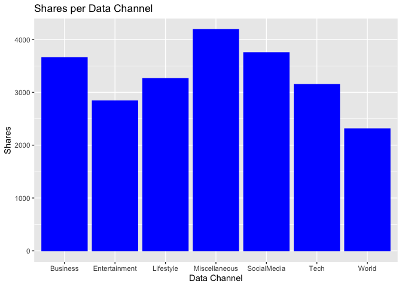
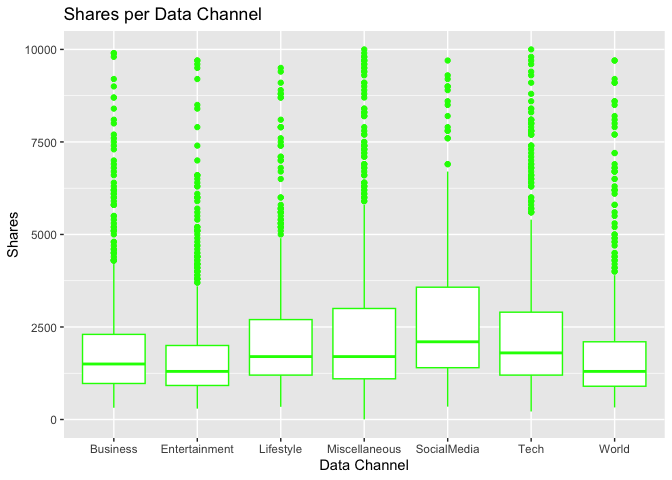
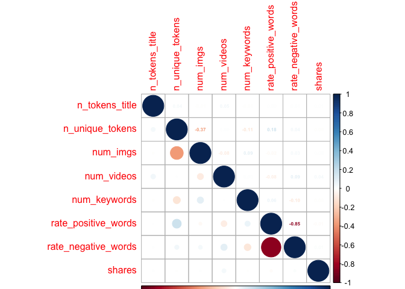
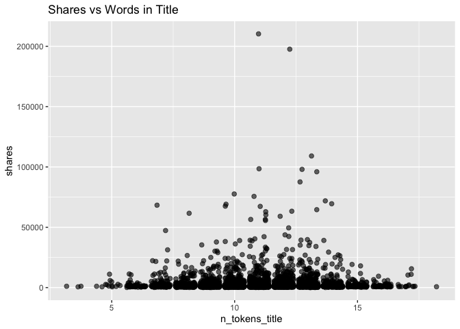
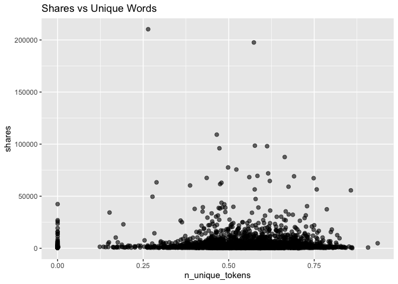
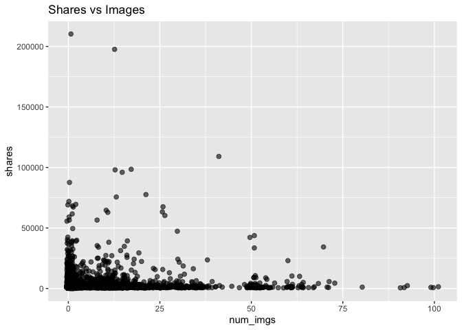
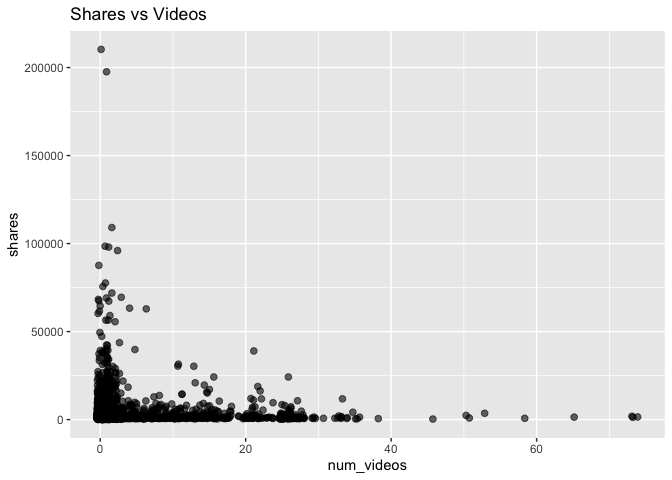
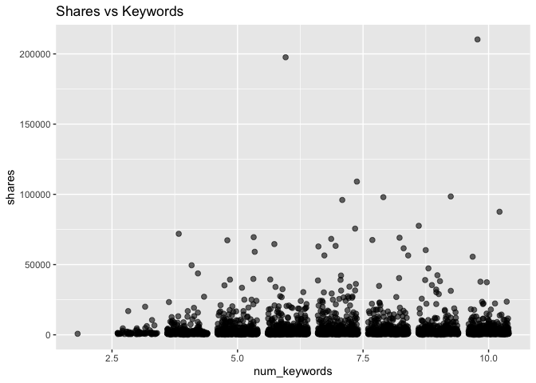
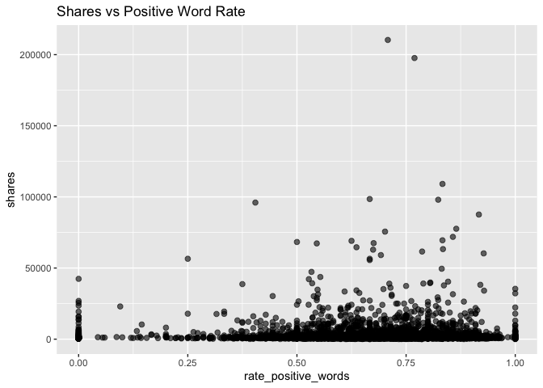
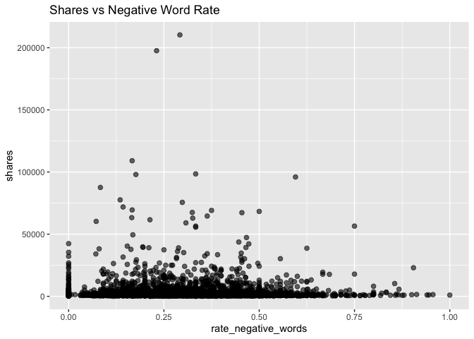

Project 2
================
Spencer Williams & Stephen Macropoulos
2023-07-09

- <a href="#introduction" id="toc-introduction">Introduction</a>
- <a href="#purpose-and-methods" id="toc-purpose-and-methods">Purpose and
  Methods</a>
- <a href="#reading-in-data" id="toc-reading-in-data">Reading in Data</a>
  - <a href="#splitting-the-data" id="toc-splitting-the-data">Splitting the
    Data</a>
- <a href="#summarizations" id="toc-summarizations">Summarizations</a>
- <a href="#modeling" id="toc-modeling">Modeling</a>
- <a href="#links-to-automated-documents"
  id="toc-links-to-automated-documents">Links to Automated Documents</a>

# Introduction

The (Online News
Popularity)\[<https://archive.ics.uci.edu/dataset/332/online+news+popularity>\]
is a data set with a heterogeneous set of features about articles
published by (Mashable)\[www.mashable.com\]. Multivariate data was
gathered on sixty-one variables over a two year span. Our end goal is to
predict the number of shares in social networks. Below are some of the
variables we will be looking at to help our prediction.

`Shares` - Number of shares (target)  
`n_tokens_title` - Number of words in the title  
`n_unique_tokens` - Rate of unique words in the content  
`num_imgs` - Number of images  
`num_videos` - Number of videos  
`num_keywords` - Number of keywords in the metadata  
`data_channel_is *` - There are six binary variables which will be
combined into one column. Theses include lifestyle, entertainment,
business, social media, tech, and world  
`rate_positive_words` - Rate of positive words among non-neutral  
`rate_negative_words` - Rate of negative words among non-neutral

# Purpose and Methods

Our end goal is to be able to predict the number of shares based on
having data from the eight variables listed above. We are going to split
the data set into two sets: training (70%) and test (30%). (Linear
Regression Models)\[<https://en.wikipedia.org/wiki/Linear_regression>\]
and (Ensemble Tree-Based
Models)\[<https://towardsdatascience.com/decision-trees-understanding-the-basis-of-ensemble-methods-e075d5bfa704>\]
will be utilized to help us predict the total number of shares. *Random
Forest Models* and *Boosted Tree Models* will be chosen using
cross-validation.

# Reading in Data

The `read.csv()` filename will change depending on who is importing the
Online News Popularity data. We have dropped any unnecessary variables
that will not be used to help us in our predictions.

``` r
# Will need to change this depending on who is working!
newsPop <- read.csv("/Users/monicabeingolea/Documents/ST558/OnlineNewsPopularity/OnlineNewsPopularity.csv")

# Only selecting the columns of interest
newsPop <- newsPop[ , c(3,5,10,11,13,14:19,49,50,61)]

# Check for missing values
sum(is.na(newsPop))
```

    ## [1] 0

We want to subset the data to work based on the different data channel
of interest. Creating a new variable called `data_channel` will allow
this to work successfully. This way, we can turn our focus to a singular
column as opposed to having six binary variables. We will use the
`mutate` function in the *tidyverse* package. Replacing NA’s in the
`data_channel` variable and setting it as a factor is very important in
order to help us predict the total shares.

``` r
library(tidyverse)
# Create new variable data_channel
newsPop <- newsPop %>% mutate(data_channel = case_when(data_channel_is_bus == 1 ~ "Business", data_channel_is_entertainment == 1 ~ "Entertainment", data_channel_is_lifestyle == 1 ~ "Lifestyle", data_channel_is_socmed == 1 ~ "SocialMedia", data_channel_is_tech == 1 ~ "Tech", data_channel_is_world == 1 ~ "World"))
# Replace any missing values with "Miscellaneous"
newsPop$data_channel <- replace_na(newsPop$data_channel, "Miscellaneous")
# Make data_channel a factor variable
newsPop$data_channel <- as.factor(newsPop$data_channel)
```

Since we have added a new `data_channel` variable with the appropriate
variables, the data_channel_is\_\* variables can be removed from our
data set. We will also subset the data to include only observations with
the data channel we want. The possible choices are Entertainment,
SocialMedia, Tech, Business, Miscellaneous, World, and Lifestyle.

``` r
datachannel <- "Entertainment"

# Remove data_channel_is*
newsPop <- newsPop[, -c(6:11)]
newsPop1 <- newsPop[newsPop$data_channel==datachannel, ]

newsPop1 <- newsPop1[,-9]
```

## Splitting the Data

``` r
# Set seed
set.seed(5432)
# split data into test and training sets
sub <- sample(1:nrow(newsPop1), 0.7 * nrow(newsPop1))

# for full data set
newsPopTrain <- newsPop[sub,]
newsPopTest <- newsPop[-sub, ]

# for Entertainment data channel
newsPop1Train <- newsPop1[sub, ]
newsPop1Test <- newsPop1[-sub, ]
```

# Summarizations

We wanted to see the summary statistics of each variable that we are
using to predict the number of shares. The statistics will include the
minimum, maximum, mean, median, and quartiles.

``` r
# Summary
summary(newsPop1Train)
```

    ##  n_tokens_title n_unique_tokens       num_imgs         num_videos      num_keywords   
    ##  Min.   : 3     Min.   :  0.0000   Min.   :  0.000   Min.   : 0.000   Min.   : 2.000  
    ##  1st Qu.:10     1st Qu.:  0.4714   1st Qu.:  1.000   1st Qu.: 0.000   1st Qu.: 5.000  
    ##  Median :11     Median :  0.5429   Median :  1.000   Median : 1.000   Median : 7.000  
    ##  Mean   :11     Mean   :  0.6744   Mean   :  6.243   Mean   : 2.548   Mean   : 6.895  
    ##  3rd Qu.:12     3rd Qu.:  0.6179   3rd Qu.:  8.000   3rd Qu.: 1.000   3rd Qu.: 8.000  
    ##  Max.   :18     Max.   :701.0000   Max.   :101.000   Max.   :74.000   Max.   :10.000  
    ##  rate_positive_words rate_negative_words     shares      
    ##  Min.   :0.0000      Min.   :0.0000      Min.   :    49  
    ##  1st Qu.:0.5781      1st Qu.:0.2000      1st Qu.:   828  
    ##  Median :0.6897      Median :0.3000      Median :  1200  
    ##  Mean   :0.6661      Mean   :0.3042      Mean   :  2919  
    ##  3rd Qu.:0.7857      3rd Qu.:0.4038      3rd Qu.:  2100  
    ##  Max.   :1.0000      Max.   :1.0000      Max.   :210300

It looks like the `n_unique_tokens`, `num_imgs`, `num_videos`, and
`shares` variables are quite right-skewed in our training set.

Another thing that we wanted to look at was the number of shares for
each data channel. One way to look at this is using a number summary to
compare the means.

``` r
# Number summary
tapply(newsPopTrain$shares, newsPopTrain$data_channel, summary)
```

    ## $Business
    ##     Min.  1st Qu.   Median     Mean  3rd Qu.     Max. 
    ##    318.0    984.5   1500.0   3658.0   2450.0 690400.0 
    ## 
    ## $Entertainment
    ##    Min. 1st Qu.  Median    Mean 3rd Qu.    Max. 
    ##   294.0   947.5  1300.0  2838.7  2275.0 68300.0 
    ## 
    ## $Lifestyle
    ##    Min. 1st Qu.  Median    Mean 3rd Qu.    Max. 
    ##     343    1200    1800    3261    3100   36200 
    ## 
    ## $Miscellaneous
    ##    Min. 1st Qu.  Median    Mean 3rd Qu.    Max. 
    ##       4    1200    1900    4188    3900  112500 
    ## 
    ## $SocialMedia
    ##    Min. 1st Qu.  Median    Mean 3rd Qu.    Max. 
    ##     348    1500    2300    3751    4200   57600 
    ## 
    ## $Tech
    ##    Min. 1st Qu.  Median    Mean 3rd Qu.    Max. 
    ##     217    1200    1900    3149    3200   71800 
    ## 
    ## $World
    ##    Min. 1st Qu.  Median    Mean 3rd Qu.    Max. 
    ##     326     907    1400    2311    2200   53100

Based on the summary from the training data set, the Miscellaneous
channel actually had the highest mean at 4,188 shares, but this is most
likely due to the outlier with a total of 112,500 shares. Out of the
other six shares listed, Business and Social Media are the highest with
total shares in the 3,600’s. The World data channel has the lowest total
share count at 2,311. Below is a barplot and box and whisker plot to
help show these results in a graphical form.

Now let’s take a look at some contingency tables. First, we group the
shares values by thousands in a new column called `sharesgroups` and add
it to the data set.

``` r
sharesgroups <- numeric()

for (i in 1:length(newsPop1Train$shares)) {
  sharesgroups[i] <- floor(newsPop1Train$shares[i]/1000)
}

#head(sharesgroups,100)

newsPop1Train <- cbind(newsPop1Train,sharesgroups)
```

Now let’s see the contingency table for `sharesgroups`.

``` r
table(newsPop1Train$sharesgroups)
```

    ## 
    ##    0    1    2    3    4    5    6    7    8    9   10   11   12   13   14   15   16   17   18   19 
    ## 1963 1653  432  212  136   93   72   48   27   33   35   29   18   18    8   18   14   11   12    7 
    ##   20   21   22   23   24   25   26   27   29   30   31   32   33   34   35   36   37   38   39   40 
    ##    8    7    5    5    5    5    5    4    2    3    3    2    1    3    2    1    2    2    5    1 
    ##   42   43   47   49   55   56   59   60   61   62   63   64   67   68   69   71   75   77   87   96 
    ##    2    1    1    1    1    2    1    1    1    1    1    1    2    1    2    1    1    1    1    1 
    ##   98  109  197  210 
    ##    2    1    1    1

We see that most of the observations had less than 20,000 shares. There
are larger jumps in thousands of shares once we get to around 70,000.

Now let’s take a look at a contingency table for the data channels.

``` r
table(newsPopTrain$data_channel)
```

    ## 
    ##      Business Entertainment     Lifestyle Miscellaneous   SocialMedia          Tech         World 
    ##           855           762           399           789           404          1082           648

We see that the Business, Entertainment, Tech, and World data channels
had more observations overall than the Lifestyle and Social Media data
channels.

Now let’s look at the shares totals for each of the data channels in a
bar plot.

``` r
# Creating base for graph
g <- ggplot(newsPopTrain, aes(x = data_channel, y = shares))
# Adding bars to the graph
g + stat_summary(fun = "mean", geom = "bar", color = "blue", fill = "blue") +
  # Creating labels and titles for graph
  labs(x = "Data Channel", y = "Shares", title = "Shares per Data Channel")
```

<!-- -->

It appears that the total number of shares for each data channel are
similar except for the Miscellaneous category. The Business and Social
Media data channels had the most total shares while the World data
channel had the least.

Now let’s see the boxplots to better understand the variability in those
share totals.

``` r
# Creating base for graph
g <- ggplot(newsPopTrain, aes(x = data_channel, y = shares))
# Adding boxplot to the graph
g + geom_boxplot(color = "green") +
  # Setting y-axis limit and labels
  ylim(0, 10000) +
  labs(x = "Data Channel", y = "Shares", title = "Shares per Data Channel")
```

<!-- -->

It looks like the Social Media data channel had the highest median
shares while the Entertainment and World data channels had the smallest
median shares.

We are curious to see if the variables that we have selected have any
correlation between them. In order to check this, a correlation plot has
been created.

``` r
# Load library
library(corrplot)
# Remove non-numeric variable
newsPopTrain_ <- newsPopTrain[ , -9]
# Find the correlation and plot the graph
newsPopTrainCorr <- cor(newsPopTrain_)
corrplot(newsPopTrainCorr, type="upper", method="number", tl.pos="lt", number.cex=0.5)
corrplot(newsPopTrainCorr, type="lower", add=TRUE, tl.pos="n", number.cex=0.5)
```

<!-- -->

Based on the correlation plots, only one of the variable-pairs seems to
be highly correlated (near 1 in magnitude). The strongest negative
correlation is -0.85 between `rate_positive_words` and
`rate_negative_words`. This is good news in our case to predict the
number of shares.

Let’s also check out some scatterplots for the Entertainment training
set. First, we look at `shares` vs `n_tokens_title`.

``` r
g <- ggplot(newsPop1Train, aes(x = n_tokens_title, y = shares))
g + labs(title = "Shares vs Words in Title") +
  geom_point(alpha = 0.6, size = 2, position = "jitter") 
```

<!-- -->

We can inspect the trend of shares as a function of the number of words
in the title. If the points show an upward trend, then articles with
more words in the title tend to be shared more often. If we see a
negative trend then articles with more words tend to be shared less
often.

Now let’s look at the same plot but for the `n_unique_tokens` variable.
We remove the extreme outlier first.

``` r
newsPop1Train <- newsPop1Train[-915,]

g <- ggplot(newsPop1Train, aes(x = n_unique_tokens, y = shares))
g + labs(title = "Shares vs Unique Words") +
  geom_point(alpha = 0.6, size = 2, position = "jitter") 
```

<!-- -->

We can inspect the trend of shares as a function of the number of unique
words in the content. If the points show an upward trend, then articles
with more unique words in the title tend to be shared more often. If we
see a negative trend then articles with more unique words tend to be
shared less often.

Now let’s look at the scatter plot of `shares` vs `num_imgs`.

``` r
g <- ggplot(newsPop1Train, aes(x = num_imgs, y = shares))
g + labs(title = "Shares vs Images") +
  geom_point(alpha = 0.6, size = 2, position = "jitter")
```

<!-- -->

We can inspect the trend of shares as a function of the number of
images. If the points show an upward trend, then articles with more
images tend to be shared more often. If there is a negative trend, then
articles with more images tend to be shared less often.

Now let’s look at the scatter plot of `shares` vs `num_videos`.

``` r
g <- ggplot(newsPop1Train, aes(x = num_videos, y = shares))
g + labs(title = "Shares vs Videos") +
  geom_point(alpha = 0.6, size = 2, position = "jitter")
```

<!-- -->

This plot looks very similar to the Shares vs Images plot!

Now let’s look at the scatter plot of `shares` vs `num_keywords`.

``` r
g <- ggplot(newsPop1Train, aes(x = num_keywords, y = shares))
g + labs(title = "Shares vs Keywords") +
  geom_point(alpha = 0.6, size = 2, position = "jitter")
```

<!-- -->

We can inspect the trend of shares as a function of the number of
keywords. If the points show an upward trend, then articles with more
keywords tend to be shared more often. If we see a negative trend then
articles with more keywords tend to be shared less often.

Now let’s look at the scatter plot of `shares` vs
\`rate_positive_words\`\`.

``` r
g <- ggplot(newsPop1Train, aes(x = rate_positive_words, y = shares))
g + labs(title = "Shares vs Positive Word Rate") +
  geom_point(alpha = 0.6, size = 2, position = "jitter")
```

<!-- -->

We can inspect the trend of shares as a function of the positive word
rate. If the points show an upward trend, then articles with more
positive words tend to be shared more often. If we see a negative trend
then articles with more positive words tend to be shared less often.

And finally let’s look at the scatter plot of `shares` vs
\`rate_negative_words\`\`.

``` r
g <- ggplot(newsPop1Train, aes(x = rate_negative_words, y = shares))
g + labs(title = "Shares vs Negative Word Rate") +
  geom_point(alpha = 0.6, size = 2, position = "jitter")
```

<!-- -->

This plot looks like the mirror image of the shares vs positive word
rate plot!

# Modeling

We will use linear regression to investigate which variables best
predict the number of shares.

Linear regression is a statistical modeling procedure which optimally
estimates the slope parameters (via least squares) for each explanatory
variable in a pre-specified linear equation of the slopes. The
assumption of error normality is often made in order to calculate
confidence intervals and prediction intervals for the average and future
responses respectively. The reliability of this technique depends on the
accuracy of the chosen linear equation of the slope parameters. A
misspecified model equation can severely mislead inference and result in
very poor predictive power. Hence, the analyst often tries many
different model equations with the most sensible explanatory variables
for the given response until the parameter estimates are statistically
significant and the information criteria are relatively optimized.

The first linear regression model will consist of all the predictive
variables that we have chosen (omitting the `sharesgroups` variable) in
linear form. After looking at the significance level of each variable,
our second linear regression model will be selected. This has been
selected based on the results for every data channel combined, so we
will analyze each one using the same two models.

``` r
newsPop1Train <- newsPop1Train[,-9]

# Create a linear regression
model1 <- lm(shares ~ ., data = newsPop1Train) 
summary(model1)
```

    ## 
    ## Call:
    ## lm(formula = shares ~ ., data = newsPop1Train)
    ## 
    ## Residuals:
    ##    Min     1Q Median     3Q    Max 
    ##  -5022  -2101  -1595   -749 207605 
    ## 
    ## Coefficients:
    ##                      Estimate Std. Error t value Pr(>|t|)   
    ## (Intercept)           640.821    995.681   0.644  0.51986   
    ## n_tokens_title         66.108     52.711   1.254  0.20984   
    ## n_unique_tokens      2097.855   1210.023   1.734  0.08303 . 
    ## num_imgs               32.928     10.877   3.027  0.00248 **
    ## num_videos             -2.143     18.138  -0.118  0.90594   
    ## num_keywords          166.040     57.844   2.871  0.00412 **
    ## rate_positive_words  -682.861    972.400  -0.702  0.48256   
    ## rate_negative_words -1500.901   1064.059  -1.411  0.15844   
    ## ---
    ## Signif. codes:  0 '***' 0.001 '**' 0.01 '*' 0.05 '.' 0.1 ' ' 1
    ## 
    ## Residual standard error: 7632 on 4930 degrees of freedom
    ## Multiple R-squared:  0.004332,   Adjusted R-squared:  0.002918 
    ## F-statistic: 3.064 on 7 and 4930 DF,  p-value: 0.003205

We can use the above output to gauge the strength of this model. If the
overall p-value at the bottom is small then we can use the asterisks to
see which are the most useful predictors in this model.

``` r
# Create a linear regression

model2 <- lm(shares ~ poly(n_tokens_title,2) + poly(n_unique_tokens,2) +
               poly(num_imgs,2) + poly(num_videos,2) + poly(num_keywords,2) +
               poly(rate_positive_words,2) + poly(rate_negative_words,2), 
               data = newsPop1Train)
 
summary(model2)
```

    ## 
    ## Call:
    ## lm(formula = shares ~ poly(n_tokens_title, 2) + poly(n_unique_tokens, 
    ##     2) + poly(num_imgs, 2) + poly(num_videos, 2) + poly(num_keywords, 
    ##     2) + poly(rate_positive_words, 2) + poly(rate_negative_words, 
    ##     2), data = newsPop1Train)
    ## 
    ## Residuals:
    ##    Min     1Q Median     3Q    Max 
    ##  -5674  -2129  -1527   -542 206396 
    ## 
    ## Coefficients: (1 not defined because of singularities)
    ##                               Estimate Std. Error t value Pr(>|t|)    
    ## (Intercept)                     2918.6      108.4  26.926  < 2e-16 ***
    ## poly(n_tokens_title, 2)1        9305.2     7702.7   1.208  0.22709    
    ## poly(n_tokens_title, 2)2      -12366.1     7639.2  -1.619  0.10556    
    ## poly(n_unique_tokens, 2)1     -32527.1    20809.7  -1.563  0.11810    
    ## poly(n_unique_tokens, 2)2      65998.1    19610.9   3.365  0.00077 ***
    ## poly(num_imgs, 2)1             20530.0     9230.7   2.224  0.02619 *  
    ## poly(num_imgs, 2)2            -25754.9     7963.0  -3.234  0.00123 ** 
    ## poly(num_videos, 2)1            2679.9     7902.2   0.339  0.73452    
    ## poly(num_videos, 2)2           -9850.8     7640.8  -1.289  0.19738    
    ## poly(num_keywords, 2)1         19310.7     7736.8   2.496  0.01259 *  
    ## poly(num_keywords, 2)2        -12859.6     7656.4  -1.680  0.09310 .  
    ## poly(rate_positive_words, 2)1  76693.0    29440.8   2.605  0.00922 ** 
    ## poly(rate_positive_words, 2)2  -1910.2    15264.1  -0.125  0.90042    
    ## poly(rate_negative_words, 2)1  51931.9    26683.2   1.946  0.05168 .  
    ## poly(rate_negative_words, 2)2       NA         NA      NA       NA    
    ## ---
    ## Signif. codes:  0 '***' 0.001 '**' 0.01 '*' 0.05 '.' 0.1 ' ' 1
    ## 
    ## Residual standard error: 7617 on 4924 degrees of freedom
    ## Multiple R-squared:  0.009379,   Adjusted R-squared:  0.006764 
    ## F-statistic: 3.586 on 13 and 4924 DF,  p-value: 1.195e-05

We can use the above output to gauge the strength of this model. If the
overall p-value at the bottom is small then we can use the asterisks to
see which are the most useful predictors in this model.

We are going to analyze the (random forest
model)\[<https://towardsdatascience.com/understanding-random-forest-58381e0602d2>\].
This model allows a user to combine multiple trees from bootstrap
samples. In most cases, the bagged trees predictions are more correlated
which will result in a smaller reduction in variance from aggregation.
The random forest model uses a random subset of the predictors for each
bootstrap tree fit.

``` r
# Load library
library(randomForest)
# Produce random forest model
newsPopFit_rf <- randomForest(shares ~ ., data = newsPop1Train, 
                              mtry = ncol(newsPop1Train)/3, 
                              ntree=200, importance=TRUE)
```

We will also use a boosted tree model to predict the number of shares.

Boosted trees are a general approach that can be applied to trees. The
trees are grown sequentially, each subsequent tree is grown on a
modified version of the original data, and predictions are updated as
the trees are grown. Cross validation is also used to select the
shrinkage and depth parameters.

``` r
library(caret)
n.trees <- c(25,50,100,150,200)
interaction.depth <- 1:4
shrinkage <- 0.1
n.minobsinnode <- 10
X <- expand.grid(n.trees = n.trees, interaction.depth = interaction.depth,
            shrinkage = shrinkage, n.minobsinnode = n.minobsinnode)

newsPopFit_boost <- train(shares ~ ., data = newsPop1Train,
               method = "gbm",
               trControl = trainControl(method = "cv", number = 5),
               tuneGrid = X)
```

    ## Iter   TrainDeviance   ValidDeviance   StepSize   Improve
    ##      1 51217653.2144             nan     0.1000 40786.8712
    ##      2 51193726.6511             nan     0.1000 -13050.7695
    ##      3 51157530.1098             nan     0.1000 6974.3187
    ##      4 51112194.7690             nan     0.1000 36336.8882
    ##      5 51096437.0534             nan     0.1000 -8181.2308
    ##      6 51076340.4738             nan     0.1000 1021.0309
    ##      7 51041230.3139             nan     0.1000 23071.5037
    ##      8 51002199.4128             nan     0.1000 24819.6580
    ##      9 50979247.2951             nan     0.1000 -28245.4383
    ##     10 50965475.6410             nan     0.1000 6557.4776
    ##     20 50767307.8277             nan     0.1000 20835.5480
    ##     40 50532989.8333             nan     0.1000 -33944.4678
    ##     60 50376606.6590             nan     0.1000 -15203.5766
    ##     80 50276536.3220             nan     0.1000 -6000.5858
    ##    100 50178556.0734             nan     0.1000 -18054.3494
    ##    120 50086428.8591             nan     0.1000 -23000.1985
    ##    140 49991149.0317             nan     0.1000 -11829.9149
    ##    160 49891538.5324             nan     0.1000 -4918.1511
    ##    180 49807763.7770             nan     0.1000 -10707.5308
    ##    200 49738745.0326             nan     0.1000 -11186.6609
    ## 
    ## Iter   TrainDeviance   ValidDeviance   StepSize   Improve
    ##      1 51238975.5899             nan     0.1000 -27081.7391
    ##      2 51184467.2414             nan     0.1000 20613.3166
    ##      3 51100873.8854             nan     0.1000 61028.9100
    ##      4 51036019.1019             nan     0.1000 -29484.4402
    ##      5 50913778.0996             nan     0.1000 98481.2973
    ##      6 50797007.7991             nan     0.1000 -6266.9337
    ##      7 50742993.7271             nan     0.1000 12170.8165
    ##      8 50636137.6252             nan     0.1000 12446.3264
    ##      9 50598617.3485             nan     0.1000 -8384.2736
    ##     10 50510322.9025             nan     0.1000 16929.2661
    ##     20 49903239.3271             nan     0.1000 -22139.3023
    ##     40 49090662.4714             nan     0.1000 -5366.8773
    ##     60 48107377.7921             nan     0.1000 -33588.0139
    ##     80 47703349.7970             nan     0.1000 -137412.8007
    ##    100 47340285.9014             nan     0.1000 -11592.5294
    ##    120 46878907.4053             nan     0.1000 -12408.3044
    ##    140 46384925.5674             nan     0.1000 -6505.8280
    ##    160 46056456.2863             nan     0.1000 -37199.6961
    ##    180 45701220.6358             nan     0.1000 -16416.2836
    ##    200 45459639.5018             nan     0.1000 -42742.8403
    ## 
    ## Iter   TrainDeviance   ValidDeviance   StepSize   Improve
    ##      1 51075712.8742             nan     0.1000 -29958.9081
    ##      2 50975520.9471             nan     0.1000 -45929.6338
    ##      3 50387165.1304             nan     0.1000 -68279.0406
    ##      4 50266817.2422             nan     0.1000 26429.9398
    ##      5 49911105.4441             nan     0.1000 9310.7665
    ##      6 49836431.0161             nan     0.1000 -23288.2551
    ##      7 49769012.0961             nan     0.1000 -14933.1607
    ##      8 49692177.0376             nan     0.1000 -4136.1580
    ##      9 49582704.4181             nan     0.1000 -29612.4004
    ##     10 49549852.5078             nan     0.1000 -16340.4859
    ##     20 48376940.0184             nan     0.1000 -18460.6774
    ##     40 46816367.0925             nan     0.1000 -205894.7119
    ##     60 45888732.7108             nan     0.1000 -34955.7483
    ##     80 44883031.7238             nan     0.1000 -33777.9917
    ##    100 44127777.8891             nan     0.1000 -43463.6449
    ##    120 43544557.1481             nan     0.1000 -81477.4490
    ##    140 42690687.5309             nan     0.1000 -63533.0660
    ##    160 42008754.5830             nan     0.1000 -13788.3225
    ##    180 41770297.3462             nan     0.1000 -44162.6430
    ##    200 41116709.2317             nan     0.1000 -49515.0634
    ## 
    ## Iter   TrainDeviance   ValidDeviance   StepSize   Improve
    ##      1 50542417.7637             nan     0.1000 9898.4423
    ##      2 50400197.7886             nan     0.1000 -40859.6167
    ##      3 50179270.6687             nan     0.1000 -37834.1734
    ##      4 49685579.1037             nan     0.1000 107532.1044
    ##      5 49338514.9211             nan     0.1000 143953.9389
    ##      6 49122455.7996             nan     0.1000 -42874.3456
    ##      7 49041171.4392             nan     0.1000 -30786.7391
    ##      8 48949710.6842             nan     0.1000 -44878.9272
    ##      9 48871931.1701             nan     0.1000 -31072.6191
    ##     10 48744745.7290             nan     0.1000 -18902.6044
    ##     20 47464576.7087             nan     0.1000 -238603.2491
    ##     40 45787018.7497             nan     0.1000 -29143.7443
    ##     60 44392031.6688             nan     0.1000 -79236.5212
    ##     80 43474098.3143             nan     0.1000 -171084.2736
    ##    100 42208419.8393             nan     0.1000 -34648.1392
    ##    120 41198670.4024             nan     0.1000 -34165.6134
    ##    140 40600933.6014             nan     0.1000 -54720.0174
    ##    160 39636126.5639             nan     0.1000 -57395.0748
    ##    180 38980495.0039             nan     0.1000 -55639.1927
    ##    200 38599445.9652             nan     0.1000 -29866.2512
    ## 
    ## Iter   TrainDeviance   ValidDeviance   StepSize   Improve
    ##      1 62247885.5105             nan     0.1000 12362.2878
    ##      2 62138674.1161             nan     0.1000 -5379.8116
    ##      3 62107053.1428             nan     0.1000 13578.5287
    ##      4 62081276.6552             nan     0.1000 -29875.7325
    ##      5 62045199.7634             nan     0.1000 16880.7113
    ##      6 61998647.5063             nan     0.1000 -63366.1407
    ##      7 61965615.1903             nan     0.1000 -45452.9998
    ##      8 61916638.2143             nan     0.1000 32653.0629
    ##      9 61904230.7907             nan     0.1000 -27368.1615
    ##     10 61865203.4386             nan     0.1000 20344.2636
    ##     20 61630323.4834             nan     0.1000 6849.7032
    ##     40 61367096.3883             nan     0.1000 -9104.8333
    ##     60 61150772.6293             nan     0.1000 -16841.8946
    ##     80 60977524.0509             nan     0.1000 -13266.1071
    ##    100 60808678.9574             nan     0.1000 15088.3169
    ##    120 60600855.7148             nan     0.1000 -9015.1643
    ##    140 60463148.6838             nan     0.1000 -11676.1556
    ##    160 60275482.3295             nan     0.1000 -2813.7800
    ##    180 60166648.2204             nan     0.1000 -55427.5151
    ##    200 60106534.6131             nan     0.1000 -46913.1279
    ## 
    ## Iter   TrainDeviance   ValidDeviance   StepSize   Improve
    ##      1 62129377.9944             nan     0.1000 135118.2287
    ##      2 61784607.4662             nan     0.1000 -25926.9646
    ##      3 61706622.7049             nan     0.1000 25797.9751
    ##      4 61621844.0490             nan     0.1000 27245.9386
    ##      5 61484231.1826             nan     0.1000 -49346.5107
    ##      6 61433455.1279             nan     0.1000 28072.2444
    ##      7 61136849.3826             nan     0.1000 -57330.5268
    ##      8 60953741.0926             nan     0.1000 -14707.1981
    ##      9 60916398.9453             nan     0.1000 5021.6458
    ##     10 60849606.3765             nan     0.1000 -12304.4927
    ##     20 60014684.4970             nan     0.1000 9245.4899
    ##     40 58775588.9448             nan     0.1000 -197105.7811
    ##     60 58152583.8110             nan     0.1000 -60151.2652
    ##     80 57649861.2549             nan     0.1000 -79841.5626
    ##    100 56804042.9391             nan     0.1000 -94138.4753
    ##    120 56143269.5210             nan     0.1000 -105091.3144
    ##    140 55656929.0480             nan     0.1000 -34635.1410
    ##    160 55059517.5791             nan     0.1000 8615.3433
    ##    180 54649682.4786             nan     0.1000 -52848.8702
    ##    200 54327016.1261             nan     0.1000 -55623.8836
    ## 
    ## Iter   TrainDeviance   ValidDeviance   StepSize   Improve
    ##      1 62126669.2395             nan     0.1000 53400.3945
    ##      2 61507022.0545             nan     0.1000 108940.5426
    ##      3 61337472.7905             nan     0.1000 -14308.6397
    ##      4 61289695.0134             nan     0.1000 -16194.1055
    ##      5 61192402.0673             nan     0.1000 -5188.3486
    ##      6 60839372.9446             nan     0.1000 -25302.1051
    ##      7 60761710.9471             nan     0.1000 -69197.9962
    ##      8 60478424.5062             nan     0.1000 -25372.9824
    ##      9 60324533.9479             nan     0.1000 26919.3412
    ##     10 60262404.2163             nan     0.1000 35480.4656
    ##     20 59080954.5501             nan     0.1000 -32222.7391
    ##     40 57424317.7667             nan     0.1000 -37101.8020
    ##     60 55612529.2110             nan     0.1000 -280921.0134
    ##     80 54683518.3269             nan     0.1000 -6624.2586
    ##    100 53574259.9460             nan     0.1000 -22438.1135
    ##    120 52569703.7168             nan     0.1000 -89841.3402
    ##    140 51588104.5483             nan     0.1000 -22656.5252
    ##    160 50874928.6555             nan     0.1000 -117464.6904
    ##    180 49794960.0728             nan     0.1000 -17814.3694
    ##    200 49016601.6538             nan     0.1000 -400695.2482
    ## 
    ## Iter   TrainDeviance   ValidDeviance   StepSize   Improve
    ##      1 61986156.7147             nan     0.1000 -42324.5711
    ##      2 61874127.0589             nan     0.1000 -53667.6209
    ##      3 61615212.1831             nan     0.1000 135973.6020
    ##      4 61499121.6468             nan     0.1000 38451.9228
    ##      5 61333297.0410             nan     0.1000 -57105.3983
    ##      6 61227713.2172             nan     0.1000 -50956.2772
    ##      7 61098207.7558             nan     0.1000 75711.8397
    ##      8 61013690.5775             nan     0.1000 -93793.5972
    ##      9 60883519.1004             nan     0.1000 62734.1278
    ##     10 60632323.1662             nan     0.1000 53839.3005
    ##     20 58174594.7190             nan     0.1000 -200176.2348
    ##     40 56186333.6908             nan     0.1000 -70787.1120
    ##     60 54864503.2251             nan     0.1000 -217002.0958
    ##     80 53328046.0557             nan     0.1000 -67716.6648
    ##    100 51897115.8494             nan     0.1000 -181878.1567
    ##    120 50601560.1467             nan     0.1000 -129020.7998
    ##    140 49521197.5029             nan     0.1000 -183771.0760
    ##    160 48500985.5633             nan     0.1000 -25618.2549
    ##    180 47759738.7343             nan     0.1000 -44035.8299
    ##    200 46967514.3073             nan     0.1000 -77961.9331
    ## 
    ## Iter   TrainDeviance   ValidDeviance   StepSize   Improve
    ##      1 50323998.3382             nan     0.1000 17714.8796
    ##      2 50281915.1625             nan     0.1000 -26972.0374
    ##      3 50274064.9441             nan     0.1000 -862.3840
    ##      4 50253152.4521             nan     0.1000 5281.9573
    ##      5 50238011.5190             nan     0.1000 -4208.3059
    ##      6 50218165.0708             nan     0.1000 -18161.6848
    ##      7 50194083.1631             nan     0.1000 -10728.4411
    ##      8 50166001.6722             nan     0.1000 -12436.8760
    ##      9 50139583.2987             nan     0.1000 -23224.0154
    ##     10 50109868.4579             nan     0.1000 -8727.3688
    ##     20 49955232.9518             nan     0.1000 -30615.0574
    ##     40 49765325.3713             nan     0.1000 -5601.4186
    ##     60 49560382.2992             nan     0.1000 2958.3231
    ##     80 49421226.9706             nan     0.1000 -29716.1138
    ##    100 49276156.5688             nan     0.1000 -25643.1339
    ##    120 49129008.5657             nan     0.1000 -14147.1223
    ##    140 49045810.6548             nan     0.1000 -25444.5386
    ##    160 48929201.1910             nan     0.1000 -23091.6763
    ##    180 48856709.9065             nan     0.1000 -36217.1172
    ##    200 48775615.7574             nan     0.1000 -28180.2500
    ## 
    ## Iter   TrainDeviance   ValidDeviance   StepSize   Improve
    ##      1 50302993.2685             nan     0.1000 15991.2206
    ##      2 50256403.4871             nan     0.1000 33196.7015
    ##      3 50198608.2380             nan     0.1000 20439.4756
    ##      4 50127036.4664             nan     0.1000 12572.1735
    ##      5 49672013.8607             nan     0.1000 -47968.7469
    ##      6 49624914.2891             nan     0.1000 -17046.2920
    ##      7 49576148.7583             nan     0.1000 -7712.4176
    ##      8 49186548.9045             nan     0.1000 -62762.3013
    ##      9 49020530.1000             nan     0.1000 -100931.7128
    ##     10 48787951.0762             nan     0.1000 -149866.3781
    ##     20 48387789.6922             nan     0.1000 19424.3686
    ##     40 47723177.5989             nan     0.1000 -150177.3811
    ##     60 47027146.5621             nan     0.1000 -307114.4079
    ##     80 46389589.7145             nan     0.1000 -65705.6324
    ##    100 45898651.0158             nan     0.1000 -122012.6784
    ##    120 45606527.4414             nan     0.1000 -20372.0172
    ##    140 44965407.2336             nan     0.1000 -18264.9855
    ##    160 44441023.0679             nan     0.1000 -52750.0746
    ##    180 44038474.3849             nan     0.1000 -21689.2252
    ##    200 43597664.4366             nan     0.1000 -17883.9589
    ## 
    ## Iter   TrainDeviance   ValidDeviance   StepSize   Improve
    ##      1 50225321.7613             nan     0.1000 8896.3596
    ##      2 50112347.8667             nan     0.1000 24908.0074
    ##      3 49924223.3091             nan     0.1000 -32971.2254
    ##      4 49838836.6359             nan     0.1000 -2434.8857
    ##      5 49779098.7974             nan     0.1000 -1302.1160
    ##      6 49647370.7150             nan     0.1000 15936.4789
    ##      7 49588041.0100             nan     0.1000 34144.2849
    ##      8 49503919.4620             nan     0.1000 -21948.8878
    ##      9 49455886.6352             nan     0.1000 -16046.4812
    ##     10 49351065.6324             nan     0.1000 -30000.5183
    ##     20 48118252.6910             nan     0.1000 13385.0237
    ##     40 46288706.1126             nan     0.1000 19113.9639
    ##     60 45381554.3101             nan     0.1000 -127724.5497
    ##     80 44294115.0704             nan     0.1000 -53154.8898
    ##    100 43219512.0192             nan     0.1000 -47351.3832
    ##    120 42455292.6803             nan     0.1000 -46286.2778
    ##    140 41737449.6788             nan     0.1000 -33154.4080
    ##    160 40970653.5676             nan     0.1000 -92450.5254
    ##    180 40357247.9080             nan     0.1000 -96842.0132
    ##    200 39686458.9649             nan     0.1000 -42484.3159
    ## 
    ## Iter   TrainDeviance   ValidDeviance   StepSize   Improve
    ##      1 50115201.5741             nan     0.1000 27241.0379
    ##      2 49989363.1350             nan     0.1000 -19333.7839
    ##      3 49706042.7310             nan     0.1000 56581.2508
    ##      4 49614956.3092             nan     0.1000 -14664.5407
    ##      5 49537747.1878             nan     0.1000 -17684.2431
    ##      6 49387574.1277             nan     0.1000 -27946.6253
    ##      7 49289705.1445             nan     0.1000 -24874.3897
    ##      8 49192482.9589             nan     0.1000 -28375.4655
    ##      9 49108997.4676             nan     0.1000 -16299.4448
    ##     10 48891890.9293             nan     0.1000 -10523.9096
    ##     20 47651072.5297             nan     0.1000 1143.8923
    ##     40 45661153.9399             nan     0.1000 -127832.2983
    ##     60 44417328.8420             nan     0.1000 -101074.5942
    ##     80 43132763.8344             nan     0.1000 -33294.6909
    ##    100 42364113.2520             nan     0.1000 -181510.2299
    ##    120 41185838.1548             nan     0.1000 -97601.9866
    ##    140 40353905.4280             nan     0.1000 -95807.8910
    ##    160 39681732.0133             nan     0.1000 -50227.1159
    ##    180 38977935.6981             nan     0.1000 -62268.4460
    ##    200 38145465.2964             nan     0.1000 -34156.2462
    ## 
    ## Iter   TrainDeviance   ValidDeviance   StepSize   Improve
    ##      1 61930676.6285             nan     0.1000 -1427.1055
    ##      2 61894193.8113             nan     0.1000 4593.4366
    ##      3 61844294.2199             nan     0.1000 23762.3479
    ##      4 61803261.6584             nan     0.1000 4734.9659
    ##      5 61764369.1289             nan     0.1000 2366.5185
    ##      6 61728595.9396             nan     0.1000 17076.2610
    ##      7 61696615.0765             nan     0.1000 -9256.5827
    ##      8 61667488.2133             nan     0.1000 -52485.3818
    ##      9 61642498.7485             nan     0.1000 1450.3642
    ##     10 61615164.1752             nan     0.1000 16530.5381
    ##     20 61361326.8105             nan     0.1000 -5014.5140
    ##     40 61084317.4047             nan     0.1000 -8946.0209
    ##     60 60864928.9462             nan     0.1000 -15816.6477
    ##     80 60746008.1896             nan     0.1000 -24517.7455
    ##    100 60614385.3551             nan     0.1000 -4747.4274
    ##    120 60486859.3287             nan     0.1000 -11522.2215
    ##    140 60370037.1695             nan     0.1000 -40070.8829
    ##    160 60276227.4525             nan     0.1000 -35263.7618
    ##    180 60188295.4404             nan     0.1000 -20506.9536
    ##    200 60087716.4806             nan     0.1000 -3417.6146
    ## 
    ## Iter   TrainDeviance   ValidDeviance   StepSize   Improve
    ##      1 61818891.9517             nan     0.1000 -52800.8888
    ##      2 61517814.5175             nan     0.1000 -27411.0517
    ##      3 61431186.5105             nan     0.1000 48908.0143
    ##      4 61278166.3242             nan     0.1000 -12462.1654
    ##      5 61016603.1042             nan     0.1000 -87893.0271
    ##      6 60866437.9944             nan     0.1000 -107837.1237
    ##      7 60762194.6543             nan     0.1000 -135457.4875
    ##      8 60688750.9420             nan     0.1000 35853.5812
    ##      9 60655457.5806             nan     0.1000 2750.8834
    ##     10 60609519.3231             nan     0.1000 -35356.8780
    ##     20 59775802.8153             nan     0.1000 -40952.1556
    ##     40 58687452.8660             nan     0.1000 -218235.6270
    ##     60 57703464.2259             nan     0.1000 -158516.6011
    ##     80 57301305.1970             nan     0.1000 -15498.7591
    ##    100 56383423.5990             nan     0.1000 -38779.0717
    ##    120 55821935.0569             nan     0.1000 -2773.7379
    ##    140 55163528.7366             nan     0.1000 -10496.6564
    ##    160 54648018.6517             nan     0.1000 -94691.8257
    ##    180 54093817.7066             nan     0.1000 -21325.9090
    ##    200 53468389.4297             nan     0.1000 -69854.7229
    ## 
    ## Iter   TrainDeviance   ValidDeviance   StepSize   Improve
    ##      1 61823111.4757             nan     0.1000 -32364.5662
    ##      2 61704705.4059             nan     0.1000 151510.3631
    ##      3 61256512.9448             nan     0.1000 -49011.6627
    ##      4 61072910.8563             nan     0.1000 91844.9896
    ##      5 60888638.0854             nan     0.1000 -39735.5454
    ##      6 60778439.0606             nan     0.1000 -19962.2256
    ##      7 60492930.4275             nan     0.1000 -65415.0447
    ##      8 60236896.8686             nan     0.1000 -54298.5970
    ##      9 60169795.7017             nan     0.1000 -19149.6842
    ##     10 59915929.3083             nan     0.1000 -55959.8559
    ##     20 58592846.8653             nan     0.1000 -5945.4145
    ##     40 57295337.9769             nan     0.1000 -139864.1102
    ##     60 55943347.9353             nan     0.1000 -110102.5513
    ##     80 54700740.9912             nan     0.1000 -125660.1883
    ##    100 53605902.8409             nan     0.1000 -84236.4252
    ##    120 52535341.3895             nan     0.1000 -48570.0874
    ##    140 51678656.7018             nan     0.1000 -75340.4150
    ##    160 50835478.2761             nan     0.1000 -53996.1541
    ##    180 49764902.8090             nan     0.1000 -107688.5389
    ##    200 49065080.3134             nan     0.1000 -39938.3930
    ## 
    ## Iter   TrainDeviance   ValidDeviance   StepSize   Improve
    ##      1 61527909.0924             nan     0.1000 -165443.5433
    ##      2 60864663.9052             nan     0.1000 22117.9491
    ##      3 60770957.6022             nan     0.1000 51174.8990
    ##      4 60439063.2943             nan     0.1000 -150729.9702
    ##      5 60169663.0205             nan     0.1000 -134480.5571
    ##      6 59909486.5764             nan     0.1000 -132263.3675
    ##      7 59760641.9852             nan     0.1000 -34106.1783
    ##      8 59336397.1503             nan     0.1000 53970.9733
    ##      9 59191019.8920             nan     0.1000 -134269.8306
    ##     10 59114488.2448             nan     0.1000 -23080.9698
    ##     20 57560402.0090             nan     0.1000 -77209.8499
    ##     40 56070834.4568             nan     0.1000 -37954.2245
    ##     60 54588684.0934             nan     0.1000 -147094.9760
    ##     80 53356956.6082             nan     0.1000 -265862.8967
    ##    100 51882926.9624             nan     0.1000 -193370.2192
    ##    120 50493239.8165             nan     0.1000 -277614.0662
    ##    140 49434576.6677             nan     0.1000 -98549.8692
    ##    160 48315124.3046             nan     0.1000 -74811.3084
    ##    180 47609945.0572             nan     0.1000 -42878.0858
    ##    200 46798238.7236             nan     0.1000 -164153.3361
    ## 
    ## Iter   TrainDeviance   ValidDeviance   StepSize   Improve
    ##      1 66008448.5369             nan     0.1000 32145.0912
    ##      2 65954940.5757             nan     0.1000 -15902.8292
    ##      3 65920207.4634             nan     0.1000 -18649.5350
    ##      4 65882658.1740             nan     0.1000 -1597.4666
    ##      5 65851222.1468             nan     0.1000 -146.4933
    ##      6 65811200.6747             nan     0.1000 8427.5079
    ##      7 65796387.3639             nan     0.1000 -34197.4786
    ##      8 65773921.9947             nan     0.1000 -5182.6585
    ##      9 65755111.4229             nan     0.1000 -3223.4233
    ##     10 65693945.3674             nan     0.1000 8229.9435
    ##     20 65458726.4906             nan     0.1000 -31554.4302
    ##     40 65144999.1473             nan     0.1000 -24330.1622
    ##     60 65015884.4135             nan     0.1000 -12322.8789
    ##     80 64778799.8272             nan     0.1000 17431.1827
    ##    100 64625952.5388             nan     0.1000 -7457.1436
    ##    120 64505783.3403             nan     0.1000 -8232.7292
    ##    140 64342495.6043             nan     0.1000 10368.7874
    ##    160 64206979.4103             nan     0.1000 -19627.6334
    ##    180 64130815.5705             nan     0.1000 -34512.3419
    ##    200 63994176.2997             nan     0.1000 -76560.3046
    ## 
    ## Iter   TrainDeviance   ValidDeviance   StepSize   Improve
    ##      1 65643387.3022             nan     0.1000 -71802.6786
    ##      2 65404243.2489             nan     0.1000 36163.9055
    ##      3 65289566.2848             nan     0.1000 70007.1492
    ##      4 65000835.2143             nan     0.1000 -605.3045
    ##      5 64947030.0477             nan     0.1000 -33455.7717
    ##      6 64885740.9559             nan     0.1000 3725.4422
    ##      7 64820954.5300             nan     0.1000 31125.3350
    ##      8 64637384.5024             nan     0.1000 -95877.7270
    ##      9 64452223.1279             nan     0.1000 -49950.0507
    ##     10 64382112.2351             nan     0.1000 5530.9623
    ##     20 63656215.5767             nan     0.1000 -1842.1192
    ##     40 62496735.4077             nan     0.1000 -28487.6022
    ##     60 61732362.4706             nan     0.1000 -172573.8383
    ##     80 60782854.8383             nan     0.1000 -27476.4118
    ##    100 60194460.9112             nan     0.1000 25442.8116
    ##    120 59544128.4418             nan     0.1000 -117325.9752
    ##    140 59121875.4882             nan     0.1000 -147818.5160
    ##    160 58549883.8151             nan     0.1000 -18649.7417
    ##    180 57811004.2286             nan     0.1000 3233.3634
    ##    200 57224381.8386             nan     0.1000 -31702.4292
    ## 
    ## Iter   TrainDeviance   ValidDeviance   StepSize   Improve
    ##      1 65619240.5550             nan     0.1000 -62474.5518
    ##      2 65161891.2131             nan     0.1000 233863.5430
    ##      3 64960240.3114             nan     0.1000 61354.8081
    ##      4 64671618.1354             nan     0.1000 155696.5536
    ##      5 64435437.5761             nan     0.1000 -48236.8732
    ##      6 64070954.2950             nan     0.1000 -169895.6622
    ##      7 63805845.3277             nan     0.1000 -47341.7001
    ##      8 63615689.1310             nan     0.1000 -8345.5226
    ##      9 63385519.1569             nan     0.1000 -199271.5195
    ##     10 63164422.4954             nan     0.1000 18442.8394
    ##     20 61663313.3391             nan     0.1000 -27839.3945
    ##     40 59729983.8831             nan     0.1000 -28878.5557
    ##     60 58568874.4999             nan     0.1000 -60046.4347
    ##     80 57189606.6666             nan     0.1000 -168628.0066
    ##    100 56286811.7174             nan     0.1000 -18892.0899
    ##    120 55431270.7303             nan     0.1000 -19080.4150
    ##    140 54451683.9790             nan     0.1000 -75707.3515
    ##    160 53742376.9581             nan     0.1000 -15563.4804
    ##    180 52775302.8861             nan     0.1000 -146610.5776
    ##    200 51933415.5117             nan     0.1000 -85029.0079
    ## 
    ## Iter   TrainDeviance   ValidDeviance   StepSize   Improve
    ##      1 65567922.5324             nan     0.1000 81599.7176
    ##      2 65364890.9189             nan     0.1000 7816.3320
    ##      3 64894080.9370             nan     0.1000 43290.2124
    ##      4 64439604.1875             nan     0.1000 -20686.6157
    ##      5 64053041.1073             nan     0.1000 -85370.8866
    ##      6 63757673.3613             nan     0.1000 -90171.9062
    ##      7 63633481.6358             nan     0.1000 -69205.7875
    ##      8 63337100.7371             nan     0.1000 -15146.3131
    ##      9 62834879.0814             nan     0.1000 -24699.6709
    ##     10 62616447.9764             nan     0.1000 -12471.8101
    ##     20 61238872.6774             nan     0.1000 -20138.7392
    ##     40 58783008.3672             nan     0.1000 -2987.6370
    ##     60 57515117.0380             nan     0.1000 -89761.2088
    ##     80 55904342.0628             nan     0.1000 -37898.8462
    ##    100 54470684.0894             nan     0.1000 -57662.0209
    ##    120 53403180.4045             nan     0.1000 -32370.3517
    ##    140 52106586.3567             nan     0.1000 -31546.5680
    ##    160 51056182.1325             nan     0.1000 -17511.6641
    ##    180 49995102.3225             nan     0.1000 -30656.0015
    ##    200 49109647.7721             nan     0.1000 -50438.9593
    ## 
    ## Iter   TrainDeviance   ValidDeviance   StepSize   Improve
    ##      1 58380733.7846             nan     0.1000 -630.7597
    ##      2 58338183.6173             nan     0.1000 11924.0567
    ##      3 58289999.1218             nan     0.1000 16327.6168
    ##      4 58272376.4691             nan     0.1000 -26270.9925
    ##      5 58249552.7302             nan     0.1000 13934.2699
    ##      6 58231339.1550             nan     0.1000 -1958.6997
    ##      7 58198875.6255             nan     0.1000 27701.4729
    ##      8 58174675.1984             nan     0.1000 11667.0889
    ##      9 58164697.4498             nan     0.1000 -8211.1259
    ##     10 58140640.5885             nan     0.1000 9757.7197
    ##     20 57906544.0694             nan     0.1000 8190.8374
    ##     40 57701579.7238             nan     0.1000 -3171.9713
    ##     50 57613172.2484             nan     0.1000 -16743.6535

Now we get the RMSE from each model and find the best one. The model
with the highest predictive power will have the smallest RMSE.

``` r
newsPop1Pred_model1 <- predict(model1, newdata = newsPop1Test)
newsPop1Pred_model2 <- predict(model2, newdata = newsPop1Test)
```

    ## Warning in predict.lm(model2, newdata = newsPop1Test): prediction from rank-deficient fit; attr(*,
    ## "non-estim") has doubtful cases

``` r
newsPop1Pred_rf <- predict(newsPopFit_rf, newdata = newsPop1Test)
newsPop1Pred_boost <- predict(newsPopFit_boost, newdata = newsPop1Test)

# Find RMSE
model1_RMSE <- round(sqrt(mean((newsPop1Pred_model1-newsPop1Test$shares)^2)),2)
model2_RMSE <- round(sqrt(mean((newsPop1Pred_model2-newsPop1Test$shares)^2)),2)
RMSE_rf <- round(sqrt(mean((newsPop1Pred_rf-newsPop1Test$shares)^2)),2)
RMSE_boost <- round(sqrt(mean((newsPop1Pred_boost-newsPop1Test$shares)^2)),2)

RMSE_mods <- c(model1_RMSE, "Full Linear Regression Model", 
               model2_RMSE, "Curvi-Linear Regression Model", 
               RMSE_rf, "Random Forest Model", 
               RMSE_boost, "Boosted Tree Model")

RMSE_mods
```

    ## [1] "8329.6"                        "Full Linear Regression Model"  "8321.63"                      
    ## [4] "Curvi-Linear Regression Model" "8467.05"                       "Random Forest Model"          
    ## [7] "8320.43"                       "Boosted Tree Model"

``` r
paste("The", RMSE_mods[which(RMSE_mods==min(RMSE_mods))+1], "had the smallest RMSE of", RMSE_mods[which(RMSE_mods==min(RMSE_mods))])
```

    ## [1] "The Boosted Tree Model had the smallest RMSE of 8320.43"

# Links to Automated Documents

The analyses for each type of Data Channel can be found below:

1.  [Business](../Business_DataChannel.md)
2.  [Entertainment](../Entertainment_DataChannel.md)
3.  [Lifestyle](../Lifestyle_DataChannel.md)
4.  [Social Media](../SocialMedia_DataChannel.md)
5.  [Tech](../Tech_DataChannel.md)
6.  [World](../World_DataChannel.md)
