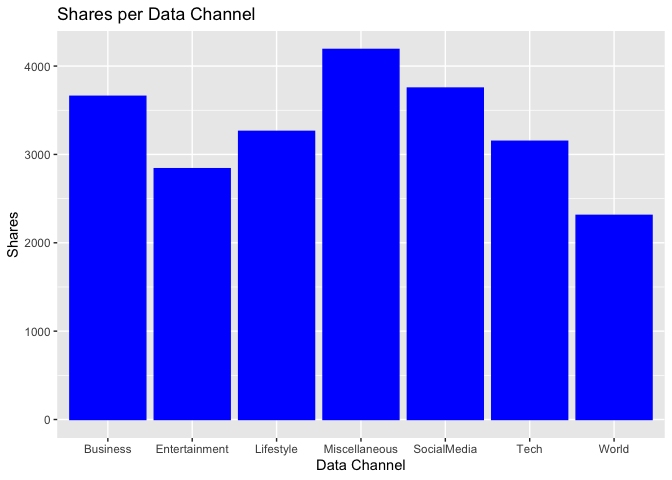

Project 2
================
Spencer Williams & Stephen Macropoulos
2023-07-09

- <a href="#introduction" id="toc-introduction">Introduction</a>
- <a href="#purpose-and-methods" id="toc-purpose-and-methods">Purpose and
  Methods</a>
- <a href="#reading-in-data" id="toc-reading-in-data">Reading in Data</a>
- <a href="#summarizations" id="toc-summarizations">Summarizations</a>

# Introduction

The (Online News
Popularity)\[<https://archive.ics.uci.edu/dataset/332/online+news+popularity>\]
is a data set with a heterogeneous set of features about articles
published by (Mashable)\[www.mashable.com\]. Multivariate data was
gathered on sixty-one variables over a two year span. Our end result is
to predict the number of shares in social networks. Below are some of
the variables we will be looking at to help our prediction.

`Shares` - Number of shares (target) `n_tokens_title` - Number of words
in the title `n_unique_tokens` - Rate of unique words in the content
`num_imgs` - Number of images `num_videos` - Number of videos
`num_keywords` - Number of keywords in the metadata
`data_channel_is *` - There are six binary variables that will only be
attributed to one variable. Theses include lifestyle, entertainment,
business, social media, tech, and world. `rate_positive_words` - Rate of
positive words among non-neutral `rate_negative_words` - Rate of
negative words among non-neutral

# Purpose and Methods

Our end goal is to be able to predict the number of shares based on
having data from the eight variables listed above. We are going to split
the data set into two sets: training (70%) and test (30%). (Linear
Regression Models)\[<https://en.wikipedia.org/wiki/Linear_regression>\]
and (Ensemble Tree-Based
Models)\[<https://towardsdatascience.com/decision-trees-understanding-the-basis-of-ensemble-methods-e075d5bfa704>\]
will be utilized to help us predict the total number of shares. *Random
Forest Models* and *Boosted Tree Models* will be chosen using
cross-validation.

# Reading in Data

The read.csv() file name will change depending on who is importing the
Online News Popularity data. We have dropped any unneccessary variables
that will not be used to help us in our predictions.

``` r
# Will need to change this depending on who is working!
newsPop <- read.csv("/Users/monicabeingolea/Documents/ST558/OnlineNewsPopularity/OnlineNewsPopularity.csv")
# Only selecting the columns of interest
newsPop <- newsPop[ , c(3,5,10,11,13,14:19,49,50,61)]
# Check for missing values
sum(is.na(newsPop))
```

    ## [1] 0

We want to subset the data to work based on the different data channel
of interest. Creating a new variable called `data_channel` will allow
this to work successfully. This way, we can turn our focus to a singular
column as opposed to having six binary variables. We will use the
`mutate` function in the *tidyverse* package. Replacing NA’s in the
`data_channel` variable and setting it as a factor is very important in
order to help us predict the total shares.

``` r
library(tidyverse)
```

    ## ── Attaching core tidyverse packages ──────────────────────── tidyverse 2.0.0 ──
    ## ✔ dplyr     1.1.2     ✔ readr     2.1.4
    ## ✔ forcats   1.0.0     ✔ stringr   1.5.0
    ## ✔ ggplot2   3.4.2     ✔ tibble    3.2.1
    ## ✔ lubridate 1.9.2     ✔ tidyr     1.3.0
    ## ✔ purrr     1.0.1     
    ## ── Conflicts ────────────────────────────────────────── tidyverse_conflicts() ──
    ## ✖ dplyr::filter() masks stats::filter()
    ## ✖ dplyr::lag()    masks stats::lag()
    ## ℹ Use the conflicted package (<http://conflicted.r-lib.org/>) to force all conflicts to become errors

``` r
# Create new variable data_channel
newsPop <- newsPop %>% mutate(data_channel = case_when(data_channel_is_bus == 1 ~ "Business", data_channel_is_entertainment == 1 ~ "Entertainment", data_channel_is_lifestyle == 1 ~ "Lifestyle", data_channel_is_socmed == 1 ~ "SocialMedia", data_channel_is_tech == 1 ~ "Tech", data_channel_is_world == 1 ~ "World"))
# Replace any missing values with "Miscellaneous"
newsPop$data_channel <- replace_na(newsPop$data_channel, "Miscellaneous")
# Make data_channel a factor variable
newsPop$data_channel <- as.factor(newsPop$data_channel)
```

Since we have added a new `data_channel` variable with the appropriate
variables, the data_channel_is\* variables can be removed from our data
set.

``` r
# Remove data_channel_is*
newsPop <- newsPop[ , -c(6:11)]
```

# Summarizations

The first thing that we wanted to look at was the number of shares for
each data channel. One way to look at this is using a number summary to
compare the means.

``` r
# Number summary
tapply(newsPop$shares, newsPop$data_channel, summary)
```

    ## $Business
    ##     Min.  1st Qu.   Median     Mean  3rd Qu.     Max. 
    ##      1.0    952.2   1400.0   3063.0   2500.0 690400.0 
    ## 
    ## $Entertainment
    ##    Min. 1st Qu.  Median    Mean 3rd Qu.    Max. 
    ##      47     833    1200    2970    2100  210300 
    ## 
    ## $Lifestyle
    ##    Min. 1st Qu.  Median    Mean 3rd Qu.    Max. 
    ##      28    1100    1700    3682    3250  208300 
    ## 
    ## $Miscellaneous
    ##    Min. 1st Qu.  Median    Mean 3rd Qu.    Max. 
    ##       4    1100    1900    5945    4700  843300 
    ## 
    ## $SocialMedia
    ##    Min. 1st Qu.  Median    Mean 3rd Qu.    Max. 
    ##       5    1400    2100    3629    3800  122800 
    ## 
    ## $Tech
    ##    Min. 1st Qu.  Median    Mean 3rd Qu.    Max. 
    ##      36    1100    1700    3072    3000  663600 
    ## 
    ## $World
    ##    Min. 1st Qu.  Median    Mean 3rd Qu.    Max. 
    ##      35     827    1100    2288    1900  284700

Based on the summary, the Miscellaneous channel actually had the highest
mean at 5945 shares, but this is most likely due to the outlier with a
total of 843,300 shares. Out of the other six shares listed, Lifestyle
and Social Media are the highest with total shares in the 3,600’s. The
World data channel has the lowest total share count at 2,288. Below is a
barplot to help show these results.

``` r
# Creating base for graph
g <- ggplot(newsPop, aes(x = data_channel, y = shares))
# Adding bars to the graph
g + stat_summary(fun = "mean", geom = "bar", color = "blue", fill = "blue") +
  # Creating labels and titles for graph
  labs(x = "Data Channel", y = "Shares", title = "Shares per Data Channel")
```

<!-- -->
