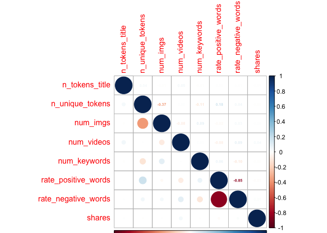
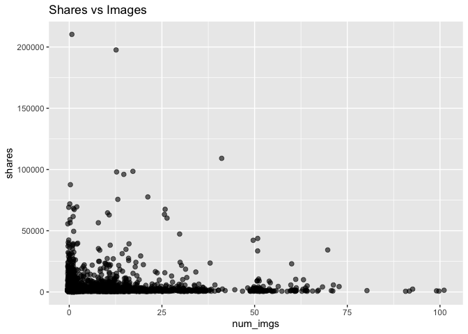
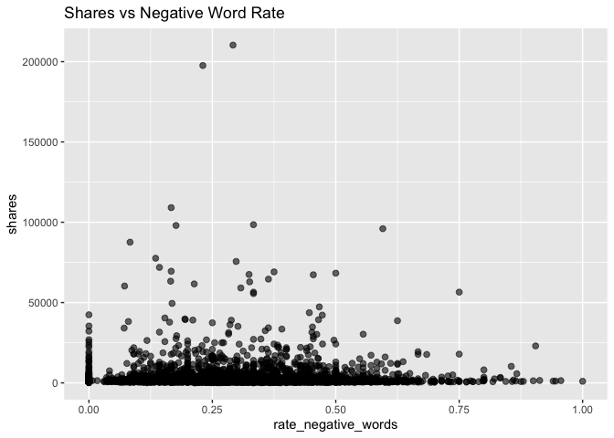

Project 2
================
Spencer Williams & Stephen Macropoulos
2023-07-09

- <a href="#introduction" id="toc-introduction">Introduction</a>
- <a href="#purpose-and-methods" id="toc-purpose-and-methods">Purpose and
  Methods</a>
- <a href="#reading-in-data" id="toc-reading-in-data">Reading in Data</a>
  - <a href="#splitting-the-data" id="toc-splitting-the-data">Splitting the
    Data</a>
- <a href="#summarizations" id="toc-summarizations">Summarizations</a>
- <a href="#modeling" id="toc-modeling">Modeling</a>

# Introduction

The (Online News
Popularity)\[<https://archive.ics.uci.edu/dataset/332/online+news+popularity>\]
is a data set with a heterogeneous set of features about articles
published by (Mashable)\[www.mashable.com\]. Multivariate data was
gathered on sixty-one variables over a two year span. Our end goal is to
predict the number of shares in social networks. Below are some of the
variables we will be looking at to help our prediction.

`Shares` - Number of shares (target)  
`n_tokens_title` - Number of words in the title  
`n_unique_tokens` - Rate of unique words in the content  
`num_imgs` - Number of images  
`num_videos` - Number of videos  
`num_keywords` - Number of keywords in the metadata  
`data_channel_is *` - There are six binary variables which will be
combined into one column. Theses include lifestyle, entertainment,
business, social media, tech, and world  
`rate_positive_words` - Rate of positive words among non-neutral  
`rate_negative_words` - Rate of negative words among non-neutral

# Purpose and Methods

Our end goal is to be able to predict the number of shares based on
having data from the eight variables listed above. We are going to split
the data set into two sets: training (70%) and test (30%). (Linear
Regression Models)\[<https://en.wikipedia.org/wiki/Linear_regression>\]
and (Ensemble Tree-Based
Models)\[<https://towardsdatascience.com/decision-trees-understanding-the-basis-of-ensemble-methods-e075d5bfa704>\]
will be utilized to help us predict the total number of shares. *Random
Forest Models* and *Boosted Tree Models* will be chosen using
cross-validation.

# Reading in Data

The `read.csv()` filename will change depending on who is importing the
Online News Popularity data. We have dropped any unnecessary variables
that will not be used to help us in our predictions.

``` r
# Will need to change this depending on who is working!
newsPop <- read.csv("/Users/monicabeingolea/Documents/ST558/OnlineNewsPopularity/OnlineNewsPopularity.csv")

# Only selecting the columns of interest
newsPop <- newsPop[ , c(3,5,10,11,13,14:19,49,50,61)]

# Check for missing values
sum(is.na(newsPop))
```

    ## [1] 0

We want to subset the data to work based on the different data channel
of interest. Creating a new variable called `data_channel` will allow
this to work successfully. This way, we can turn our focus to a singular
column as opposed to having six binary variables. We will use the
`mutate` function in the *tidyverse* package. Replacing NA’s in the
`data_channel` variable and setting it as a factor is very important in
order to help us predict the total shares.

``` r
library(tidyverse)
# Create new variable data_channel
newsPop <- newsPop %>% mutate(data_channel = case_when(data_channel_is_bus == 1 ~ "Business", data_channel_is_entertainment == 1 ~ "Entertainment", data_channel_is_lifestyle == 1 ~ "Lifestyle", data_channel_is_socmed == 1 ~ "SocialMedia", data_channel_is_tech == 1 ~ "Tech", data_channel_is_world == 1 ~ "World"))
# Replace any missing values with "Miscellaneous"
newsPop$data_channel <- replace_na(newsPop$data_channel, "Miscellaneous")
# Make data_channel a factor variable
newsPop$data_channel <- as.factor(newsPop$data_channel)
```

Since we have added a new `data_channel` variable with the appropriate
variables, the data_channel_is\_\* variables can be removed from our
data set. We will also subset the data to include only observations with
the data channel we want. The possible choices are Entertainment,
SocialMedia, Tech, Business, Miscellaneous, World, and Lifestyle.

``` r
datachannel <- "SocialMedia"

# Remove data_channel_is*
newsPop <- newsPop[, -c(6:11)]
newsPop1 <- newsPop[newsPop$data_channel==datachannel, ]

newsPop1 <- newsPop1[,-9]
```

## Splitting the Data

``` r
# Set seed
set.seed(5432)
# split data into test and training sets
sub <- sample(1:nrow(newsPop1), 0.7 * nrow(newsPop1))

# for full data set
newsPopTrain <- newsPop[sub,]
newsPopTest <- newsPop[-sub, ]

# for Entertainment data channel
newsPop1Train <- newsPop1[sub, ]
newsPop1Test <- newsPop1[-sub, ]
```

# Summarizations

We wanted to see the summary statistics of each variable that we are
using to predict the number of shares. The statistics will include the
minimum, maximum, mean, median, and quartiles.

``` r
# Summary
summary(newsPop1Train)
```

    ##  n_tokens_title   n_unique_tokens     num_imgs        num_videos    
    ##  Min.   : 4.000   Min.   :0.0000   Min.   : 0.000   Min.   : 0.000  
    ##  1st Qu.: 8.000   1st Qu.:0.4623   1st Qu.: 1.000   1st Qu.: 0.000  
    ##  Median :10.000   Median :0.5343   Median : 1.000   Median : 0.000  
    ##  Mean   : 9.648   Mean   :0.5356   Mean   : 4.274   Mean   : 1.112  
    ##  3rd Qu.:11.000   3rd Qu.:0.6085   3rd Qu.: 3.000   3rd Qu.: 1.000  
    ##  Max.   :18.000   Max.   :0.9714   Max.   :62.000   Max.   :73.000  
    ##   num_keywords    rate_positive_words rate_negative_words     shares     
    ##  Min.   : 1.000   Min.   :0.0000      Min.   :0.0000      Min.   :   53  
    ##  1st Qu.: 5.000   1st Qu.:0.6672      1st Qu.:0.1623      1st Qu.: 1400  
    ##  Median : 7.000   Median :0.7500      Median :0.2500      Median : 2100  
    ##  Mean   : 6.605   Mean   :0.7455      Mean   :0.2489      Mean   : 3658  
    ##  3rd Qu.: 8.000   3rd Qu.:0.8333      3rd Qu.:0.3271      3rd Qu.: 3900  
    ##  Max.   :10.000   Max.   :1.0000      Max.   :1.0000      Max.   :59000

It looks like the `n_unique_tokens`, `num_imgs`, `num_videos`, and
`shares` variables are quite right-skewed in our training set.

Another thing that we wanted to look at was the number of shares for
each data channel. One way to look at this is using a number summary to
compare the means.

``` r
# Number summary
tapply(newsPopTrain$shares, newsPopTrain$data_channel, summary)
```

    ## $Business
    ##    Min. 1st Qu.  Median    Mean 3rd Qu.    Max. 
    ##   318.0   830.2  1400.0  1959.3  2100.0 16700.0 
    ## 
    ## $Entertainment
    ##    Min. 1st Qu.  Median    Mean 3rd Qu.    Max. 
    ##   294.0   813.2  1200.0  2497.4  2000.0 69100.0 
    ## 
    ## $Lifestyle
    ##    Min. 1st Qu.  Median    Mean 3rd Qu.    Max. 
    ##     343    1100    1600    2592    2400   18100 
    ## 
    ## $Miscellaneous
    ##    Min. 1st Qu.  Median    Mean 3rd Qu.    Max. 
    ##     341    1000    1500    3177    2600   66900 
    ## 
    ## $SocialMedia
    ##    Min. 1st Qu.  Median    Mean 3rd Qu.    Max. 
    ##     348    1300    2400    3867    4400   51900 
    ## 
    ## $Tech
    ##    Min. 1st Qu.  Median    Mean 3rd Qu.    Max. 
    ##     217    1100    1700    2823    3025   40100 
    ## 
    ## $World
    ##    Min. 1st Qu.  Median    Mean 3rd Qu.    Max. 
    ##     300     712    1200    1820    2100   25200

Based on the summary from the training data set, the Miscellaneous
channel actually had the highest mean at 4,188 shares, but this is most
likely due to the outlier with a total of 112,500 shares. Out of the
other six shares listed, Business and Social Media are the highest with
total shares in the 3,600’s. The World data channel has the lowest total
share count at 2,311. Below is a barplot and box and whisker plot to
help show these results in a graphical form.

Now let’s take a look at some contingency tables. First, we group the
shares values by thousands in a new column called `sharesgroups` and add
it to the data set.

``` r
sharesgroups <- numeric()

for (i in 1:length(newsPop1Train$shares)) {
  sharesgroups[i] <- floor(newsPop1Train$shares[i]/1000)
}

#head(sharesgroups,100)

newsPop1Train <- cbind(newsPop1Train,sharesgroups)
```

Now let’s see the contingency table for `sharesgroups`.

``` r
table(newsPop1Train$sharesgroups)
```

    ## 
    ##   0   1   2   3   4   5   6   7   8   9  10  11  12  13  14  15  16  17  18  19 
    ## 153 573 331 171 111  66  48  31  31  14   9  14  12   7  11   5   6   3   1   3 
    ##  20  21  22  23  25  26  28  30  31  32  34  35  37  47  51  54  57  59 
    ##   2   1   2   3   1   1   2   1   1   1   1   1   2   2   1   1   2   1

We see that most of the observations had less than 20,000 shares. There
are larger jumps in thousands of shares once we get to around 70,000.

Now let’s take a look at a contingency table for the data channels.

``` r
table(newsPopTrain$data_channel)
```

    ## 
    ##      Business Entertainment     Lifestyle Miscellaneous   SocialMedia 
    ##           272           238           157           261           132 
    ##          Tech         World 
    ##           340           226

We see that the Business, Entertainment, Tech, and World data channels
had more observations overall than the Lifestyle and Social Media data
channels.

Now let’s look at the shares totals for each of the data channels in a
bar plot.

``` r
# Creating base for graph
g <- ggplot(newsPopTrain, aes(x = data_channel, y = shares))
# Adding bars to the graph
g + stat_summary(fun = "mean", geom = "bar", color = "blue", fill = "blue") +
  # Creating labels and titles for graph
  labs(x = "Data Channel", y = "Shares", title = "Shares per Data Channel")
```

<!-- -->

It appears that the total number of shares for each data channel are
similar except for the Miscellaneous category. The Business and Social
Media data channels had the most total shares while the World data
channel had the least.

Now let’s see the boxplots to better understand the variability in those
share totals.

``` r
# Creating base for graph
g <- ggplot(newsPopTrain, aes(x = data_channel, y = shares))
# Adding boxplot to the graph
g + geom_boxplot(color = "green") +
  # Setting y-axis limit and labels
  ylim(0, 10000) +
  labs(x = "Data Channel", y = "Shares", title = "Shares per Data Channel")
```

<!-- -->

It looks like the Social Media data channel had the highest median
shares while the Entertainment and World data channels had the smallest
median shares.

We are curious to see if the variables that we have selected have any
correlation between them. In order to check this, a correlation plot has
been created.

``` r
# Load library
library(corrplot)
```

    ## corrplot 0.92 loaded

``` r
# Remove non-numeric variable
newsPopTrain_ <- newsPopTrain[ , -9]
# Find the correlation and plot the graph
newsPopTrainCorr <- cor(newsPopTrain_)
corrplot(newsPopTrainCorr, type="upper", method="number", tl.pos="lt", number.cex=0.5)
corrplot(newsPopTrainCorr, type="lower", add=TRUE, tl.pos="n", number.cex=0.5)
```

<!-- -->

Based on the correlation plots, only one of the variable-pairs seems to
be highly correlated (near 1 in magnitude). The strongest negative
correlation is -0.85 between `rate_positive_words` and
`rate_negative_words`. This is good news in our case to predict the
number of shares.

Let’s also check out some scatterplots for the Entertainment training
set. First, we look at `shares` vs `n_tokens_title`.

``` r
g <- ggplot(newsPop1Train, aes(x = n_tokens_title, y = shares))
g + labs(title = "Shares vs Words in Title") +
  geom_point(alpha = 0.6, size = 2, position = "jitter") 
```

<!-- -->

We can inspect the trend of shares as a function of the number of words
in the title. If the points show an upward trend, then articles with
more words in the title tend to be shared more often. If we see a
negative trend then articles with more words tend to be shared less
often.

Now let’s look at the same plot but for the `n_unique_tokens` variable.
We remove the extreme outlier first.

``` r
newsPop1Train <- newsPop1Train[-915,]

g <- ggplot(newsPop1Train, aes(x = n_unique_tokens, y = shares))
g + labs(title = "Shares vs Unique Words") +
  geom_point(alpha = 0.6, size = 2, position = "jitter") 
```

<!-- -->

We can inspect the trend of shares as a function of the number of unique
words in the content. If the points show an upward trend, then articles
with more unique words in the title tend to be shared more often. If we
see a negative trend then articles with more unique words tend to be
shared less often.

Now let’s look at the scatter plot of `shares` vs `num_imgs`.

``` r
g <- ggplot(newsPop1Train, aes(x = num_imgs, y = shares))
g + labs(title = "Shares vs Images") +
  geom_point(alpha = 0.6, size = 2, position = "jitter")
```

<!-- -->

We can inspect the trend of shares as a function of the number of
images. If the points show an upward trend, then articles with more
images tend to be shared more often. If there is a negative trend, then
articles with more images tend to be shared less often.

Now let’s look at the scatter plot of `shares` vs `num_videos`.

``` r
g <- ggplot(newsPop1Train, aes(x = num_videos, y = shares))
g + labs(title = "Shares vs Videos") +
  geom_point(alpha = 0.6, size = 2, position = "jitter")
```

<!-- -->

This plot looks very similar to the Shares vs Images plot!

Now let’s look at the scatter plot of `shares` vs `num_keywords`.

``` r
g <- ggplot(newsPop1Train, aes(x = num_keywords, y = shares))
g + labs(title = "Shares vs Keywords") +
  geom_point(alpha = 0.6, size = 2, position = "jitter")
```

<!-- -->

We can inspect the trend of shares as a function of the number of
keywords. If the points show an upward trend, then articles with more
keywords tend to be shared more often. If we see a negative trend then
articles with more keywords tend to be shared less often.

Now let’s look at the scatter plot of `shares` vs
\`rate_positive_words\`\`.

``` r
g <- ggplot(newsPop1Train, aes(x = rate_positive_words, y = shares))
g + labs(title = "Shares vs Positive Word Rate") +
  geom_point(alpha = 0.6, size = 2, position = "jitter")
```

<!-- -->

We can inspect the trend of shares as a function of the positive word
rate. If the points show an upward trend, then articles with more
positive words tend to be shared more often. If we see a negative trend
then articles with more positive words tend to be shared less often.

And finally let’s look at the scatter plot of `shares` vs
\`rate_negative_words\`\`.

``` r
g <- ggplot(newsPop1Train, aes(x = rate_negative_words, y = shares))
g + labs(title = "Shares vs Negative Word Rate") +
  geom_point(alpha = 0.6, size = 2, position = "jitter")
```

<!-- -->

This plot looks like the mirror image of the shares vs positive word
rate plot!

# Modeling

We will use linear regression to investigate which variables best
predict the number of shares.

Linear regression is a statistical modeling procedure which optimally
estimates the slope parameters (via least squares) for each explanatory
variable in a pre-specified linear equation of the slopes. The
assumption of error normality is often made in order to calculate
confidence intervals and prediction intervals for the average and future
responses respectively. The reliability of this technique depends on the
accuracy of the chosen linear equation of the slope parameters. A
misspecified model equation can severely mislead inference and result in
very poor predictive power. Hence, the analyst often tries many
different model equations with the most sensible explanatory variables
for the given response until the parameter estimates are statistically
significant and the information criteria are relatively optimized.

The first linear regression model will consist of all the predictive
variables that we have chosen (omitting the `sharesgroups` variable) in
linear form. After looking at the significance level of each variable,
our second linear regression model will be selected. This has been
selected based on the results for every data channel combined, so we
will analyze each one using the same two models.

``` r
newsPop1Train <- newsPop1Train[,-9]

# Create a linear regression
model1 <- lm(shares ~ ., data = newsPop1Train) 
summary(model1)
```

    ## 
    ## Call:
    ## lm(formula = shares ~ ., data = newsPop1Train)
    ## 
    ## Residuals:
    ##    Min     1Q Median     3Q    Max 
    ##  -4652  -2163  -1319    179  55569 
    ## 
    ## Coefficients:
    ##                     Estimate Std. Error t value Pr(>|t|)    
    ## (Intercept)          4052.66    1849.17   2.192 0.028550 *  
    ## n_tokens_title        -34.42      60.82  -0.566 0.571487    
    ## n_unique_tokens     -5986.20    1214.18  -4.930 9.06e-07 ***
    ## num_imgs              -58.40      17.22  -3.391 0.000714 ***
    ## num_videos             14.41      34.34   0.419 0.674937    
    ## num_keywords           41.01      58.10   0.706 0.480420    
    ## rate_positive_words  2638.40    1850.64   1.426 0.154156    
    ## rate_negative_words  4539.07    1971.17   2.303 0.021420 *  
    ## ---
    ## Signif. codes:  0 '***' 0.001 '**' 0.01 '*' 0.05 '.' 0.1 ' ' 1
    ## 
    ## Residual standard error: 5107 on 1617 degrees of freedom
    ## Multiple R-squared:  0.01925,    Adjusted R-squared:  0.01501 
    ## F-statistic: 4.535 on 7 and 1617 DF,  p-value: 5.061e-05

We can use the above output to gauge the strength of this model. If the
overall p-value at the bottom is small then we can use the asterisks to
see which are the most useful predictors in this model.

``` r
# Create a linear regression

model2 <- lm(shares ~ poly(n_tokens_title,2) + poly(n_unique_tokens,2) +
               poly(num_imgs,2) + poly(num_videos,2) + poly(num_keywords,2) +
               poly(rate_positive_words,2) + poly(rate_negative_words,2), 
               data = newsPop1Train)
 
summary(model2)
```

    ## 
    ## Call:
    ## lm(formula = shares ~ poly(n_tokens_title, 2) + poly(n_unique_tokens, 
    ##     2) + poly(num_imgs, 2) + poly(num_videos, 2) + poly(num_keywords, 
    ##     2) + poly(rate_positive_words, 2) + poly(rate_negative_words, 
    ##     2), data = newsPop1Train)
    ## 
    ## Residuals:
    ##    Min     1Q Median     3Q    Max 
    ##  -5379  -2151  -1301    267  55447 
    ## 
    ## Coefficients: (1 not defined because of singularities)
    ##                               Estimate Std. Error t value Pr(>|t|)    
    ## (Intercept)                     3648.0      126.4  28.863  < 2e-16 ***
    ## poly(n_tokens_title, 2)1       -1800.0     5154.9  -0.349  0.72700    
    ## poly(n_tokens_title, 2)2        -351.8     5174.2  -0.068  0.94580    
    ## poly(n_unique_tokens, 2)1     -33949.6     6711.7  -5.058 4.71e-07 ***
    ## poly(n_unique_tokens, 2)2      14971.8     8005.9   1.870  0.06165 .  
    ## poly(num_imgs, 2)1            -22846.7     5855.6  -3.902 9.95e-05 ***
    ## poly(num_imgs, 2)2             -9374.2     5211.2  -1.799  0.07223 .  
    ## poly(num_videos, 2)1            1848.6     5224.8   0.354  0.72352    
    ## poly(num_videos, 2)2           -1188.1     5204.4  -0.228  0.81945    
    ## poly(num_keywords, 2)1          2940.4     5213.2   0.564  0.57281    
    ## poly(num_keywords, 2)2        -14639.0     5123.6  -2.857  0.00433 ** 
    ## poly(rate_positive_words, 2)1  34725.9    18523.5   1.875  0.06102 .  
    ## poly(rate_positive_words, 2)2  -1811.8     7599.0  -0.238  0.81158    
    ## poly(rate_negative_words, 2)1  41991.6    18712.2   2.244  0.02496 *  
    ## poly(rate_negative_words, 2)2       NA         NA      NA       NA    
    ## ---
    ## Signif. codes:  0 '***' 0.001 '**' 0.01 '*' 0.05 '.' 0.1 ' ' 1
    ## 
    ## Residual standard error: 5095 on 1611 degrees of freedom
    ## Multiple R-squared:  0.02738,    Adjusted R-squared:  0.01953 
    ## F-statistic: 3.488 on 13 and 1611 DF,  p-value: 2.195e-05

We can use the above output to gauge the strength of this model. If the
overall p-value at the bottom is small then we can use the asterisks to
see which are the most useful predictors in this model.

We are going to analyze the (random forest
model)\[<https://towardsdatascience.com/understanding-random-forest-58381e0602d2>\].
This model allows a user to combine multiple trees from bootstrap
samples. In most cases, the bagged trees predictions are more correlated
which will result in a smaller reduction in variance from aggregation.
The random forest model uses a random subset of the predictors for each
bootstrap tree fit.

``` r
# Load library
library(randomForest)
```

    ## randomForest 4.7-1.1

    ## Type rfNews() to see new features/changes/bug fixes.

    ## 
    ## Attaching package: 'randomForest'

    ## The following object is masked from 'package:dplyr':
    ## 
    ##     combine

    ## The following object is masked from 'package:ggplot2':
    ## 
    ##     margin

``` r
# Produce random forest model
newsPopFit_rf <- randomForest(shares ~ ., data = newsPop1Train, 
                              mtry = ncol(newsPop1Train)/3, 
                              ntree=200, importance=TRUE)
```

We will also use a boosted tree model to predict the number of shares.

Boosted trees are a general approach that can be applied to trees. The
trees are grown sequentially, each subsequent tree is grown on a
modified version of the original data, and predictions are updated as
the trees are grown. Cross validation is also used to select the
shrinkage and depth parameters.

``` r
library(caret)
```

    ## Loading required package: lattice

    ## 
    ## Attaching package: 'caret'

    ## The following object is masked from 'package:purrr':
    ## 
    ##     lift

``` r
n.trees <- c(25,50,100,150,200)
interaction.depth <- 1:4
shrinkage <- 0.1
n.minobsinnode <- 10
X <- expand.grid(n.trees = n.trees, interaction.depth = interaction.depth,
            shrinkage = shrinkage, n.minobsinnode = n.minobsinnode)

newsPopFit_boost <- train(shares ~ ., data = newsPop1Train,
               method = "gbm",
               trControl = trainControl(method = "cv", number = 5),
               tuneGrid = X)
```

    ## Iter   TrainDeviance   ValidDeviance   StepSize   Improve
    ##      1 24342267.3175             nan     0.1000 -23644.8453
    ##      2 24301339.1994             nan     0.1000 -19457.4268
    ##      3 24244485.0992             nan     0.1000 44174.8082
    ##      4 24183868.0626             nan     0.1000 13398.6748
    ##      5 24146887.9943             nan     0.1000 18659.2863
    ##      6 24137992.9861             nan     0.1000 -36205.3832
    ##      7 24097161.6882             nan     0.1000 6907.0195
    ##      8 24066456.9213             nan     0.1000 15404.2132
    ##      9 24014058.5432             nan     0.1000 -16520.7025
    ##     10 23998661.5688             nan     0.1000 -3062.7451
    ##     20 23739237.8626             nan     0.1000 10130.3303
    ##     40 23405155.7889             nan     0.1000 -5538.5027
    ##     60 23210173.0149             nan     0.1000 -27804.8935
    ##     80 23043443.7503             nan     0.1000 5147.4346
    ##    100 22932644.9505             nan     0.1000 -37184.6099
    ##    120 22797586.9417             nan     0.1000 -19062.1215
    ##    140 22710338.9615             nan     0.1000 -17365.1785
    ##    160 22595802.1527             nan     0.1000 -11896.7306
    ##    180 22482046.6005             nan     0.1000 -11655.6594
    ##    200 22410527.3271             nan     0.1000 -38364.0713
    ## 
    ## Iter   TrainDeviance   ValidDeviance   StepSize   Improve
    ##      1 24252145.3568             nan     0.1000 12408.5307
    ##      2 24136963.7670             nan     0.1000 42967.9446
    ##      3 24114715.5055             nan     0.1000 -40206.7776
    ##      4 24059205.1415             nan     0.1000 -5245.7449
    ##      5 23919071.3282             nan     0.1000 83202.2879
    ##      6 23860038.8007             nan     0.1000 -7640.5604
    ##      7 23797277.1114             nan     0.1000 -29070.8758
    ##      8 23687399.8792             nan     0.1000 -75898.8435
    ##      9 23617432.1319             nan     0.1000 29956.8479
    ##     10 23555992.2688             nan     0.1000 -32825.8390
    ##     20 22900829.8620             nan     0.1000 -15506.7670
    ##     40 22148102.7147             nan     0.1000 -27651.8685
    ##     60 21691167.2305             nan     0.1000 -36476.2606
    ##     80 21225390.4070             nan     0.1000 -28803.7529
    ##    100 20780817.1959             nan     0.1000 -25626.4324
    ##    120 20424310.8864             nan     0.1000 -24252.0985
    ##    140 20186455.3328             nan     0.1000 -33024.1004
    ##    160 19834639.5252             nan     0.1000 -41953.7418
    ##    180 19589142.9181             nan     0.1000 -15874.5497
    ##    200 19399468.7103             nan     0.1000 -34954.0218
    ## 
    ## Iter   TrainDeviance   ValidDeviance   StepSize   Improve
    ##      1 24040909.1035             nan     0.1000 -10727.6087
    ##      2 23934736.1608             nan     0.1000 43420.6467
    ##      3 23853404.6583             nan     0.1000 -2663.5145
    ##      4 23693692.0330             nan     0.1000 20832.2153
    ##      5 23554799.1810             nan     0.1000 28710.2993
    ##      6 23384688.1063             nan     0.1000 -58001.5911
    ##      7 23221435.0696             nan     0.1000 -103568.2391
    ##      8 23085719.8393             nan     0.1000 -2031.2594
    ##      9 22924104.5270             nan     0.1000 112053.6717
    ##     10 22827904.4093             nan     0.1000 19772.9751
    ##     20 21975794.3962             nan     0.1000 20618.5754
    ##     40 21032393.3724             nan     0.1000 -23164.5063
    ##     60 20341175.7338             nan     0.1000 -62365.3167
    ##     80 19538021.7994             nan     0.1000 3802.1220
    ##    100 19043909.9974             nan     0.1000 -12458.7482
    ##    120 18542685.2882             nan     0.1000 -31034.1571
    ##    140 18055461.0000             nan     0.1000 -57572.5021
    ##    160 17654334.6648             nan     0.1000 -84580.7907
    ##    180 17380902.8675             nan     0.1000 -64387.5989
    ##    200 16951135.3585             nan     0.1000 -51902.5663
    ## 
    ## Iter   TrainDeviance   ValidDeviance   StepSize   Improve
    ##      1 24068361.2214             nan     0.1000 64060.0108
    ##      2 23940375.9328             nan     0.1000 81753.5281
    ##      3 23806688.2093             nan     0.1000 96942.8482
    ##      4 23731366.7143             nan     0.1000 10116.7167
    ##      5 23562520.5376             nan     0.1000 19220.2186
    ##      6 23470234.5520             nan     0.1000 -29663.2911
    ##      7 23407373.5483             nan     0.1000 -27414.2035
    ##      8 23297354.4113             nan     0.1000 5154.2802
    ##      9 23174200.4951             nan     0.1000 -1703.8451
    ##     10 23083339.8895             nan     0.1000 -28183.7133
    ##     20 21974827.8262             nan     0.1000 -12226.3527
    ##     40 20539167.5293             nan     0.1000 -75799.5136
    ##     60 19386973.9544             nan     0.1000 -51336.3381
    ##     80 18679215.2946             nan     0.1000 -40018.6574
    ##    100 17891699.4749             nan     0.1000 -36499.4343
    ##    120 17204060.2897             nan     0.1000 -57675.9530
    ##    140 16706204.2872             nan     0.1000 -26571.0487
    ##    160 16180570.9014             nan     0.1000 -52443.7743
    ##    180 15580660.9897             nan     0.1000 -26156.2004
    ##    200 15203732.5649             nan     0.1000 -45215.5584
    ## 
    ## Iter   TrainDeviance   ValidDeviance   StepSize   Improve
    ##      1 25907565.1970             nan     0.1000 3651.5471
    ##      2 25845696.6279             nan     0.1000 -23257.4282
    ##      3 25799737.7682             nan     0.1000 -4590.9898
    ##      4 25776521.1958             nan     0.1000 -13696.5912
    ##      5 25732972.2324             nan     0.1000 -23060.5499
    ##      6 25713305.8884             nan     0.1000 -3306.2288
    ##      7 25718944.4889             nan     0.1000 -51088.5095
    ##      8 25689696.5727             nan     0.1000 -54236.8327
    ##      9 25672099.3716             nan     0.1000 -31616.0831
    ##     10 25638093.2975             nan     0.1000 -14369.9485
    ##     20 25447668.6784             nan     0.1000 -21140.2535
    ##     40 25110098.6788             nan     0.1000 -90500.5084
    ##     60 24873346.2605             nan     0.1000   33.3054
    ##     80 24689324.4706             nan     0.1000 -25883.2379
    ##    100 24547252.5169             nan     0.1000 -16828.9777
    ##    120 24399025.6527             nan     0.1000 -21632.2818
    ##    140 24280622.6989             nan     0.1000 -7657.4615
    ##    160 24209044.5263             nan     0.1000 -34235.2307
    ##    180 24144796.0388             nan     0.1000 -30616.8368
    ##    200 24083868.3183             nan     0.1000 -41799.0895
    ## 
    ## Iter   TrainDeviance   ValidDeviance   StepSize   Improve
    ##      1 25908387.3611             nan     0.1000 26480.4362
    ##      2 25847865.2354             nan     0.1000 34720.0565
    ##      3 25775782.6997             nan     0.1000 22314.9120
    ##      4 25677255.6138             nan     0.1000 -9840.5298
    ##      5 25591519.9485             nan     0.1000 -38111.1531
    ##      6 25529304.3695             nan     0.1000 -1871.0313
    ##      7 25479372.3831             nan     0.1000 -15973.2206
    ##      8 25430226.4077             nan     0.1000 -24383.9315
    ##      9 25347673.4993             nan     0.1000 46279.5929
    ##     10 25318207.5705             nan     0.1000 -9346.6459
    ##     20 24862104.3261             nan     0.1000 -18628.5685
    ##     40 23991854.6563             nan     0.1000 -13696.1624
    ##     60 23521365.4107             nan     0.1000 -43961.6518
    ##     80 23156120.4086             nan     0.1000 -23187.9292
    ##    100 22878242.0298             nan     0.1000 -58435.8022
    ##    120 22549209.5039             nan     0.1000 -36849.5445
    ##    140 22241873.1261             nan     0.1000 -58320.4131
    ##    160 21991058.1856             nan     0.1000 -21998.4413
    ##    180 21715548.6035             nan     0.1000 -33235.9388
    ##    200 21469763.2202             nan     0.1000 -16789.8066
    ## 
    ## Iter   TrainDeviance   ValidDeviance   StepSize   Improve
    ##      1 25928619.1205             nan     0.1000 -51058.0362
    ##      2 25705712.4742             nan     0.1000 64759.5891
    ##      3 25620444.4253             nan     0.1000 -16193.1953
    ##      4 25506183.9341             nan     0.1000 1836.1333
    ##      5 25402982.8825             nan     0.1000 28905.3111
    ##      6 25263397.1102             nan     0.1000 -21028.8422
    ##      7 25103116.6094             nan     0.1000 96828.8613
    ##      8 24950674.6634             nan     0.1000 18466.3734
    ##      9 24869726.5694             nan     0.1000 -22241.6752
    ##     10 24807081.4827             nan     0.1000 -32342.8601
    ##     20 24186244.0289             nan     0.1000 -66527.7743
    ##     40 23299083.1819             nan     0.1000 -53615.0880
    ##     60 22491312.2628             nan     0.1000 -30644.1670
    ##     80 21949755.3795             nan     0.1000 -67493.4369
    ##    100 21432905.0401             nan     0.1000 -34788.9653
    ##    120 20955046.9737             nan     0.1000 -38772.9188
    ##    140 20445835.1544             nan     0.1000 -47790.9486
    ##    160 20047561.0885             nan     0.1000 -53589.2738
    ##    180 19548581.9269             nan     0.1000 -73331.0500
    ##    200 19001308.7454             nan     0.1000 -47043.7301
    ## 
    ## Iter   TrainDeviance   ValidDeviance   StepSize   Improve
    ##      1 25899364.5430             nan     0.1000 14175.8139
    ##      2 25760908.2855             nan     0.1000 30438.5167
    ##      3 25554367.5303             nan     0.1000 21629.6899
    ##      4 25441516.8203             nan     0.1000 53417.7904
    ##      5 25349042.3765             nan     0.1000 15871.1586
    ##      6 25281109.9334             nan     0.1000 -40837.7241
    ##      7 25189703.2203             nan     0.1000 -5340.4052
    ##      8 25089830.9492             nan     0.1000 -35103.0462
    ##      9 24992069.8611             nan     0.1000 21102.7909
    ##     10 24934593.0458             nan     0.1000 -17972.9456
    ##     20 23819155.3067             nan     0.1000 -122842.5341
    ##     40 22443944.5271             nan     0.1000 -37521.0804
    ##     60 21379804.2766             nan     0.1000 -68284.8168
    ##     80 20534250.3639             nan     0.1000 -108496.0580
    ##    100 19845620.8575             nan     0.1000 -47298.9592
    ##    120 19193284.7344             nan     0.1000 -39151.5301
    ##    140 18527037.6040             nan     0.1000 -135080.1789
    ##    160 17965754.1604             nan     0.1000 -50951.7003
    ##    180 17475831.4049             nan     0.1000 -31120.3777
    ##    200 17046878.1752             nan     0.1000 -43812.8677
    ## 
    ## Iter   TrainDeviance   ValidDeviance   StepSize   Improve
    ##      1 28604170.7213             nan     0.1000 30394.8301
    ##      2 28497629.7315             nan     0.1000 3871.3699
    ##      3 28404746.3983             nan     0.1000 41519.6359
    ##      4 28320435.1066             nan     0.1000 50883.0054
    ##      5 28256855.5984             nan     0.1000 40894.4953
    ##      6 28172412.6262             nan     0.1000 31180.2603
    ##      7 28130207.7433             nan     0.1000 35030.5150
    ##      8 28061508.3741             nan     0.1000 5627.9864
    ##      9 28018938.0047             nan     0.1000 -37363.0691
    ##     10 27969357.3362             nan     0.1000 -698.4501
    ##     20 27622806.7726             nan     0.1000 -3386.3006
    ##     40 27129883.5414             nan     0.1000 -8973.2148
    ##     60 26781087.1090             nan     0.1000 -18248.3617
    ##     80 26508948.7044             nan     0.1000 -10750.2380
    ##    100 26349542.9305             nan     0.1000 -33172.9033
    ##    120 26180645.6948             nan     0.1000 -15872.6383
    ##    140 26048633.3683             nan     0.1000 -97039.1078
    ##    160 25926993.9032             nan     0.1000 -19809.8738
    ##    180 25792307.9275             nan     0.1000 -40018.2577
    ##    200 25710017.9370             nan     0.1000 -35333.8510
    ## 
    ## Iter   TrainDeviance   ValidDeviance   StepSize   Improve
    ##      1 28425716.9339             nan     0.1000 18595.8168
    ##      2 28281923.4858             nan     0.1000 73320.4567
    ##      3 28056491.4264             nan     0.1000 2052.0420
    ##      4 27929849.3311             nan     0.1000 78299.2260
    ##      5 27854525.3863             nan     0.1000 -17752.5504
    ##      6 27761354.3810             nan     0.1000 20475.2537
    ##      7 27708963.3271             nan     0.1000 -16123.3698
    ##      8 27578914.5184             nan     0.1000 -8844.4892
    ##      9 27521249.8222             nan     0.1000 30178.3297
    ##     10 27388589.3132             nan     0.1000 -58012.2267
    ##     20 26695852.8186             nan     0.1000 -71397.5559
    ##     40 25863429.0806             nan     0.1000 -19361.0111
    ##     60 25259509.9873             nan     0.1000 -52862.4429
    ##     80 24810932.4721             nan     0.1000 -98140.0543
    ##    100 24343670.6631             nan     0.1000 -33227.1855
    ##    120 24010543.8393             nan     0.1000 -48763.7991
    ##    140 23724005.4884             nan     0.1000 -81877.9100
    ##    160 23377144.5468             nan     0.1000 -53538.6540
    ##    180 23073081.2164             nan     0.1000 -79653.0852
    ##    200 22706333.5049             nan     0.1000 -26878.1485
    ## 
    ## Iter   TrainDeviance   ValidDeviance   StepSize   Improve
    ##      1 28426090.9395             nan     0.1000 102907.8222
    ##      2 28213428.5850             nan     0.1000 -74138.6277
    ##      3 28058231.3067             nan     0.1000 22920.0466
    ##      4 27977953.4670             nan     0.1000 6404.7009
    ##      5 27685870.8091             nan     0.1000 109666.0121
    ##      6 27605403.8057             nan     0.1000 3549.1724
    ##      7 27493071.2109             nan     0.1000 -52868.9490
    ##      8 27392054.0890             nan     0.1000 -11834.3787
    ##      9 27304991.9945             nan     0.1000 7092.3202
    ##     10 27053438.4030             nan     0.1000 -126689.6990
    ##     20 26103867.4903             nan     0.1000 -50508.6493
    ##     40 24998985.1821             nan     0.1000 -27621.2834
    ##     60 24033430.1495             nan     0.1000 -65840.0650
    ##     80 23358765.7616             nan     0.1000 -56139.3411
    ##    100 22810943.1760             nan     0.1000 -68530.0598
    ##    120 22141729.3201             nan     0.1000 -64773.2655
    ##    140 21729351.2504             nan     0.1000 -23067.0513
    ##    160 21184585.4701             nan     0.1000 -68437.6155
    ##    180 20818649.1881             nan     0.1000 -33100.9028
    ##    200 20417606.6644             nan     0.1000 -52714.8313
    ## 
    ## Iter   TrainDeviance   ValidDeviance   StepSize   Improve
    ##      1 28389987.8144             nan     0.1000 66437.8927
    ##      2 28119350.9230             nan     0.1000 102221.4499
    ##      3 27905567.3467             nan     0.1000 8932.9613
    ##      4 27746195.3882             nan     0.1000  295.7200
    ##      5 27558856.6410             nan     0.1000 -79221.4431
    ##      6 27376098.9152             nan     0.1000 23996.1755
    ##      7 27228025.9694             nan     0.1000 -3140.2041
    ##      8 26945556.2006             nan     0.1000 173208.3196
    ##      9 26807688.7746             nan     0.1000 26730.0615
    ##     10 26627867.8824             nan     0.1000 -60867.0554
    ##     20 25708554.4499             nan     0.1000 -89205.2890
    ##     40 24074397.5569             nan     0.1000 -37344.8570
    ##     60 22745191.5027             nan     0.1000 -90405.1356
    ##     80 21974636.7890             nan     0.1000 -65914.0107
    ##    100 21053250.8530             nan     0.1000 -42334.7633
    ##    120 20390083.4500             nan     0.1000 -74877.9477
    ##    140 19781949.5922             nan     0.1000 -26551.7253
    ##    160 19164779.6704             nan     0.1000 -61268.2769
    ##    180 18575042.6367             nan     0.1000 -56838.4334
    ##    200 18011978.3347             nan     0.1000 -90751.3077
    ## 
    ## Iter   TrainDeviance   ValidDeviance   StepSize   Improve
    ##      1 26000910.5196             nan     0.1000 13670.8903
    ##      2 25912930.1004             nan     0.1000 35551.5825
    ##      3 25844906.5394             nan     0.1000 65938.2125
    ##      4 25765331.8348             nan     0.1000 6099.6057
    ##      5 25723447.8506             nan     0.1000 6569.3311
    ##      6 25676962.1344             nan     0.1000 12073.8635
    ##      7 25632675.9689             nan     0.1000 17657.2137
    ##      8 25604654.6302             nan     0.1000 -3582.4009
    ##      9 25545728.4804             nan     0.1000 39203.1995
    ##     10 25511135.9163             nan     0.1000 20905.3489
    ##     20 25229553.4349             nan     0.1000 -7556.9693
    ##     40 24847728.7519             nan     0.1000 -76211.6052
    ##     60 24604734.9575             nan     0.1000 -13976.8370
    ##     80 24424358.8859             nan     0.1000 -18040.3742
    ##    100 24204167.2005             nan     0.1000 -4079.2547
    ##    120 24095707.5002             nan     0.1000 -24360.7201
    ##    140 23964711.2418             nan     0.1000 -28032.3296
    ##    160 23879477.5092             nan     0.1000 -45710.9992
    ##    180 23800881.7773             nan     0.1000 -26128.0562
    ##    200 23670963.6944             nan     0.1000 -25503.1057
    ## 
    ## Iter   TrainDeviance   ValidDeviance   StepSize   Improve
    ##      1 25985037.9210             nan     0.1000 -53771.2700
    ##      2 25777701.1509             nan     0.1000 32086.9433
    ##      3 25718145.7638             nan     0.1000 -22843.9367
    ##      4 25563298.0305             nan     0.1000 -3292.9777
    ##      5 25487838.7683             nan     0.1000 31534.1887
    ##      6 25373721.6203             nan     0.1000 -9043.8796
    ##      7 25261691.3585             nan     0.1000 49956.2810
    ##      8 25198632.0609             nan     0.1000 -11713.6081
    ##      9 25119485.7696             nan     0.1000 -24277.4569
    ##     10 25025347.7188             nan     0.1000 41720.4659
    ##     20 24366224.2099             nan     0.1000 -58749.8375
    ##     40 23546952.1037             nan     0.1000 -3519.6360
    ##     60 22752583.2236             nan     0.1000 -34796.5109
    ##     80 22332164.4375             nan     0.1000 -46519.7882
    ##    100 21843251.5516             nan     0.1000 -30317.8399
    ##    120 21584832.7461             nan     0.1000 -19435.7394
    ##    140 21322864.1176             nan     0.1000 -82436.5471
    ##    160 21095901.4692             nan     0.1000 -45246.4258
    ##    180 20749992.5525             nan     0.1000 -75558.5960
    ##    200 20470553.4931             nan     0.1000 -52730.4465
    ## 
    ## Iter   TrainDeviance   ValidDeviance   StepSize   Improve
    ##      1 25882446.2595             nan     0.1000 62564.6936
    ##      2 25730992.8402             nan     0.1000 -68377.6263
    ##      3 25459424.2936             nan     0.1000 144714.4189
    ##      4 25335942.3462             nan     0.1000 18107.2672
    ##      5 25212620.7295             nan     0.1000 85098.6728
    ##      6 25036492.4211             nan     0.1000 67425.6232
    ##      7 24954975.9133             nan     0.1000 16182.6788
    ##      8 24794638.4772             nan     0.1000 24726.3372
    ##      9 24543336.3956             nan     0.1000 -58905.9407
    ##     10 24369400.5318             nan     0.1000 -36266.1980
    ##     20 23526312.8089             nan     0.1000 -63599.1809
    ##     40 22146582.3783             nan     0.1000  951.3802
    ##     60 21367908.1514             nan     0.1000 -38332.4937
    ##     80 20825687.8808             nan     0.1000 -85520.8413
    ##    100 20183470.9463             nan     0.1000 -68433.3221
    ##    120 19821737.5231             nan     0.1000 -46235.3371
    ##    140 19380250.5729             nan     0.1000 -70921.9720
    ##    160 18949658.0355             nan     0.1000 -69760.1857
    ##    180 18540806.6231             nan     0.1000 -34374.3291
    ##    200 18254624.0935             nan     0.1000 -52908.6942
    ## 
    ## Iter   TrainDeviance   ValidDeviance   StepSize   Improve
    ##      1 25882264.9493             nan     0.1000 96852.3678
    ##      2 25482491.6113             nan     0.1000 118593.4707
    ##      3 25316531.1979             nan     0.1000 -1019.3991
    ##      4 25206590.3385             nan     0.1000 -17418.8764
    ##      5 25029639.1732             nan     0.1000 -23873.5012
    ##      6 24769751.5842             nan     0.1000 180765.7152
    ##      7 24622261.8469             nan     0.1000 47427.5462
    ##      8 24438055.9689             nan     0.1000 5053.6056
    ##      9 24356108.1099             nan     0.1000 -3098.4500
    ##     10 24278069.0697             nan     0.1000 7374.4993
    ##     20 23431930.2942             nan     0.1000 -105920.9149
    ##     40 22397143.0025             nan     0.1000 -25185.1050
    ##     60 21303882.0074             nan     0.1000 -52041.3364
    ##     80 20382529.2776             nan     0.1000 -75212.1854
    ##    100 19774023.1957             nan     0.1000 -79243.8654
    ##    120 19172063.1531             nan     0.1000 -9464.0368
    ##    140 18655565.0911             nan     0.1000 -41572.1072
    ##    160 18153429.5618             nan     0.1000 -71644.9489
    ##    180 17658219.7317             nan     0.1000 -35239.9967
    ##    200 17230286.7841             nan     0.1000 -112424.1076
    ## 
    ## Iter   TrainDeviance   ValidDeviance   StepSize   Improve
    ##      1 27172908.6303             nan     0.1000 -25557.2298
    ##      2 27062735.8832             nan     0.1000 59207.2941
    ##      3 26983701.0402             nan     0.1000 54473.8324
    ##      4 26937798.1799             nan     0.1000 29481.2446
    ##      5 26903255.8270             nan     0.1000 11917.1000
    ##      6 26885288.5796             nan     0.1000 -3464.9007
    ##      7 26819865.7571             nan     0.1000 4370.4069
    ##      8 26760635.3257             nan     0.1000 -1165.4224
    ##      9 26714512.3275             nan     0.1000 -24759.3815
    ##     10 26674971.6869             nan     0.1000 -3575.2446
    ##     20 26432635.1679             nan     0.1000 -52814.0282
    ##     40 26112184.9044             nan     0.1000 -6471.1672
    ##     60 25808837.0402             nan     0.1000 -13029.3590
    ##     80 25654855.7685             nan     0.1000 -19790.1394
    ##    100 25503673.0503             nan     0.1000 -48359.7180
    ##    120 25322276.3788             nan     0.1000 -23171.0861
    ##    140 25171426.4708             nan     0.1000 -18584.2242
    ##    160 25062487.9009             nan     0.1000 -129206.4492
    ##    180 24936415.3469             nan     0.1000 -10332.1807
    ##    200 24846115.2949             nan     0.1000 -11996.6015
    ## 
    ## Iter   TrainDeviance   ValidDeviance   StepSize   Improve
    ##      1 27032650.4342             nan     0.1000 39265.1910
    ##      2 26993503.0693             nan     0.1000 8657.0273
    ##      3 26889641.5697             nan     0.1000 46842.7094
    ##      4 26849197.1798             nan     0.1000 14610.1432
    ##      5 26819133.0642             nan     0.1000 -20234.7615
    ##      6 26773022.2952             nan     0.1000 6399.4518
    ##      7 26653684.0226             nan     0.1000 -75026.9208
    ##      8 26581137.6306             nan     0.1000 6394.5632
    ##      9 26497390.3739             nan     0.1000 42701.5921
    ##     10 26306429.7374             nan     0.1000 -87313.7105
    ##     20 25718109.4929             nan     0.1000 -17765.1399
    ##     40 24908620.1641             nan     0.1000 -49425.8862
    ##     60 24476323.4998             nan     0.1000 -18640.7872
    ##     80 24101356.1579             nan     0.1000 -22364.5940
    ##    100 23717833.5470             nan     0.1000 -52047.2686
    ##    120 23284908.5030             nan     0.1000 -82682.6431
    ##    140 23027487.0915             nan     0.1000 -35055.4761
    ##    160 22778235.6746             nan     0.1000 -73472.2117
    ##    180 22466871.0365             nan     0.1000 -9336.4107
    ##    200 22221096.0469             nan     0.1000 -38081.3803
    ## 
    ## Iter   TrainDeviance   ValidDeviance   StepSize   Improve
    ##      1 27030906.6281             nan     0.1000 -47251.5289
    ##      2 26920464.1593             nan     0.1000 72949.1709
    ##      3 26731351.9070             nan     0.1000 84062.7054
    ##      4 26625738.2027             nan     0.1000 -36834.5808
    ##      5 26526097.1819             nan     0.1000 46119.2045
    ##      6 26441283.7019             nan     0.1000 -44420.1993
    ##      7 26353061.3560             nan     0.1000 17755.4536
    ##      8 26302076.8806             nan     0.1000 -13395.4606
    ##      9 26217429.1044             nan     0.1000 -20678.0757
    ##     10 26122815.9173             nan     0.1000 -11427.7223
    ##     20 25324686.5336             nan     0.1000 -19381.5120
    ##     40 23860863.8143             nan     0.1000 -60650.0159
    ##     60 22840584.2659             nan     0.1000 14015.9355
    ##     80 22094783.0626             nan     0.1000 -35453.1127
    ##    100 21525808.2006             nan     0.1000 -52502.1329
    ##    120 21125079.1942             nan     0.1000 -48273.2728
    ##    140 20570625.4355             nan     0.1000 -58640.7064
    ##    160 20189065.5135             nan     0.1000 -18765.8001
    ##    180 19691607.0620             nan     0.1000 -46329.3497
    ##    200 19354042.5186             nan     0.1000 -39825.3932
    ## 
    ## Iter   TrainDeviance   ValidDeviance   StepSize   Improve
    ##      1 27083455.8420             nan     0.1000 37826.5013
    ##      2 26909773.8811             nan     0.1000 58805.7793
    ##      3 26783065.0008             nan     0.1000 79585.6377
    ##      4 26651188.5085             nan     0.1000 55018.7561
    ##      5 26408712.6336             nan     0.1000 75983.3666
    ##      6 26242828.3541             nan     0.1000 -52437.7000
    ##      7 26056059.0616             nan     0.1000 6324.8068
    ##      8 25915353.7307             nan     0.1000 -53125.9437
    ##      9 25826383.6416             nan     0.1000 -2904.2007
    ##     10 25734218.5196             nan     0.1000 -67207.1385
    ##     20 24599376.6337             nan     0.1000 -47488.0298
    ##     40 23051018.6451             nan     0.1000 -41108.0392
    ##     60 21956694.2563             nan     0.1000 -53363.8196
    ##     80 21201948.8426             nan     0.1000 -13807.0835
    ##    100 20528234.3463             nan     0.1000 -102104.0711
    ##    120 19838463.7420             nan     0.1000 -41347.9587
    ##    140 19267857.2560             nan     0.1000 -62862.0046
    ##    160 18719803.8717             nan     0.1000 -49089.4837
    ##    180 18292301.9087             nan     0.1000 -103054.3137
    ##    200 17863929.9731             nan     0.1000 -102932.3744
    ## 
    ## Iter   TrainDeviance   ValidDeviance   StepSize   Improve
    ##      1 26389579.8745             nan     0.1000 12069.9079
    ##      2 26252575.6356             nan     0.1000 31851.2750
    ##      3 26191486.8785             nan     0.1000 -15157.0931
    ##      4 26149483.9382             nan     0.1000 -15643.6652
    ##      5 26075064.1294             nan     0.1000 52051.4328
    ##      6 26016989.9273             nan     0.1000 25538.1901
    ##      7 25939331.8439             nan     0.1000 29754.2833
    ##      8 25881496.4707             nan     0.1000 31216.5085
    ##      9 25857521.3999             nan     0.1000 -29449.1345
    ##     10 25822569.7537             nan     0.1000 9098.2302
    ##     20 25344597.6097             nan     0.1000 -32120.2626
    ##     25 25102296.4282             nan     0.1000 -33406.2487

Now we get the RMSE from each model and find the best one. The model
with the highest predictive power will have the smallest RMSE.

``` r
newsPop1Pred_model1 <- predict(model1, newdata = newsPop1Test)
newsPop1Pred_model2 <- predict(model2, newdata = newsPop1Test)
```

    ## Warning in predict.lm(model2, newdata = newsPop1Test): prediction from
    ## rank-deficient fit; attr(*, "non-estim") has doubtful cases

``` r
newsPop1Pred_rf <- predict(newsPopFit_rf, newdata = newsPop1Test)
newsPop1Pred_boost <- predict(newsPopFit_boost, newdata = newsPop1Test)

# Find RMSE
model1_RMSE <- round(sqrt(mean((newsPop1Pred_model1-newsPop1Test$shares)^2)),2)
model2_RMSE <- round(sqrt(mean((newsPop1Pred_model2-newsPop1Test$shares)^2)),2)
RMSE_rf <- round(sqrt(mean((newsPop1Pred_rf-newsPop1Test$shares)^2)),2)
RMSE_boost <- round(sqrt(mean((newsPop1Pred_boost-newsPop1Test$shares)^2)),2)

RMSE_mods <- c(model1_RMSE, "Full Linear Regression Model", 
               model2_RMSE, "Curvi-Linear Regression Model", 
               RMSE_rf, "Random Forest Model", 
               RMSE_boost, "Boosted Tree Model")

RMSE_mods
```

    ## [1] "6242.47"                       "Full Linear Regression Model" 
    ## [3] "6232.97"                       "Curvi-Linear Regression Model"
    ## [5] "6501.08"                       "Random Forest Model"          
    ## [7] "6268.25"                       "Boosted Tree Model"

``` r
paste("The", RMSE_mods[which(RMSE_mods==min(RMSE_mods))+1], "had the smallest RMSE of", RMSE_mods[which(RMSE_mods==min(RMSE_mods))])
```

    ## [1] "The Curvi-Linear Regression Model had the smallest RMSE of 6232.97"
