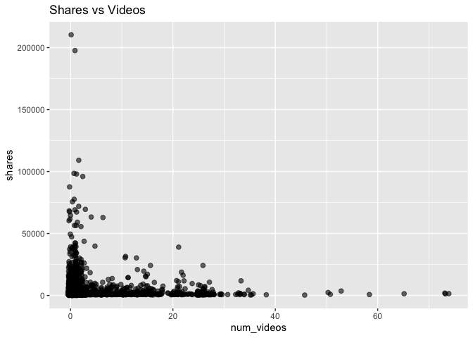
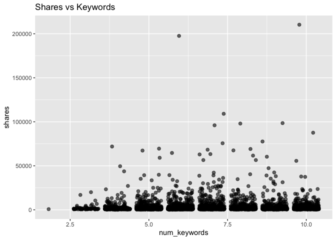

Project 2
================
Spencer Williams & Stephen Macropoulos
2023-07-09

- <a href="#introduction" id="toc-introduction">Introduction</a>
- <a href="#purpose-and-methods" id="toc-purpose-and-methods">Purpose and
  Methods</a>
- <a href="#reading-in-data" id="toc-reading-in-data">Reading in Data</a>
  - <a href="#splitting-the-data" id="toc-splitting-the-data">Splitting the
    Data</a>
- <a href="#summarizations" id="toc-summarizations">Summarizations</a>
- <a href="#modeling" id="toc-modeling">Modeling</a>

# Introduction

The (Online News
Popularity)\[<https://archive.ics.uci.edu/dataset/332/online+news+popularity>\]
is a data set with a heterogeneous set of features about articles
published by (Mashable)\[www.mashable.com\]. Multivariate data was
gathered on sixty-one variables over a two year span. Our end goal is to
predict the number of shares in social networks. Below are some of the
variables we will be looking at to help our prediction.

`Shares` - Number of shares (target)  
`n_tokens_title` - Number of words in the title  
`n_unique_tokens` - Rate of unique words in the content  
`num_imgs` - Number of images  
`num_videos` - Number of videos  
`num_keywords` - Number of keywords in the metadata  
`data_channel_is *` - There are six binary variables which will be
combined into one column. Theses include lifestyle, entertainment,
business, social media, tech, and world  
`rate_positive_words` - Rate of positive words among non-neutral  
`rate_negative_words` - Rate of negative words among non-neutral

# Purpose and Methods

Our end goal is to be able to predict the number of shares based on
having data from the eight variables listed above. We are going to split
the data set into two sets: training (70%) and test (30%). (Linear
Regression Models)\[<https://en.wikipedia.org/wiki/Linear_regression>\]
and (Ensemble Tree-Based
Models)\[<https://towardsdatascience.com/decision-trees-understanding-the-basis-of-ensemble-methods-e075d5bfa704>\]
will be utilized to help us predict the total number of shares. *Random
Forest Models* and *Boosted Tree Models* will be chosen using
cross-validation.

# Reading in Data

The `read.csv()` filename will change depending on who is importing the
Online News Popularity data. We have dropped any unnecessary variables
that will not be used to help us in our predictions.

``` r
# Will need to change this depending on who is working!
newsPop <- read.csv("/Users/monicabeingolea/Documents/ST558/OnlineNewsPopularity/OnlineNewsPopularity.csv")

# Only selecting the columns of interest
newsPop <- newsPop[ , c(3,5,10,11,13,14:19,49,50,61)]

# Check for missing values
sum(is.na(newsPop))
```

    ## [1] 0

We want to subset the data to work based on the different data channel
of interest. Creating a new variable called `data_channel` will allow
this to work successfully. This way, we can turn our focus to a singular
column as opposed to having six binary variables. We will use the
`mutate` function in the *tidyverse* package. Replacing NA’s in the
`data_channel` variable and setting it as a factor is very important in
order to help us predict the total shares.

``` r
library(tidyverse)
# Create new variable data_channel
newsPop <- newsPop %>% mutate(data_channel = case_when(data_channel_is_bus == 1 ~ "Business", data_channel_is_entertainment == 1 ~ "Entertainment", data_channel_is_lifestyle == 1 ~ "Lifestyle", data_channel_is_socmed == 1 ~ "SocialMedia", data_channel_is_tech == 1 ~ "Tech", data_channel_is_world == 1 ~ "World"))
# Replace any missing values with "Miscellaneous"
newsPop$data_channel <- replace_na(newsPop$data_channel, "Miscellaneous")
# Make data_channel a factor variable
newsPop$data_channel <- as.factor(newsPop$data_channel)
```

Since we have added a new `data_channel` variable with the appropriate
variables, the data_channel_is\_\* variables can be removed from our
data set. We will also subset the data to include only observations with
the data channel we want. The possible choices are Entertainment,
SocialMedia, Tech, Business, Miscellaneous, World, and Lifestyle.

``` r
datachannel <- "Tech"

# Remove data_channel_is*
newsPop <- newsPop[, -c(6:11)]
newsPop1 <- newsPop[newsPop$data_channel==datachannel, ]

newsPop1 <- newsPop1[,-9]
```

## Splitting the Data

``` r
# Set seed
set.seed(5432)
# split data into test and training sets
sub <- sample(1:nrow(newsPop1), 0.7 * nrow(newsPop1))

# for full data set
newsPopTrain <- newsPop[sub,]
newsPopTest <- newsPop[-sub, ]

# for Entertainment data channel
newsPop1Train <- newsPop1[sub, ]
newsPop1Test <- newsPop1[-sub, ]
```

# Summarizations

We wanted to see the summary statistics of each variable that we are
using to predict the number of shares. The statistics will include the
minimum, maximum, mean, median, and quartiles.

``` r
# Summary
summary(newsPop1Train)
```

    ##  n_tokens_title n_unique_tokens     num_imgs        num_videos     
    ##  Min.   : 4.0   Min.   :0.0000   Min.   : 0.000   Min.   : 0.0000  
    ##  1st Qu.: 9.0   1st Qu.:0.4585   1st Qu.: 1.000   1st Qu.: 0.0000  
    ##  Median :10.0   Median :0.5327   Median : 1.000   Median : 0.0000  
    ##  Mean   :10.2   Mean   :0.5300   Mean   : 4.478   Mean   : 0.4434  
    ##  3rd Qu.:12.0   3rd Qu.:0.6000   3rd Qu.: 6.000   3rd Qu.: 1.0000  
    ##  Max.   :19.0   Max.   :0.9143   Max.   :65.000   Max.   :73.0000  
    ##   num_keywords    rate_positive_words rate_negative_words     shares      
    ##  Min.   : 2.000   Min.   :0.0000      Min.   :0.0000      Min.   :    36  
    ##  1st Qu.: 7.000   1st Qu.:0.6667      1st Qu.:0.1667      1st Qu.:  1100  
    ##  Median : 8.000   Median :0.7500      Median :0.2500      Median :  1700  
    ##  Mean   : 7.785   Mean   :0.7466      Mean   :0.2509      Mean   :  3121  
    ##  3rd Qu.: 9.000   3rd Qu.:0.8333      3rd Qu.:0.3312      3rd Qu.:  3000  
    ##  Max.   :10.000   Max.   :1.0000      Max.   :1.0000      Max.   :663600

It looks like the `n_unique_tokens`, `num_imgs`, `num_videos`, and
`shares` variables are quite right-skewed in our training set.

Another thing that we wanted to look at was the number of shares for
each data channel. One way to look at this is using a number summary to
compare the means.

``` r
# Number summary
tapply(newsPopTrain$shares, newsPopTrain$data_channel, summary)
```

    ## $Business
    ##    Min. 1st Qu.  Median    Mean 3rd Qu.    Max. 
    ##     318     979    1500    3721    2500  690400 
    ## 
    ## $Entertainment
    ##    Min. 1st Qu.  Median    Mean 3rd Qu.    Max. 
    ##     294     945    1300    2693    2200   67500 
    ## 
    ## $Lifestyle
    ##    Min. 1st Qu.  Median    Mean 3rd Qu.    Max. 
    ##     343    1300    1800    3182    3000   36200 
    ## 
    ## $Miscellaneous
    ##    Min. 1st Qu.  Median    Mean 3rd Qu.    Max. 
    ##       4    1100    1800    5159    3900  617900 
    ## 
    ## $SocialMedia
    ##    Min. 1st Qu.  Median    Mean 3rd Qu.    Max. 
    ##     348    1500    2300    3769    4200   57600 
    ## 
    ## $Tech
    ##    Min. 1st Qu.  Median    Mean 3rd Qu.    Max. 
    ##     217    1200    1800    3153    3200   71800 
    ## 
    ## $World
    ##    Min. 1st Qu.  Median    Mean 3rd Qu.    Max. 
    ##     296     880    1400    2200    2300   27700

Based on the summary from the training data set, the Miscellaneous
channel actually had the highest mean at 4,188 shares, but this is most
likely due to the outlier with a total of 112,500 shares. Out of the
other six shares listed, Business and Social Media are the highest with
total shares in the 3,600’s. The World data channel has the lowest total
share count at 2,311. Below is a barplot and box and whisker plot to
help show these results in a graphical form.

Now let’s take a look at some contingency tables. First, we group the
shares values by thousands in a new column called `sharesgroups` and add
it to the data set.

``` r
sharesgroups <- numeric()

for (i in 1:length(newsPop1Train$shares)) {
  sharesgroups[i] <- floor(newsPop1Train$shares[i]/1000)
}

#head(sharesgroups,100)

newsPop1Train <- cbind(newsPop1Train,sharesgroups)
```

Now let’s see the contingency table for `sharesgroups`.

``` r
table(newsPop1Train$sharesgroups)
```

    ## 
    ##    0    1    2    3    4    5    6    7    8    9   10   11   12   13   14   15 
    ##  913 2009  901  424  235  160  109   83   45   48   30   32   22   14   13    8 
    ##   16   17   18   19   20   21   22   23   24   25   26   27   28   29   31   32 
    ##   12   11   13    2    4    6    5    1    6    1    3    3    3    1    1    1 
    ##   35   36   37   38   39   40   42   47   48   50   51   52   53   55   67   83 
    ##    2    1    1    1    1    1    2    1    1    1    1    1    2    1    1    1 
    ##   88   96  104  663 
    ##    1    1    1    1

We see that most of the observations had less than 20,000 shares. There
are larger jumps in thousands of shares once we get to around 70,000.

Now let’s take a look at a contingency table for the data channels.

``` r
table(newsPopTrain$data_channel)
```

    ## 
    ##      Business Entertainment     Lifestyle Miscellaneous   SocialMedia 
    ##           901           793           397           811           432 
    ##          Tech         World 
    ##          1127           681

We see that the Business, Entertainment, Tech, and World data channels
had more observations overall than the Lifestyle and Social Media data
channels.

Now let’s look at the shares totals for each of the data channels in a
bar plot.

``` r
# Creating base for graph
g <- ggplot(newsPopTrain, aes(x = data_channel, y = shares))
# Adding bars to the graph
g + stat_summary(fun = "mean", geom = "bar", color = "blue", fill = "blue") +
  # Creating labels and titles for graph
  labs(x = "Data Channel", y = "Shares", title = "Shares per Data Channel")
```

<!-- -->

It appears that the total number of shares for each data channel are
similar except for the Miscellaneous category. The Business and Social
Media data channels had the most total shares while the World data
channel had the least.

Now let’s see the boxplots to better understand the variability in those
share totals.

``` r
# Creating base for graph
g <- ggplot(newsPopTrain, aes(x = data_channel, y = shares))
# Adding boxplot to the graph
g + geom_boxplot(color = "green") +
  # Setting y-axis limit and labels
  ylim(0, 10000) +
  labs(x = "Data Channel", y = "Shares", title = "Shares per Data Channel")
```

<!-- -->

It looks like the Social Media data channel had the highest median
shares while the Entertainment and World data channels had the smallest
median shares.

We are curious to see if the variables that we have selected have any
correlation between them. In order to check this, a correlation plot has
been created.

``` r
# Load library
library(corrplot)
```

    ## corrplot 0.92 loaded

``` r
# Remove non-numeric variable
newsPopTrain_ <- newsPopTrain[ , -9]
# Find the correlation and plot the graph
newsPopTrainCorr <- cor(newsPopTrain_)
corrplot(newsPopTrainCorr, type="upper", method="number", tl.pos="lt", number.cex=0.5)
corrplot(newsPopTrainCorr, type="lower", add=TRUE, tl.pos="n", number.cex=0.5)
```

<!-- -->

Based on the correlation plots, only one of the variable-pairs seems to
be highly correlated (near 1 in magnitude). The strongest negative
correlation is -0.85 between `rate_positive_words` and
`rate_negative_words`. This is good news in our case to predict the
number of shares.

Let’s also check out some scatterplots for the Entertainment training
set. First, we look at `shares` vs `n_tokens_title`.

``` r
g <- ggplot(newsPop1Train, aes(x = n_tokens_title, y = shares))
g + labs(title = "Shares vs Words in Title") +
  geom_point(alpha = 0.6, size = 2, position = "jitter") 
```

<!-- -->

We can inspect the trend of shares as a function of the number of words
in the title. If the points show an upward trend, then articles with
more words in the title tend to be shared more often. If we see a
negative trend then articles with more words tend to be shared less
often.

Now let’s look at the same plot but for the `n_unique_tokens` variable.
We remove the extreme outlier first.

``` r
newsPop1Train <- newsPop1Train[-915,]

g <- ggplot(newsPop1Train, aes(x = n_unique_tokens, y = shares))
g + labs(title = "Shares vs Unique Words") +
  geom_point(alpha = 0.6, size = 2, position = "jitter") 
```

<!-- -->

We can inspect the trend of shares as a function of the number of unique
words in the content. If the points show an upward trend, then articles
with more unique words in the title tend to be shared more often. If we
see a negative trend then articles with more unique words tend to be
shared less often.

Now let’s look at the scatter plot of `shares` vs `num_imgs`.

``` r
g <- ggplot(newsPop1Train, aes(x = num_imgs, y = shares))
g + labs(title = "Shares vs Images") +
  geom_point(alpha = 0.6, size = 2, position = "jitter")
```

<!-- -->

We can inspect the trend of shares as a function of the number of
images. If the points show an upward trend, then articles with more
images tend to be shared more often. If there is a negative trend, then
articles with more images tend to be shared less often.

Now let’s look at the scatter plot of `shares` vs `num_videos`.

``` r
g <- ggplot(newsPop1Train, aes(x = num_videos, y = shares))
g + labs(title = "Shares vs Videos") +
  geom_point(alpha = 0.6, size = 2, position = "jitter")
```

<!-- -->

This plot looks very similar to the Shares vs Images plot!

Now let’s look at the scatter plot of `shares` vs `num_keywords`.

``` r
g <- ggplot(newsPop1Train, aes(x = num_keywords, y = shares))
g + labs(title = "Shares vs Keywords") +
  geom_point(alpha = 0.6, size = 2, position = "jitter")
```

<!-- -->

We can inspect the trend of shares as a function of the number of
keywords. If the points show an upward trend, then articles with more
keywords tend to be shared more often. If we see a negative trend then
articles with more keywords tend to be shared less often.

Now let’s look at the scatter plot of `shares` vs
\`rate_positive_words\`\`.

``` r
g <- ggplot(newsPop1Train, aes(x = rate_positive_words, y = shares))
g + labs(title = "Shares vs Positive Word Rate") +
  geom_point(alpha = 0.6, size = 2, position = "jitter")
```

<!-- -->

We can inspect the trend of shares as a function of the positive word
rate. If the points show an upward trend, then articles with more
positive words tend to be shared more often. If we see a negative trend
then articles with more positive words tend to be shared less often.

And finally let’s look at the scatter plot of `shares` vs
\`rate_negative_words\`\`.

``` r
g <- ggplot(newsPop1Train, aes(x = rate_negative_words, y = shares))
g + labs(title = "Shares vs Negative Word Rate") +
  geom_point(alpha = 0.6, size = 2, position = "jitter")
```

<!-- -->

This plot looks like the mirror image of the shares vs positive word
rate plot!

# Modeling

We will use linear regression to investigate which variables best
predict the number of shares.

Linear regression is a statistical modeling procedure which optimally
estimates the slope parameters (via least squares) for each explanatory
variable in a pre-specified linear equation of the slopes. The
assumption of error normality is often made in order to calculate
confidence intervals and prediction intervals for the average and future
responses respectively. The reliability of this technique depends on the
accuracy of the chosen linear equation of the slope parameters. A
misspecified model equation can severely mislead inference and result in
very poor predictive power. Hence, the analyst often tries many
different model equations with the most sensible explanatory variables
for the given response until the parameter estimates are statistically
significant and the information criteria are relatively optimized.

The first linear regression model will consist of all the predictive
variables that we have chosen (omitting the `sharesgroups` variable) in
linear form. After looking at the significance level of each variable,
our second linear regression model will be selected. This has been
selected based on the results for every data channel combined, so we
will analyze each one using the same two models.

``` r
newsPop1Train <- newsPop1Train[,-9]

# Create a linear regression
model1 <- lm(shares ~ ., data = newsPop1Train) 
summary(model1)
```

    ## 
    ## Call:
    ## lm(formula = shares ~ ., data = newsPop1Train)
    ## 
    ## Residuals:
    ##    Min     1Q Median     3Q    Max 
    ## -17323  -2004  -1225     35 657762 
    ## 
    ## Coefficients:
    ##                       Estimate Std. Error t value Pr(>|t|)    
    ## (Intercept)          3029.8130  3040.6514   0.996   0.3191    
    ## n_tokens_title          0.7578    68.7167   0.011   0.9912    
    ## n_unique_tokens     -6624.3958  1676.2796  -3.952 7.86e-05 ***
    ## num_imgs              -34.6886    24.0874  -1.440   0.1499    
    ## num_videos            192.4162    96.5456   1.993   0.0463 *  
    ## num_keywords           82.9384    85.8489   0.966   0.3340    
    ## rate_positive_words  2357.8670  3047.9281   0.774   0.4392    
    ## rate_negative_words  5016.4075  3134.8887   1.600   0.1096    
    ## ---
    ## Signif. codes:  0 '***' 0.001 '**' 0.01 '*' 0.05 '.' 0.1 ' ' 1
    ## 
    ## Residual standard error: 10380 on 5133 degrees of freedom
    ## Multiple R-squared:  0.005773,   Adjusted R-squared:  0.004417 
    ## F-statistic: 4.258 on 7 and 5133 DF,  p-value: 0.0001062

We can use the above output to gauge the strength of this model. If the
overall p-value at the bottom is small then we can use the asterisks to
see which are the most useful predictors in this model.

``` r
# Create a linear regression

model2 <- lm(shares ~ poly(n_tokens_title,2) + poly(n_unique_tokens,2) +
               poly(num_imgs,2) + poly(num_videos,2) + poly(num_keywords,2) +
               poly(rate_positive_words,2) + poly(rate_negative_words,2), 
               data = newsPop1Train)
 
summary(model2)
```

    ## 
    ## Call:
    ## lm(formula = shares ~ poly(n_tokens_title, 2) + poly(n_unique_tokens, 
    ##     2) + poly(num_imgs, 2) + poly(num_videos, 2) + poly(num_keywords, 
    ##     2) + poly(rate_positive_words, 2) + poly(rate_negative_words, 
    ##     2), data = newsPop1Train)
    ## 
    ## Residuals:
    ##    Min     1Q Median     3Q    Max 
    ## -11096  -1890  -1050    187 652516 
    ## 
    ## Coefficients: (1 not defined because of singularities)
    ##                               Estimate Std. Error t value Pr(>|t|)    
    ## (Intercept)                     3121.2      144.3  21.632  < 2e-16 ***
    ## poly(n_tokens_title, 2)1       -3708.6    10387.6  -0.357 0.721088    
    ## poly(n_tokens_title, 2)2        9299.9    10374.5   0.896 0.370072    
    ## poly(n_unique_tokens, 2)1     -73044.2    14001.4  -5.217 1.89e-07 ***
    ## poly(n_unique_tokens, 2)2      83872.4    14524.7   5.774 8.17e-09 ***
    ## poly(num_imgs, 2)1            -33148.7    12623.4  -2.626 0.008666 ** 
    ## poly(num_imgs, 2)2              4256.0    10788.9   0.394 0.693243    
    ## poly(num_videos, 2)1           20045.1    10400.8   1.927 0.054000 .  
    ## poly(num_videos, 2)2          -27214.2    10373.2  -2.624 0.008728 ** 
    ## poly(num_keywords, 2)1          4903.7    10553.6   0.465 0.642204    
    ## poly(num_keywords, 2)2         13294.7    10364.6   1.283 0.199656    
    ## poly(rate_positive_words, 2)1 165446.3    45299.2   3.652 0.000262 ***
    ## poly(rate_positive_words, 2)2  -9499.6    14474.8  -0.656 0.511668    
    ## poly(rate_negative_words, 2)1 182421.5    45565.2   4.004 6.33e-05 ***
    ## poly(rate_negative_words, 2)2       NA         NA      NA       NA    
    ## ---
    ## Signif. codes:  0 '***' 0.001 '**' 0.01 '*' 0.05 '.' 0.1 ' ' 1
    ## 
    ## Residual standard error: 10350 on 5127 degrees of freedom
    ## Multiple R-squared:  0.01426,    Adjusted R-squared:  0.01176 
    ## F-statistic: 5.704 on 13 and 5127 DF,  p-value: 1.664e-10

We can use the above output to gauge the strength of this model. If the
overall p-value at the bottom is small then we can use the asterisks to
see which are the most useful predictors in this model.

We are going to analyze the (random forest
model)\[<https://towardsdatascience.com/understanding-random-forest-58381e0602d2>\].
This model allows a user to combine multiple trees from bootstrap
samples. In most cases, the bagged trees predictions are more correlated
which will result in a smaller reduction in variance from aggregation.
The random forest model uses a random subset of the predictors for each
bootstrap tree fit.

``` r
# Load library
library(randomForest)
```

    ## randomForest 4.7-1.1

    ## Type rfNews() to see new features/changes/bug fixes.

    ## 
    ## Attaching package: 'randomForest'

    ## The following object is masked from 'package:dplyr':
    ## 
    ##     combine

    ## The following object is masked from 'package:ggplot2':
    ## 
    ##     margin

``` r
# Produce random forest model
newsPopFit_rf <- randomForest(shares ~ ., data = newsPop1Train, 
                              mtry = ncol(newsPop1Train)/3, 
                              ntree=200, importance=TRUE)
```

We will also use a boosted tree model to predict the number of shares.

Boosted trees are a general approach that can be applied to trees. The
trees are grown sequentially, each subsequent tree is grown on a
modified version of the original data, and predictions are updated as
the trees are grown. Cross validation is also used to select the
shrinkage and depth parameters.

``` r
library(caret)
```

    ## Loading required package: lattice

    ## 
    ## Attaching package: 'caret'

    ## The following object is masked from 'package:purrr':
    ## 
    ##     lift

``` r
n.trees <- c(25,50,100,150,200)
interaction.depth <- 1:4
shrinkage <- 0.1
n.minobsinnode <- 10
X <- expand.grid(n.trees = n.trees, interaction.depth = interaction.depth,
            shrinkage = shrinkage, n.minobsinnode = n.minobsinnode)

newsPopFit_boost <- train(shares ~ ., data = newsPop1Train,
               method = "gbm",
               trControl = trainControl(method = "cv", number = 5),
               tuneGrid = X)
```

    ## Iter   TrainDeviance   ValidDeviance   StepSize   Improve
    ##      1 129120329.1700             nan     0.1000 -230490.1778
    ##      2 127584941.0186             nan     0.1000 -379517.6878
    ##      3 126579226.1124             nan     0.1000 -728097.5440
    ##      4 125802196.0406             nan     0.1000 -763868.1591
    ##      5 125302796.9445             nan     0.1000 -784219.4937
    ##      6 125273859.3987             nan     0.1000 -2075043.2598
    ##      7 125388576.0235             nan     0.1000 -1709824.7319
    ##      8 125342882.3474             nan     0.1000 -1001388.9129
    ##      9 125466401.2169             nan     0.1000 -1251091.8418
    ##     10 125459531.3645             nan     0.1000 -1653262.1265
    ##     20 125231615.1108             nan     0.1000 -534561.8097
    ##     40 124077707.5337             nan     0.1000 -306961.6835
    ##     60 123546338.6466             nan     0.1000 -1350099.2185
    ##     80 121392063.4215             nan     0.1000 -1817067.6887
    ##    100 120396033.3604             nan     0.1000 -1435999.1262
    ##    120 120035750.5196             nan     0.1000 -1544493.7342
    ##    140 120266272.2943             nan     0.1000 -1467287.9575
    ##    160 119139316.1099             nan     0.1000 -1237178.3679
    ##    180 118395339.9709             nan     0.1000 -648596.4790
    ##    200 118430824.9579             nan     0.1000 -1089683.0487
    ## 
    ## Iter   TrainDeviance   ValidDeviance   StepSize   Improve
    ##      1 128906120.5094             nan     0.1000 -371226.8518
    ##      2 127533189.8596             nan     0.1000 -771535.3651
    ##      3 126389688.7109             nan     0.1000 -455104.5178
    ##      4 126615379.6241             nan     0.1000 -805056.0104
    ##      5 125650567.3595             nan     0.1000 -555599.6942
    ##      6 125800842.8160             nan     0.1000 -506810.9657
    ##      7 125115939.5522             nan     0.1000 -720351.8291
    ##      8 125311400.8540             nan     0.1000 -936161.2751
    ##      9 124751420.8983             nan     0.1000 -607914.7400
    ##     10 124931898.4062             nan     0.1000 -750055.4460
    ##     20 122390360.1993             nan     0.1000 95074.6521
    ##     40 122395127.6365             nan     0.1000 -1439071.8001
    ##     60 121988164.4960             nan     0.1000 -774544.2542
    ##     80 121713520.7405             nan     0.1000 -666162.9533
    ##    100 119140719.2443             nan     0.1000 -647769.0652
    ##    120 116393690.5200             nan     0.1000 -1767539.4665
    ##    140 113178866.1583             nan     0.1000 -501743.9672
    ##    160 113016505.0765             nan     0.1000 -1189329.8642
    ##    180 112400634.4109             nan     0.1000 -1014851.5143
    ##    200 110465267.4590             nan     0.1000 -493208.8002
    ## 
    ## Iter   TrainDeviance   ValidDeviance   StepSize   Improve
    ##      1 128899407.7876             nan     0.1000 -306261.3026
    ##      2 128805549.1008             nan     0.1000 33273.0093
    ##      3 128681470.1587             nan     0.1000 32507.2351
    ##      4 128619720.1386             nan     0.1000 5665.3223
    ##      5 127242768.0150             nan     0.1000 -630002.4709
    ##      6 127399841.1732             nan     0.1000 -494140.8767
    ##      7 126308098.2072             nan     0.1000 -758035.3108
    ##      8 126448305.4783             nan     0.1000 -428423.0438
    ##      9 125720594.6524             nan     0.1000 -992367.4962
    ##     10 125938613.4144             nan     0.1000 -893635.6644
    ##     20 126485658.5288             nan     0.1000 -588869.3735
    ##     40 123567751.1719             nan     0.1000 -1044986.5097
    ##     60 123155867.9092             nan     0.1000 -711698.1023
    ##     80 120518928.0350             nan     0.1000 -219512.7633
    ##    100 118008724.8659             nan     0.1000 -927875.8181
    ##    120 112514024.9067             nan     0.1000 -1035256.5817
    ##    140 111999360.1957             nan     0.1000 -550794.0297
    ##    160 111578770.7424             nan     0.1000 -946743.9116
    ##    180 110995672.2955             nan     0.1000 -790918.5099
    ##    200 110762430.8192             nan     0.1000 -1761310.0929
    ## 
    ## Iter   TrainDeviance   ValidDeviance   StepSize   Improve
    ##      1 130787026.5447             nan     0.1000 80753.2276
    ##      2 130726089.2484             nan     0.1000 -12774.5216
    ##      3 128721761.6122             nan     0.1000 -238610.0065
    ##      4 128632010.9895             nan     0.1000 17045.6486
    ##      5 126882322.3081             nan     0.1000 -233631.8918
    ##      6 125742000.8777             nan     0.1000 -585506.7034
    ##      7 124922658.9772             nan     0.1000 -162738.6731
    ##      8 124183432.1467             nan     0.1000 -572029.7143
    ##      9 124358135.2554             nan     0.1000 -751597.2930
    ##     10 123835324.6647             nan     0.1000 -1155302.6773
    ##     20 120609226.0553             nan     0.1000 -1057962.1940
    ##     40 120456233.7729             nan     0.1000 -579268.2520
    ##     60 119375881.0885             nan     0.1000 -1749407.1962
    ##     80 116570834.5018             nan     0.1000 -576330.8141
    ##    100 112146858.6957             nan     0.1000 -536711.4537
    ##    120 111877442.1100             nan     0.1000 -1189873.5187
    ##    140 111872279.6374             nan     0.1000 -621990.8416
    ##    160 110105482.4494             nan     0.1000 -734203.9550
    ##    180 109147904.9646             nan     0.1000 -1266160.2569
    ##    200 106109948.5262             nan     0.1000 -502669.1130
    ## 
    ## Iter   TrainDeviance   ValidDeviance   StepSize   Improve
    ##      1 129268456.9687             nan     0.1000 85880.9439
    ##      2 129205210.7726             nan     0.1000 77329.3008
    ##      3 127342204.5571             nan     0.1000 -36351.1361
    ##      4 125798068.0851             nan     0.1000 -703855.9656
    ##      5 124641259.0653             nan     0.1000 -506310.1567
    ##      6 124881616.7132             nan     0.1000 -774576.6790
    ##      7 123982631.0771             nan     0.1000 -619751.4909
    ##      8 124252199.9538             nan     0.1000 -832292.3574
    ##      9 124534201.9116             nan     0.1000 -824065.3308
    ##     10 124796093.0942             nan     0.1000 -720935.3698
    ##     20 123058266.2719             nan     0.1000 -1053397.4020
    ##     40 122306651.4335             nan     0.1000 -849817.5162
    ##     60 121266509.1562             nan     0.1000 -1109681.3687
    ##     80 119834354.7802             nan     0.1000 306816.4237
    ##    100 117148019.3835             nan     0.1000 -1089095.9709
    ##    120 116027050.1184             nan     0.1000 -345928.3430
    ##    140 116106119.7445             nan     0.1000 -608843.6257
    ##    160 114842964.6998             nan     0.1000 -1224885.0109
    ##    180 115042950.2638             nan     0.1000 -768929.6260
    ##    200 114970389.5721             nan     0.1000 -537215.8839
    ## 
    ## Iter   TrainDeviance   ValidDeviance   StepSize   Improve
    ##      1 127252359.5905             nan     0.1000 -49456.0037
    ##      2 125723270.7086             nan     0.1000 -392928.3331
    ##      3 125939247.3787             nan     0.1000 -581483.1315
    ##      4 126122363.9037             nan     0.1000 -499199.1559
    ##      5 126265336.9024             nan     0.1000 -359705.4939
    ##      6 126431431.2400             nan     0.1000 -421138.9023
    ##      7 124982541.3246             nan     0.1000 -520846.2138
    ##      8 124026866.3082             nan     0.1000 -748588.9854
    ##      9 123770759.2068             nan     0.1000 99353.7816
    ##     10 122909865.8511             nan     0.1000 -502446.0743
    ##     20 122127780.9583             nan     0.1000 -809165.3499
    ##     40 119819437.7568             nan     0.1000 -985498.3119
    ##     60 117091749.7254             nan     0.1000 -755300.8440
    ##     80 111093237.7850             nan     0.1000 -986953.7962
    ##    100 107069331.5760             nan     0.1000 -1594447.7799
    ##    120 106258925.1062             nan     0.1000 -1299680.7396
    ##    140 104389377.8101             nan     0.1000 -1033155.5659
    ##    160 103454914.2262             nan     0.1000 -477290.6842
    ##    180 103362617.9882             nan     0.1000 -744348.0786
    ##    200 103176068.4473             nan     0.1000 -664492.1504
    ## 
    ## Iter   TrainDeviance   ValidDeviance   StepSize   Improve
    ##      1 127278465.1155             nan     0.1000 -255571.9678
    ##      2 127178975.1301             nan     0.1000 60870.8800
    ##      3 125668366.6017             nan     0.1000 -354092.0886
    ##      4 125834550.9054             nan     0.1000 -520887.0037
    ##      5 125969936.0591             nan     0.1000 -392865.8001
    ##      6 124844242.0660             nan     0.1000 -735561.1097
    ##      7 124919045.2132             nan     0.1000 -275600.0082
    ##      8 125149844.7910             nan     0.1000 -742060.2607
    ##      9 124290474.5142             nan     0.1000 -981226.4749
    ##     10 124467438.1660             nan     0.1000 -632940.5734
    ##     20 123114441.6240             nan     0.1000 -1137395.5941
    ##     40 121661667.3651             nan     0.1000 -1604474.1040
    ##     60 121422136.3242             nan     0.1000 -1098163.6642
    ##     80 120115032.1242             nan     0.1000 -908684.6276
    ##    100 115954644.8988             nan     0.1000 -515319.5674
    ##    120 111781192.3174             nan     0.1000 -210296.1635
    ##    140 109411011.9595             nan     0.1000 -1202153.5136
    ##    160 106719887.1467             nan     0.1000 -490209.1590
    ##    180 106103399.2448             nan     0.1000 -1338936.7118
    ##    200 104125937.0542             nan     0.1000 -737095.5100
    ## 
    ## Iter   TrainDeviance   ValidDeviance   StepSize   Improve
    ##      1 127260954.5583             nan     0.1000 -179555.7688
    ##      2 125790187.7014             nan     0.1000 -335754.7353
    ##      3 125840191.8707             nan     0.1000 -225966.1264
    ##      4 125914422.7326             nan     0.1000 -260671.8930
    ##      5 124781260.5919             nan     0.1000 -161834.5983
    ##      6 123892204.9172             nan     0.1000 -891027.8174
    ##      7 123961443.2936             nan     0.1000 -378113.4765
    ##      8 124132469.8206             nan     0.1000 -600511.8340
    ##      9 124286378.9926             nan     0.1000 -648595.6252
    ##     10 124535042.2055             nan     0.1000 -862405.0150
    ##     20 125108976.4966             nan     0.1000 -641287.3278
    ##     40 121438320.0483             nan     0.1000 -1004187.2067
    ##     60 117752351.9788             nan     0.1000 -904132.3602
    ##     80 113464315.7915             nan     0.1000 -1116955.4742
    ##    100 111367411.0142             nan     0.1000 -790314.7929
    ##    120 107112690.4357             nan     0.1000 -724465.9289
    ##    140 105553839.1386             nan     0.1000 -1294145.6386
    ##    160 103294355.1641             nan     0.1000 -527973.2174
    ##    180 100009787.8463             nan     0.1000 -721975.5221
    ##    200 98813051.2468             nan     0.1000 -111424.2397
    ## 
    ## Iter   TrainDeviance   ValidDeviance   StepSize   Improve
    ##      1 125362937.9956             nan     0.1000 16824.5049
    ##      2 125290375.1288             nan     0.1000 86700.3453
    ##      3 123762204.7001             nan     0.1000 75387.5603
    ##      4 122234293.2397             nan     0.1000 -448772.7130
    ##      5 121421120.2248             nan     0.1000 -304138.3777
    ##      6 121647219.8948             nan     0.1000 -599399.2191
    ##      7 120840006.8772             nan     0.1000 -595762.9400
    ##      8 120262152.0943             nan     0.1000 -1243457.2910
    ##      9 120400187.8106             nan     0.1000 -488196.7775
    ##     10 120585813.3683             nan     0.1000 -624962.1823
    ##     20 119036916.8669             nan     0.1000 -1020977.7308
    ##     40 116460918.2961             nan     0.1000 -842757.9966
    ##     60 114387953.8471             nan     0.1000 -315603.5027
    ##     80 113704520.8829             nan     0.1000 -1107154.9407
    ##    100 112264540.2823             nan     0.1000 -962122.7669
    ##    120 109939697.9051             nan     0.1000 255874.1242
    ##    140 108900116.4710             nan     0.1000 -664148.4469
    ##    160 105682372.1545             nan     0.1000 -892769.2667
    ##    180 104704665.7389             nan     0.1000 345831.4539
    ##    200 102014829.4346             nan     0.1000 -716694.4605
    ## 
    ## Iter   TrainDeviance   ValidDeviance   StepSize   Improve
    ##      1 125308459.0198             nan     0.1000 25214.8725
    ##      2 125177634.5211             nan     0.1000 178619.7217
    ##      3 123592930.0019             nan     0.1000 23955.8204
    ##      4 123696474.1120             nan     0.1000 -258971.9869
    ##      5 123672510.0724             nan     0.1000 -13321.5620
    ##      6 123521488.9289             nan     0.1000 196022.0326
    ##      7 123401702.1516             nan     0.1000 163000.3752
    ##      8 121757898.3624             nan     0.1000 -560631.8750
    ##      9 120674709.1579             nan     0.1000 -813595.4732
    ##     10 120418500.4235             nan     0.1000 184077.9048
    ##     20 114734903.5987             nan     0.1000 -568610.8532
    ##     40 109646384.0466             nan     0.1000 -453611.2421
    ##     60 104274524.1100             nan     0.1000 -244878.9206
    ##     80 97887271.6873             nan     0.1000 -608160.2454
    ##    100 90231806.4922             nan     0.1000 -636688.9262
    ##    120 88897513.4865             nan     0.1000 -846932.8493
    ##    140 87523227.4764             nan     0.1000 -406429.3852
    ##    160 85873868.4723             nan     0.1000 -503788.8990
    ##    180 82354387.4491             nan     0.1000 -967128.3102
    ##    200 79263872.9859             nan     0.1000 -350605.2377
    ## 
    ## Iter   TrainDeviance   ValidDeviance   StepSize   Improve
    ##      1 123750776.3260             nan     0.1000 81462.4794
    ##      2 122113480.9126             nan     0.1000 -489997.4878
    ##      3 121969316.7070             nan     0.1000 86131.7874
    ##      4 122114698.2784             nan     0.1000 -559027.2737
    ##      5 120924718.8108             nan     0.1000 -613048.9977
    ##      6 120667455.2943             nan     0.1000 172240.4230
    ##      7 120811830.3705             nan     0.1000 -405085.9609
    ##      8 120961675.6439             nan     0.1000 -537667.6454
    ##      9 121128792.1128             nan     0.1000 -554019.3192
    ##     10 121240733.7399             nan     0.1000 -392860.2720
    ##     20 118190819.2206             nan     0.1000 -823241.5169
    ##     40 113722590.8891             nan     0.1000 419146.6082
    ##     60 110963104.0549             nan     0.1000 -855058.1113
    ##     80 108250415.7087             nan     0.1000 -1128205.0227
    ##    100 107308321.5280             nan     0.1000 -1108217.0911
    ##    120 105653035.5298             nan     0.1000 -1041759.7499
    ##    140 98420537.1942             nan     0.1000 -338742.2877
    ##    160 98680603.9575             nan     0.1000 -598626.0873
    ##    180 97427855.6569             nan     0.1000 -464323.3670
    ##    200 94979399.3222             nan     0.1000 -218043.0977
    ## 
    ## Iter   TrainDeviance   ValidDeviance   StepSize   Improve
    ##      1 123325725.8472             nan     0.1000 -100082.1865
    ##      2 123229099.1240             nan     0.1000 64751.7124
    ##      3 121722465.1514             nan     0.1000 -722176.3724
    ##      4 121856558.2249             nan     0.1000 -454562.2277
    ##      5 121989217.4233             nan     0.1000 -474315.5113
    ##      6 122144304.2986             nan     0.1000 -432434.9383
    ##      7 122272154.6745             nan     0.1000 -443672.6930
    ##      8 121003084.2732             nan     0.1000 -796536.9960
    ##      9 121239538.8362             nan     0.1000 -756032.9181
    ##     10 121426487.2862             nan     0.1000 -558597.1723
    ##     20 118162826.4436             nan     0.1000 -1104769.3866
    ##     40 115692768.1348             nan     0.1000 -645517.3452
    ##     60 111906995.8088             nan     0.1000 103521.1175
    ##     80 110658983.5373             nan     0.1000 -1108725.7105
    ##    100 104781126.5554             nan     0.1000 -601705.3181
    ##    120 98435788.4124             nan     0.1000 -739056.2916
    ##    140 92216753.9519             nan     0.1000 -229809.4586
    ##    160 88525756.4265             nan     0.1000 -513046.1799
    ##    180 84685114.5302             nan     0.1000 -174631.9595
    ##    200 82147913.2703             nan     0.1000 -749269.1203
    ## 
    ## Iter   TrainDeviance   ValidDeviance   StepSize   Improve
    ##      1 130597746.6517             nan     0.1000 70416.6841
    ##      2 130510753.4957             nan     0.1000 93255.3955
    ##      3 128528854.7504             nan     0.1000 -132518.1366
    ##      4 128518475.8713             nan     0.1000 -17417.4969
    ##      5 127063284.9860             nan     0.1000 -269543.8383
    ##      6 127260725.9386             nan     0.1000 -465073.7851
    ##      7 127169304.4537             nan     0.1000 50542.8534
    ##      8 127098958.9356             nan     0.1000 30761.9952
    ##      9 127034562.5254             nan     0.1000 27350.1099
    ##     10 127209356.1906             nan     0.1000 -396305.2273
    ##     20 123971667.3278             nan     0.1000 -947794.9273
    ##     40 123284636.0598             nan     0.1000 -835785.7661
    ##     60 122366536.7268             nan     0.1000 -1469003.9464
    ##     80 122119240.2762             nan     0.1000 -1319760.8570
    ##    100 121930005.3234             nan     0.1000 -1242355.4041
    ##    120 120861365.0936             nan     0.1000 -929168.8523
    ##    140 118984045.2501             nan     0.1000 -822716.5359
    ##    160 118788299.3735             nan     0.1000 -958821.3134
    ##    180 118137237.5277             nan     0.1000 -1108784.6706
    ##    200 117331882.9895             nan     0.1000 -708136.4318
    ## 
    ## Iter   TrainDeviance   ValidDeviance   StepSize   Improve
    ##      1 128678090.3653             nan     0.1000 -111949.2437
    ##      2 127215936.2325             nan     0.1000 -628992.1296
    ##      3 126227790.4830             nan     0.1000 -923742.4443
    ##      4 125608638.4720             nan     0.1000 -951051.4526
    ##      5 125223632.5131             nan     0.1000 -1049632.9527
    ##      6 124807467.2160             nan     0.1000 -619802.8522
    ##      7 124647275.0018             nan     0.1000 -969076.2904
    ##      8 124492349.1493             nan     0.1000 -665902.1639
    ##      9 124427411.2663             nan     0.1000 -598703.1016
    ##     10 124390631.2000             nan     0.1000 -877228.6154
    ##     20 124172142.2425             nan     0.1000 -625302.5245
    ##     40 122966540.1360             nan     0.1000 -544176.8946
    ##     60 120658127.3375             nan     0.1000 -864616.3749
    ##     80 119477658.4946             nan     0.1000 -486193.8220
    ##    100 119855086.6397             nan     0.1000 -1171420.2423
    ##    120 114079642.6510             nan     0.1000 189109.3874
    ##    140 114145312.3406             nan     0.1000 -796436.5338
    ##    160 113883010.5763             nan     0.1000 -685396.0227
    ##    180 113104813.4939             nan     0.1000 -485393.0119
    ##    200 113078924.1920             nan     0.1000 -767020.4219
    ## 
    ## Iter   TrainDeviance   ValidDeviance   StepSize   Improve
    ##      1 130487411.5364             nan     0.1000 -4656.3584
    ##      2 130407345.9078             nan     0.1000 -58632.9627
    ##      3 130254728.5743             nan     0.1000 23035.0060
    ##      4 129960181.0517             nan     0.1000 424724.0478
    ##      5 128053228.5510             nan     0.1000 -310010.7647
    ##      6 128171920.5447             nan     0.1000 -361573.4295
    ##      7 126598265.6978             nan     0.1000 -337961.4859
    ##      8 126800240.7972             nan     0.1000 -572109.1394
    ##      9 125640094.1107             nan     0.1000 -691790.2219
    ##     10 124869537.9899             nan     0.1000 -913228.6945
    ##     20 124635847.4076             nan     0.1000 -737180.2890
    ##     40 119040720.1387             nan     0.1000 -133369.6894
    ##     60 117592480.3001             nan     0.1000 -1258298.5730
    ##     80 117131394.7728             nan     0.1000 -1313541.3795
    ##    100 111675968.5118             nan     0.1000 -256467.5476
    ##    120 110938660.4428             nan     0.1000 -1355730.0053
    ##    140 107985803.1347             nan     0.1000 -526264.4936
    ##    160 107502575.1393             nan     0.1000 -922725.9738
    ##    180 106066386.0263             nan     0.1000 -965188.9034
    ##    200 105387666.4528             nan     0.1000 -1765979.2956
    ## 
    ## Iter   TrainDeviance   ValidDeviance   StepSize   Improve
    ##      1 130539994.7613             nan     0.1000 83398.6369
    ##      2 130402427.2585             nan     0.1000 38799.6095
    ##      3 130152955.6078             nan     0.1000 219722.0952
    ##      4 128117798.0516             nan     0.1000 -153986.3394
    ##      5 126584542.3054             nan     0.1000 -484154.7568
    ##      6 126742630.5876             nan     0.1000 -644356.7022
    ##      7 125652392.3734             nan     0.1000 -292646.8094
    ##      8 124851246.8408             nan     0.1000 -1106839.5027
    ##      9 125086198.5422             nan     0.1000 -936868.5872
    ##     10 125282698.9596             nan     0.1000 -724071.3851
    ##     20 124038688.0881             nan     0.1000 -2098479.9585
    ##     40 122913217.0839             nan     0.1000 -1455144.7541
    ##     60 119006518.3830             nan     0.1000 397181.3478
    ##     80 117718558.8514             nan     0.1000 -626988.2075
    ##    100 115663673.4375             nan     0.1000 -934220.4218
    ##    120 115793572.6380             nan     0.1000 -455836.6112
    ##    140 112026201.0249             nan     0.1000 -253420.4044
    ##    160 111603213.7270             nan     0.1000 -884288.4519
    ##    180 111116297.3713             nan     0.1000 -482817.0102
    ##    200 110907837.9655             nan     0.1000 -623437.3009
    ## 
    ## Iter   TrainDeviance   ValidDeviance   StepSize   Improve
    ##      1 24939406.6971             nan     0.1000 40700.8174
    ##      2 24928545.7072             nan     0.1000 -12791.2527
    ##      3 24911959.9189             nan     0.1000 -6233.9349
    ##      4 24882295.9190             nan     0.1000 13623.9275
    ##      5 24855398.7461             nan     0.1000 21422.7022
    ##      6 24831678.3085             nan     0.1000 4962.0378
    ##      7 24812776.6997             nan     0.1000 -4418.5743
    ##      8 24785039.7010             nan     0.1000 1752.5569
    ##      9 24750546.6029             nan     0.1000 24096.1845
    ##     10 24731675.4735             nan     0.1000 -4320.1375
    ##     20 24548479.6112             nan     0.1000 -8578.1114
    ##     40 24410775.5325             nan     0.1000 -32892.6226
    ##     60 24332768.9181             nan     0.1000 -7083.1708
    ##     80 24305998.5149             nan     0.1000 -21600.4156
    ##    100 24273653.9071             nan     0.1000 -5858.6393
    ##    120 24240549.8217             nan     0.1000 -10821.0291
    ##    140 24219082.3291             nan     0.1000 -12317.7569
    ##    160 24195856.5680             nan     0.1000 -14032.1414
    ##    180 24180762.6838             nan     0.1000 -7307.5631
    ##    200 24151543.9909             nan     0.1000 -6041.5915
    ## 
    ## Iter   TrainDeviance   ValidDeviance   StepSize   Improve
    ##      1 24904776.6792             nan     0.1000 68568.4756
    ##      2 24849061.7820             nan     0.1000 42873.4607
    ##      3 24785919.9160             nan     0.1000 27704.3355
    ##      4 24730156.2559             nan     0.1000 1208.1253
    ##      5 24704798.2805             nan     0.1000 -18015.7363
    ##      6 24623262.6673             nan     0.1000 15158.0135
    ##      7 24568439.9302             nan     0.1000 24518.0393
    ##      8 24532124.5280             nan     0.1000 -6149.0946
    ##      9 24510735.4950             nan     0.1000 -1914.1353
    ##     10 24497932.5388             nan     0.1000 -16415.5481
    ##     20 24155380.8541             nan     0.1000 16629.7719
    ##     40 23867877.1845             nan     0.1000 -14185.5934
    ##     60 23540282.8565             nan     0.1000 -18370.5180
    ##     80 23227096.4209             nan     0.1000 -51090.2083
    ##    100 23064279.1941             nan     0.1000 -14269.7410
    ##    120 22896031.8504             nan     0.1000 -9075.6477
    ##    140 22752373.9356             nan     0.1000 -54331.5408
    ##    160 22552756.5333             nan     0.1000 -7785.7581
    ##    180 22413284.5461             nan     0.1000 -39911.8376
    ##    200 22316612.5192             nan     0.1000 -13442.5932
    ## 
    ## Iter   TrainDeviance   ValidDeviance   StepSize   Improve
    ##      1 24836099.6053             nan     0.1000 71726.8810
    ##      2 24730014.9859             nan     0.1000 28893.3783
    ##      3 24655406.0285             nan     0.1000 40318.1087
    ##      4 24551414.8680             nan     0.1000 -44084.2721
    ##      5 24493524.5008             nan     0.1000 4927.7351
    ##      6 24445844.8382             nan     0.1000 6408.5878
    ##      7 24369544.6012             nan     0.1000 31256.5569
    ##      8 24260320.8750             nan     0.1000 -20194.8218
    ##      9 24231420.9882             nan     0.1000 -5328.8142
    ##     10 24182339.5947             nan     0.1000 -15967.4286
    ##     20 23669268.7815             nan     0.1000 -19759.1587
    ##     40 23201121.3030             nan     0.1000 -47054.4394
    ##     60 22710103.5308             nan     0.1000 -18937.2810
    ##     80 22426338.5679             nan     0.1000 -44156.3849
    ##    100 22138312.5447             nan     0.1000 -85829.5411
    ##    120 21809013.7603             nan     0.1000 -14720.1739
    ##    140 21575006.9071             nan     0.1000 -16358.6248
    ##    160 21266822.4414             nan     0.1000 -16468.2916
    ##    180 21006070.5907             nan     0.1000 -43953.2201
    ##    200 20817493.3652             nan     0.1000 -6333.4854
    ## 
    ## Iter   TrainDeviance   ValidDeviance   StepSize   Improve
    ##      1 24838135.1979             nan     0.1000 39419.7655
    ##      2 24700473.2489             nan     0.1000 22748.0021
    ##      3 24604576.1601             nan     0.1000 28439.5130
    ##      4 24466888.1545             nan     0.1000 27703.9721
    ##      5 24354430.4906             nan     0.1000 60981.9855
    ##      6 24287671.7628             nan     0.1000 -2337.6097
    ##      7 24229542.2380             nan     0.1000 10316.8360
    ##      8 24207327.2005             nan     0.1000 -6030.2605
    ##      9 24149524.9108             nan     0.1000  259.1761
    ##     10 24069745.1627             nan     0.1000 7260.9977
    ##     20 23411363.1667             nan     0.1000 -32327.3426
    ##     40 22603240.5209             nan     0.1000 10006.8773
    ##     60 22039966.6952             nan     0.1000 -33610.7649
    ##     80 21543701.9288             nan     0.1000 -25653.5026
    ##    100 21179672.7810             nan     0.1000 -12460.9941
    ##    120 20751033.5831             nan     0.1000 -56023.0286
    ##    140 20480497.6617             nan     0.1000 -44256.2744
    ##    160 20296342.9709             nan     0.1000 -44301.7136
    ##    180 19931560.7698             nan     0.1000 -16414.3945
    ##    200 19599180.6513             nan     0.1000 -7783.1773
    ## 
    ## Iter   TrainDeviance   ValidDeviance   StepSize   Improve
    ##      1 106675879.3198             nan     0.1000 -207563.8093
    ##      2 106765702.2905             nan     0.1000 -294237.2422
    ##      3 105660032.3053             nan     0.1000 -370463.3037
    ##      4 104854714.8471             nan     0.1000 -420241.3852
    ##      5 104983263.5214             nan     0.1000 -466875.3012
    ##      6 104426665.8414             nan     0.1000 -534972.0665
    ##      7 104068256.6545             nan     0.1000 -382462.6957
    ##      8 104203943.2928             nan     0.1000 -628737.5544
    ##      9 104292359.5516             nan     0.1000 -331050.9173
    ##     10 104465025.5077             nan     0.1000 -607245.5922
    ##     20 102665487.1582             nan     0.1000 -1335876.8909
    ##     25 100071050.7219             nan     0.1000 -889785.8445

Now we get the RMSE from each model and find the best one. The model
with the highest predictive power will have the smallest RMSE.

``` r
newsPop1Pred_model1 <- predict(model1, newdata = newsPop1Test)
newsPop1Pred_model2 <- predict(model2, newdata = newsPop1Test)
```

    ## Warning in predict.lm(model2, newdata = newsPop1Test): prediction from
    ## rank-deficient fit; attr(*, "non-estim") has doubtful cases

``` r
newsPop1Pred_rf <- predict(newsPopFit_rf, newdata = newsPop1Test)
newsPop1Pred_boost <- predict(newsPopFit_boost, newdata = newsPop1Test)

# Find RMSE
model1_RMSE <- round(sqrt(mean((newsPop1Pred_model1-newsPop1Test$shares)^2)),2)
model2_RMSE <- round(sqrt(mean((newsPop1Pred_model2-newsPop1Test$shares)^2)),2)
RMSE_rf <- round(sqrt(mean((newsPop1Pred_rf-newsPop1Test$shares)^2)),2)
RMSE_boost <- round(sqrt(mean((newsPop1Pred_boost-newsPop1Test$shares)^2)),2)

RMSE_mods <- c(model1_RMSE, "Full Linear Regression Model", 
               model2_RMSE, "Curvi-Linear Regression Model", 
               RMSE_rf, "Random Forest Model", 
               RMSE_boost, "Boosted Tree Model")

RMSE_mods
```

    ## [1] "4349.83"                       "Full Linear Regression Model" 
    ## [3] "4412.14"                       "Curvi-Linear Regression Model"
    ## [5] "5254.09"                       "Random Forest Model"          
    ## [7] "4884.86"                       "Boosted Tree Model"

``` r
paste("The", RMSE_mods[which(RMSE_mods==min(RMSE_mods))+1], "had the smallest RMSE of", RMSE_mods[which(RMSE_mods==min(RMSE_mods))])
```

    ## [1] "The Full Linear Regression Model had the smallest RMSE of 4349.83"
