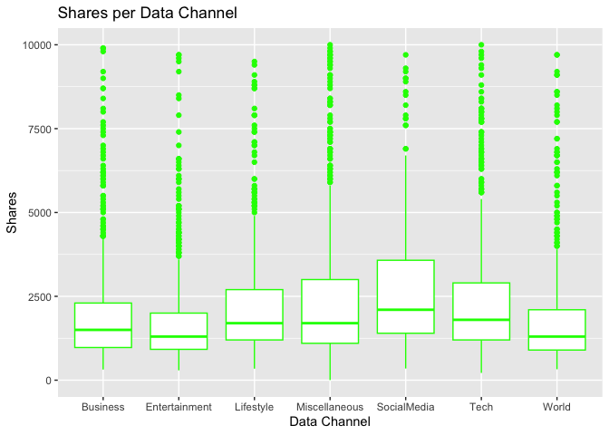
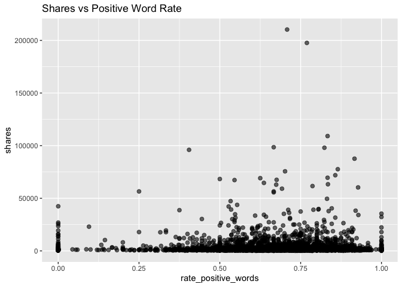

Project 2
================
Spencer Williams & Stephen Macropoulos
2023-07-09

- <a href="#introduction" id="toc-introduction">Introduction</a>
- <a href="#purpose-and-methods" id="toc-purpose-and-methods">Purpose and
  Methods</a>
- <a href="#reading-in-data" id="toc-reading-in-data">Reading in Data</a>
  - <a href="#splitting-the-data" id="toc-splitting-the-data">Splitting the
    Data</a>
- <a href="#summarizations" id="toc-summarizations">Summarizations</a>
- <a href="#modeling" id="toc-modeling">Modeling</a>

# Introduction

The (Online News
Popularity)\[<https://archive.ics.uci.edu/dataset/332/online+news+popularity>\]
is a data set with a heterogeneous set of features about articles
published by (Mashable)\[www.mashable.com\]. Multivariate data was
gathered on sixty-one variables over a two year span. Our end goal is to
predict the number of shares in social networks. Below are some of the
variables we will be looking at to help our prediction.

`Shares` - Number of shares (target)  
`n_tokens_title` - Number of words in the title  
`n_unique_tokens` - Rate of unique words in the content  
`num_imgs` - Number of images  
`num_videos` - Number of videos  
`num_keywords` - Number of keywords in the metadata  
`data_channel_is *` - There are six binary variables which will be
combined into one column. Theses include lifestyle, entertainment,
business, social media, tech, and world  
`rate_positive_words` - Rate of positive words among non-neutral  
`rate_negative_words` - Rate of negative words among non-neutral

# Purpose and Methods

Our end goal is to be able to predict the number of shares based on
having data from the eight variables listed above. We are going to split
the data set into two sets: training (70%) and test (30%). (Linear
Regression Models)\[<https://en.wikipedia.org/wiki/Linear_regression>\]
and (Ensemble Tree-Based
Models)\[<https://towardsdatascience.com/decision-trees-understanding-the-basis-of-ensemble-methods-e075d5bfa704>\]
will be utilized to help us predict the total number of shares. *Random
Forest Models* and *Boosted Tree Models* will be chosen using
cross-validation.

# Reading in Data

The `read.csv()` filename will change depending on who is importing the
Online News Popularity data. We have dropped any unnecessary variables
that will not be used to help us in our predictions.

``` r
# Will need to change this depending on who is working!
newsPop <- read.csv("/Users/monicabeingolea/Documents/ST558/OnlineNewsPopularity/OnlineNewsPopularity.csv")

# Only selecting the columns of interest
newsPop <- newsPop[ , c(3,5,10,11,13,14:19,49,50,61)]

# Check for missing values
sum(is.na(newsPop))
```

    ## [1] 0

We want to subset the data to work based on the different data channel
of interest. Creating a new variable called `data_channel` will allow
this to work successfully. This way, we can turn our focus to a singular
column as opposed to having six binary variables. We will use the
`mutate` function in the *tidyverse* package. Replacing NA’s in the
`data_channel` variable and setting it as a factor is very important in
order to help us predict the total shares.

``` r
library(tidyverse)
# Create new variable data_channel
newsPop <- newsPop %>% mutate(data_channel = case_when(data_channel_is_bus == 1 ~ "Business", data_channel_is_entertainment == 1 ~ "Entertainment", data_channel_is_lifestyle == 1 ~ "Lifestyle", data_channel_is_socmed == 1 ~ "SocialMedia", data_channel_is_tech == 1 ~ "Tech", data_channel_is_world == 1 ~ "World"))
# Replace any missing values with "Miscellaneous"
newsPop$data_channel <- replace_na(newsPop$data_channel, "Miscellaneous")
# Make data_channel a factor variable
newsPop$data_channel <- as.factor(newsPop$data_channel)
```

Since we have added a new `data_channel` variable with the appropriate
variables, the data_channel_is\_\* variables can be removed from our
data set. We will also subset the data to include only observations with
the data channel we want. The possible choices are Entertainment,
SocialMedia, Tech, Business, Miscellaneous, World, and Lifestyle.

``` r
datachannel <- "World"

# Remove data_channel_is*
newsPop <- newsPop[, -c(6:11)]
newsPop1 <- newsPop[newsPop$data_channel==datachannel, ]

newsPop1 <- newsPop1[,-9]
```

## Splitting the Data

``` r
# Set seed
set.seed(5432)
# split data into test and training sets
sub <- sample(1:nrow(newsPop1), 0.7 * nrow(newsPop1))

# for full data set
newsPopTrain <- newsPop[sub,]
newsPopTest <- newsPop[-sub, ]

# for Entertainment data channel
newsPop1Train <- newsPop1[sub, ]
newsPop1Test <- newsPop1[-sub, ]
```

# Summarizations

We wanted to see the summary statistics of each variable that we are
using to predict the number of shares. The statistics will include the
minimum, maximum, mean, median, and quartiles.

``` r
# Summary
summary(newsPop1Train)
```

    ##  n_tokens_title n_unique_tokens     num_imgs         num_videos     
    ##  Min.   : 4.0   Min.   :0.0000   Min.   :  0.000   Min.   : 0.0000  
    ##  1st Qu.: 9.0   1st Qu.:0.4644   1st Qu.:  1.000   1st Qu.: 0.0000  
    ##  Median :11.0   Median :0.5184   Median :  1.000   Median : 0.0000  
    ##  Mean   :10.6   Mean   :0.5096   Mean   :  2.923   Mean   : 0.5487  
    ##  3rd Qu.:12.0   3rd Qu.:0.5732   3rd Qu.:  2.000   3rd Qu.: 1.0000  
    ##  Max.   :20.0   Max.   :0.9762   Max.   :100.000   Max.   :51.0000  
    ##   num_keywords    rate_positive_words rate_negative_words     shares      
    ##  Min.   : 2.000   Min.   :0.0000      Min.   :0.0000      Min.   :    35  
    ##  1st Qu.: 6.000   1st Qu.:0.5385      1st Qu.:0.2478      1st Qu.:   823  
    ##  Median : 7.000   Median :0.6429      Median :0.3462      Median :  1100  
    ##  Mean   : 7.283   Mean   :0.6242      Mean   :0.3445      Mean   :  2242  
    ##  3rd Qu.: 9.000   3rd Qu.:0.7419      3rd Qu.:0.4444      3rd Qu.:  1800  
    ##  Max.   :10.000   Max.   :1.0000      Max.   :1.0000      Max.   :284700

It looks like the `n_unique_tokens`, `num_imgs`, `num_videos`, and
`shares` variables are quite right-skewed in our training set.

Another thing that we wanted to look at was the number of shares for
each data channel. One way to look at this is using a number summary to
compare the means.

``` r
# Number summary
tapply(newsPopTrain$shares, newsPopTrain$data_channel, summary)
```

    ## $Business
    ##     Min.  1st Qu.   Median     Mean  3rd Qu.     Max. 
    ##    140.0    933.8   1400.0   3371.8   2400.0 690400.0 
    ## 
    ## $Entertainment
    ##    Min. 1st Qu.  Median    Mean 3rd Qu.    Max. 
    ##    47.0   892.5  1300.0  2776.8  2400.0 68300.0 
    ## 
    ## $Lifestyle
    ##    Min. 1st Qu.  Median    Mean 3rd Qu.    Max. 
    ##     184    1200    1800    3582    3000   81200 
    ## 
    ## $Miscellaneous
    ##    Min. 1st Qu.  Median    Mean 3rd Qu.    Max. 
    ##       4    1100    1800    5352    3800  617900 
    ## 
    ## $SocialMedia
    ##    Min. 1st Qu.  Median    Mean 3rd Qu.    Max. 
    ##     348    1500    2300    3994    4400   59000 
    ## 
    ## $Tech
    ##    Min. 1st Qu.  Median    Mean 3rd Qu.    Max. 
    ##      86    1200    1800    3103    3200   71800 
    ## 
    ## $World
    ##    Min. 1st Qu.  Median    Mean 3rd Qu.    Max. 
    ##      41     825    1200    2104    2200   53100

Based on the summary from the training data set, the Miscellaneous
channel actually had the highest mean at 4,188 shares, but this is most
likely due to the outlier with a total of 112,500 shares. Out of the
other six shares listed, Business and Social Media are the highest with
total shares in the 3,600’s. The World data channel has the lowest total
share count at 2,311. Below is a barplot and box and whisker plot to
help show these results in a graphical form.

Now let’s take a look at some contingency tables. First, we group the
shares values by thousands in a new column called `sharesgroups` and add
it to the data set.

``` r
sharesgroups <- numeric()

for (i in 1:length(newsPop1Train$shares)) {
  sharesgroups[i] <- floor(newsPop1Train$shares[i]/1000)
}

#head(sharesgroups,100)

newsPop1Train <- cbind(newsPop1Train,sharesgroups)
```

Now let’s see the contingency table for `sharesgroups`.

``` r
table(newsPop1Train$sharesgroups)
```

    ## 
    ##    0    1    2    3    4    5    6    7    8    9   10   11   12   13   14   15 
    ## 2386 2134  566  249  135   84   60   50   27   35   29   12   10   12   10   11 
    ##   16   17   18   19   20   21   22   23   24   25   26   27   28   29   30   31 
    ##   12    4    9    4    6    4    4    5    3    4    2    3    1    1    2    1 
    ##   36   38   39   44   45   46   48   49   52   62   67   69   75   84   96  108 
    ##    1    2    1    1    1    2    2    1    3    1    1    1    1    1    1    1 
    ##  128  284 
    ##    1    1

We see that most of the observations had less than 20,000 shares. There
are larger jumps in thousands of shares once we get to around 70,000.

Now let’s take a look at a contingency table for the data channels.

``` r
table(newsPopTrain$data_channel)
```

    ## 
    ##      Business Entertainment     Lifestyle Miscellaneous   SocialMedia 
    ##          1032           906           432           914           468 
    ##          Tech         World 
    ##          1323           823

We see that the Business, Entertainment, Tech, and World data channels
had more observations overall than the Lifestyle and Social Media data
channels.

Now let’s look at the shares totals for each of the data channels in a
bar plot.

``` r
# Creating base for graph
g <- ggplot(newsPopTrain, aes(x = data_channel, y = shares))
# Adding bars to the graph
g + stat_summary(fun = "mean", geom = "bar", color = "blue", fill = "blue") +
  # Creating labels and titles for graph
  labs(x = "Data Channel", y = "Shares", title = "Shares per Data Channel")
```

<!-- -->

It appears that the total number of shares for each data channel are
similar except for the Miscellaneous category. The Business and Social
Media data channels had the most total shares while the World data
channel had the least.

Now let’s see the boxplots to better understand the variability in those
share totals.

``` r
# Creating base for graph
g <- ggplot(newsPopTrain, aes(x = data_channel, y = shares))
# Adding boxplot to the graph
g + geom_boxplot(color = "green") +
  # Setting y-axis limit and labels
  ylim(0, 10000) +
  labs(x = "Data Channel", y = "Shares", title = "Shares per Data Channel")
```

<!-- -->

It looks like the Social Media data channel had the highest median
shares while the Entertainment and World data channels had the smallest
median shares.

We are curious to see if the variables that we have selected have any
correlation between them. In order to check this, a correlation plot has
been created.

``` r
# Load library
library(corrplot)
```

    ## corrplot 0.92 loaded

``` r
# Remove non-numeric variable
newsPopTrain_ <- newsPopTrain[ , -9]
# Find the correlation and plot the graph
newsPopTrainCorr <- cor(newsPopTrain_)
corrplot(newsPopTrainCorr, type="upper", method="number", tl.pos="lt", number.cex=0.5)
corrplot(newsPopTrainCorr, type="lower", add=TRUE, tl.pos="n", number.cex=0.5)
```

<!-- -->

Based on the correlation plots, only one of the variable-pairs seems to
be highly correlated (near 1 in magnitude). The strongest negative
correlation is -0.85 between `rate_positive_words` and
`rate_negative_words`. This is good news in our case to predict the
number of shares.

Let’s also check out some scatterplots for the Entertainment training
set. First, we look at `shares` vs `n_tokens_title`.

``` r
g <- ggplot(newsPop1Train, aes(x = n_tokens_title, y = shares))
g + labs(title = "Shares vs Words in Title") +
  geom_point(alpha = 0.6, size = 2, position = "jitter") 
```

<!-- -->

We can inspect the trend of shares as a function of the number of words
in the title. If the points show an upward trend, then articles with
more words in the title tend to be shared more often. If we see a
negative trend then articles with more words tend to be shared less
often.

Now let’s look at the same plot but for the `n_unique_tokens` variable.
We remove the extreme outlier first.

``` r
newsPop1Train <- newsPop1Train[-915,]

g <- ggplot(newsPop1Train, aes(x = n_unique_tokens, y = shares))
g + labs(title = "Shares vs Unique Words") +
  geom_point(alpha = 0.6, size = 2, position = "jitter") 
```

<!-- -->

We can inspect the trend of shares as a function of the number of unique
words in the content. If the points show an upward trend, then articles
with more unique words in the title tend to be shared more often. If we
see a negative trend then articles with more unique words tend to be
shared less often.

Now let’s look at the scatter plot of `shares` vs `num_imgs`.

``` r
g <- ggplot(newsPop1Train, aes(x = num_imgs, y = shares))
g + labs(title = "Shares vs Images") +
  geom_point(alpha = 0.6, size = 2, position = "jitter")
```

<!-- -->

We can inspect the trend of shares as a function of the number of
images. If the points show an upward trend, then articles with more
images tend to be shared more often. If there is a negative trend, then
articles with more images tend to be shared less often.

Now let’s look at the scatter plot of `shares` vs `num_videos`.

``` r
g <- ggplot(newsPop1Train, aes(x = num_videos, y = shares))
g + labs(title = "Shares vs Videos") +
  geom_point(alpha = 0.6, size = 2, position = "jitter")
```

<!-- -->

This plot looks very similar to the Shares vs Images plot!

Now let’s look at the scatter plot of `shares` vs `num_keywords`.

``` r
g <- ggplot(newsPop1Train, aes(x = num_keywords, y = shares))
g + labs(title = "Shares vs Keywords") +
  geom_point(alpha = 0.6, size = 2, position = "jitter")
```

<!-- -->

We can inspect the trend of shares as a function of the number of
keywords. If the points show an upward trend, then articles with more
keywords tend to be shared more often. If we see a negative trend then
articles with more keywords tend to be shared less often.

Now let’s look at the scatter plot of `shares` vs
\`rate_positive_words\`\`.

``` r
g <- ggplot(newsPop1Train, aes(x = rate_positive_words, y = shares))
g + labs(title = "Shares vs Positive Word Rate") +
  geom_point(alpha = 0.6, size = 2, position = "jitter")
```

<!-- -->

We can inspect the trend of shares as a function of the positive word
rate. If the points show an upward trend, then articles with more
positive words tend to be shared more often. If we see a negative trend
then articles with more positive words tend to be shared less often.

And finally let’s look at the scatter plot of `shares` vs
\`rate_negative_words\`\`.

``` r
g <- ggplot(newsPop1Train, aes(x = rate_negative_words, y = shares))
g + labs(title = "Shares vs Negative Word Rate") +
  geom_point(alpha = 0.6, size = 2, position = "jitter")
```

<!-- -->

This plot looks like the mirror image of the shares vs positive word
rate plot!

# Modeling

We will use linear regression to investigate which variables best
predict the number of shares.

Linear regression is a statistical modeling procedure which optimally
estimates the slope parameters (via least squares) for each explanatory
variable in a pre-specified linear equation of the slopes. The
assumption of error normality is often made in order to calculate
confidence intervals and prediction intervals for the average and future
responses respectively. The reliability of this technique depends on the
accuracy of the chosen linear equation of the slope parameters. A
misspecified model equation can severely mislead inference and result in
very poor predictive power. Hence, the analyst often tries many
different model equations with the most sensible explanatory variables
for the given response until the parameter estimates are statistically
significant and the information criteria are relatively optimized.

The first linear regression model will consist of all the predictive
variables that we have chosen (omitting the `sharesgroups` variable) in
linear form. After looking at the significance level of each variable,
our second linear regression model will be selected. This has been
selected based on the results for every data channel combined, so we
will analyze each one using the same two models.

``` r
newsPop1Train <- newsPop1Train[,-9]

# Create a linear regression
model1 <- lm(shares ~ ., data = newsPop1Train) 
summary(model1)
```

    ## 
    ## Call:
    ## lm(formula = shares ~ ., data = newsPop1Train)
    ## 
    ## Residuals:
    ##    Min     1Q Median     3Q    Max 
    ##  -8521  -1378   -920   -251 281762 
    ## 
    ## Coefficients:
    ##                     Estimate Std. Error t value Pr(>|t|)    
    ## (Intercept)          1091.53     695.08   1.570  0.11639    
    ## n_tokens_title        109.91      37.67   2.918  0.00354 ** 
    ## n_unique_tokens      2437.43     996.82   2.445  0.01451 *  
    ## num_imgs               90.66      15.89   5.704 1.23e-08 ***
    ## num_videos            152.96      49.00   3.122  0.00181 ** 
    ## num_keywords           57.89      41.93   1.381  0.16740    
    ## rate_positive_words -1607.24     711.37  -2.259  0.02390 *  
    ## rate_negative_words -2973.69     732.90  -4.057 5.03e-05 ***
    ## ---
    ## Signif. codes:  0 '***' 0.001 '**' 0.01 '*' 0.05 '.' 0.1 ' ' 1
    ## 
    ## Residual standard error: 6015 on 5889 degrees of freedom
    ## Multiple R-squared:  0.01196,    Adjusted R-squared:  0.01078 
    ## F-statistic: 10.18 on 7 and 5889 DF,  p-value: 9.854e-13

We can use the above output to gauge the strength of this model. If the
overall p-value at the bottom is small then we can use the asterisks to
see which are the most useful predictors in this model.

``` r
# Create a linear regression

model2 <- lm(shares ~ poly(n_tokens_title,2) + poly(n_unique_tokens,2) +
               poly(num_imgs,2) + poly(num_videos,2) + poly(num_keywords,2) +
               poly(rate_positive_words,2) + poly(rate_negative_words,2), 
               data = newsPop1Train)
 
summary(model2)
```

    ## 
    ## Call:
    ## lm(formula = shares ~ poly(n_tokens_title, 2) + poly(n_unique_tokens, 
    ##     2) + poly(num_imgs, 2) + poly(num_videos, 2) + poly(num_keywords, 
    ##     2) + poly(rate_positive_words, 2) + poly(rate_negative_words, 
    ##     2), data = newsPop1Train)
    ## 
    ## Residuals:
    ##    Min     1Q Median     3Q    Max 
    ##  -6632  -1389   -907   -246 281602 
    ## 
    ## Coefficients: (1 not defined because of singularities)
    ##                                Estimate Std. Error t value Pr(>|t|)    
    ## (Intercept)                     2241.58      78.32  28.620  < 2e-16 ***
    ## poly(n_tokens_title, 2)1       17582.96    6052.97   2.905  0.00369 ** 
    ## poly(n_tokens_title, 2)2       10636.83    6022.63   1.766  0.07742 .  
    ## poly(n_unique_tokens, 2)1      43315.49   21464.44   2.018  0.04364 *  
    ## poly(n_unique_tokens, 2)2     -18843.51   18071.66  -1.043  0.29713    
    ## poly(num_imgs, 2)1             38474.96    6704.37   5.739    1e-08 ***
    ## poly(num_imgs, 2)2              8243.86    6121.28   1.347  0.17811    
    ## poly(num_videos, 2)1           19112.92    6028.94   3.170  0.00153 ** 
    ## poly(num_videos, 2)2           -5904.86    6027.47  -0.980  0.32730    
    ## poly(num_keywords, 2)1          8813.93    6101.63   1.445  0.14865    
    ## poly(num_keywords, 2)2          3164.93    6026.62   0.525  0.59949    
    ## poly(rate_positive_words, 2)1 -55232.04   28924.88  -1.909  0.05625 .  
    ## poly(rate_positive_words, 2)2  -7138.38   11243.37  -0.635  0.52552    
    ## poly(rate_negative_words, 2)1 -69189.58   27099.18  -2.553  0.01070 *  
    ## poly(rate_negative_words, 2)2        NA         NA      NA       NA    
    ## ---
    ## Signif. codes:  0 '***' 0.001 '**' 0.01 '*' 0.05 '.' 0.1 ' ' 1
    ## 
    ## Residual standard error: 6015 on 5883 degrees of freedom
    ## Multiple R-squared:  0.01326,    Adjusted R-squared:  0.01108 
    ## F-statistic: 6.079 on 13 and 5883 DF,  p-value: 2.039e-11

We can use the above output to gauge the strength of this model. If the
overall p-value at the bottom is small then we can use the asterisks to
see which are the most useful predictors in this model.

We are going to analyze the (random forest
model)\[<https://towardsdatascience.com/understanding-random-forest-58381e0602d2>\].
This model allows a user to combine multiple trees from bootstrap
samples. In most cases, the bagged trees predictions are more correlated
which will result in a smaller reduction in variance from aggregation.
The random forest model uses a random subset of the predictors for each
bootstrap tree fit.

``` r
# Load library
library(randomForest)
```

    ## randomForest 4.7-1.1

    ## Type rfNews() to see new features/changes/bug fixes.

    ## 
    ## Attaching package: 'randomForest'

    ## The following object is masked from 'package:dplyr':
    ## 
    ##     combine

    ## The following object is masked from 'package:ggplot2':
    ## 
    ##     margin

``` r
# Produce random forest model
newsPopFit_rf <- randomForest(shares ~ ., data = newsPop1Train, 
                              mtry = ncol(newsPop1Train)/3, 
                              ntree=200, importance=TRUE)
```

We will also use a boosted tree model to predict the number of shares.

Boosted trees are a general approach that can be applied to trees. The
trees are grown sequentially, each subsequent tree is grown on a
modified version of the original data, and predictions are updated as
the trees are grown. Cross validation is also used to select the
shrinkage and depth parameters.

``` r
library(caret)
```

    ## Loading required package: lattice

    ## 
    ## Attaching package: 'caret'

    ## The following object is masked from 'package:purrr':
    ## 
    ##     lift

``` r
n.trees <- c(25,50,100,150,200)
interaction.depth <- 1:4
shrinkage <- 0.1
n.minobsinnode <- 10
X <- expand.grid(n.trees = n.trees, interaction.depth = interaction.depth,
            shrinkage = shrinkage, n.minobsinnode = n.minobsinnode)

newsPopFit_boost <- train(shares ~ ., data = newsPop1Train,
               method = "gbm",
               trControl = trainControl(method = "cv", number = 5),
               tuneGrid = X)
```

    ## Iter   TrainDeviance   ValidDeviance   StepSize   Improve
    ##      1 41275066.5227             nan     0.1000 -2311.2488
    ##      2 41222670.2685             nan     0.1000 55174.4501
    ##      3 41195936.3282             nan     0.1000 10052.7129
    ##      4 41167293.9701             nan     0.1000 -9403.9356
    ##      5 41105827.1106             nan     0.1000 12948.9000
    ##      6 41056990.2765             nan     0.1000 -17828.2639
    ##      7 40993570.2978             nan     0.1000 -5409.8902
    ##      8 40938865.9432             nan     0.1000 16524.0354
    ##      9 40900684.4449             nan     0.1000 -3392.8653
    ##     10 40861020.4017             nan     0.1000 19150.5545
    ##     20 40696503.2805             nan     0.1000 -3208.1857
    ##     40 40507218.4229             nan     0.1000 1616.8060
    ##     60 40401294.7901             nan     0.1000 -27992.5359
    ##     80 40314402.4238             nan     0.1000 -10265.4666
    ##    100 40248573.8513             nan     0.1000 -15095.8710
    ##    120 40181703.0008             nan     0.1000 -37646.6231
    ##    140 40126249.1183             nan     0.1000 -30159.6366
    ##    160 40069229.2321             nan     0.1000 4833.1658
    ##    180 40040511.9410             nan     0.1000 -20520.9011
    ##    200 39997594.9019             nan     0.1000 -10411.9654
    ## 
    ## Iter   TrainDeviance   ValidDeviance   StepSize   Improve
    ##      1 41164802.4810             nan     0.1000  484.6979
    ##      2 41017607.5245             nan     0.1000 2260.7678
    ##      3 40718325.5633             nan     0.1000 18398.4854
    ##      4 40672647.6328             nan     0.1000 -16833.0293
    ##      5 40580935.4191             nan     0.1000 4330.5753
    ##      6 40451159.2951             nan     0.1000 -47219.9008
    ##      7 40369209.3133             nan     0.1000 -38705.7146
    ##      8 40324018.7390             nan     0.1000 1115.9769
    ##      9 40229980.9465             nan     0.1000 -23366.8903
    ##     10 40040562.0659             nan     0.1000 -71311.1079
    ##     20 39301713.4920             nan     0.1000 17687.2689
    ##     40 38594344.7702             nan     0.1000 -176802.8849
    ##     60 38208108.5062             nan     0.1000 -150365.9436
    ##     80 37393622.1868             nan     0.1000 -73051.3119
    ##    100 36794168.1553             nan     0.1000 -87784.6028
    ##    120 36356121.5055             nan     0.1000 -123349.2436
    ##    140 36061047.6611             nan     0.1000 -17101.0861
    ##    160 35867272.2683             nan     0.1000 -40165.5178
    ##    180 35366288.0501             nan     0.1000 -76759.8319
    ##    200 35183478.9250             nan     0.1000 -27902.1047
    ## 
    ## Iter   TrainDeviance   ValidDeviance   StepSize   Improve
    ##      1 41085278.1690             nan     0.1000 52262.4573
    ##      2 40930101.1344             nan     0.1000 -19987.0070
    ##      3 40807290.6258             nan     0.1000 -18430.5767
    ##      4 40551332.3078             nan     0.1000 73905.5147
    ##      5 40152031.9944             nan     0.1000 -70548.7968
    ##      6 40025088.5673             nan     0.1000 -24124.1925
    ##      7 39976816.8427             nan     0.1000 -26749.1583
    ##      8 39905840.3616             nan     0.1000 6544.5655
    ##      9 39853254.6834             nan     0.1000 19541.7684
    ##     10 39816293.7607             nan     0.1000 -2436.6519
    ##     20 38458218.7617             nan     0.1000 -35972.3111
    ##     40 37385416.9359             nan     0.1000 -83718.4441
    ##     60 35844563.5761             nan     0.1000 -88093.3585
    ##     80 35067904.4448             nan     0.1000 -288540.4281
    ##    100 34517093.9574             nan     0.1000 -126899.5745
    ##    120 34143790.7266             nan     0.1000 -27621.2571
    ##    140 33233752.4081             nan     0.1000 3309.0528
    ##    160 32845859.1319             nan     0.1000 9919.4403
    ##    180 32565551.8956             nan     0.1000 -172825.0554
    ##    200 31576700.9061             nan     0.1000 -90424.9083
    ## 
    ## Iter   TrainDeviance   ValidDeviance   StepSize   Improve
    ##      1 41056102.4121             nan     0.1000 30895.3074
    ##      2 40695046.1700             nan     0.1000 -43332.1552
    ##      3 40386888.6591             nan     0.1000 20681.1122
    ##      4 40120981.7042             nan     0.1000 -110410.8590
    ##      5 39696915.3717             nan     0.1000 -71609.7344
    ##      6 39562585.5330             nan     0.1000 -10419.2549
    ##      7 39484544.3853             nan     0.1000 -13365.9640
    ##      8 39378916.2951             nan     0.1000 -2813.5308
    ##      9 39198019.3868             nan     0.1000 -7081.3432
    ##     10 39095660.9043             nan     0.1000 -37074.3741
    ##     20 38083307.0255             nan     0.1000 1152.3697
    ##     40 36281812.4124             nan     0.1000 -41696.7385
    ##     60 34268742.9148             nan     0.1000 -87622.9011
    ##     80 33197597.5432             nan     0.1000 -267071.2658
    ##    100 32536713.9644             nan     0.1000 -135538.8418
    ##    120 31665176.8504             nan     0.1000 -103443.3179
    ##    140 30904567.5628             nan     0.1000 -68197.2165
    ##    160 30239847.9179             nan     0.1000 -34422.1520
    ##    180 29475194.2286             nan     0.1000 -110087.0429
    ##    200 28609882.0612             nan     0.1000 -46334.6129
    ## 
    ## Iter   TrainDeviance   ValidDeviance   StepSize   Improve
    ##      1 42898714.4752             nan     0.1000 -9636.5857
    ##      2 42834302.2263             nan     0.1000 43273.0018
    ##      3 42786311.7933             nan     0.1000 16548.6029
    ##      4 42694116.5352             nan     0.1000 35179.6003
    ##      5 42675214.3864             nan     0.1000 2560.8731
    ##      6 42643510.8186             nan     0.1000 -8872.7528
    ##      7 42612022.6692             nan     0.1000 16108.6701
    ##      8 42580808.8790             nan     0.1000 26170.3585
    ##      9 42524620.8051             nan     0.1000 -4880.7768
    ##     10 42490502.5586             nan     0.1000 15579.3974
    ##     20 42244120.3871             nan     0.1000 6876.6633
    ##     40 42017946.9351             nan     0.1000 3680.0724
    ##     60 41925926.7521             nan     0.1000 -23371.1617
    ##     80 41805967.3636             nan     0.1000 4014.2791
    ##    100 41732747.0572             nan     0.1000 8666.3852
    ##    120 41671087.3431             nan     0.1000 -26478.1813
    ##    140 41591522.8632             nan     0.1000 -1006.1477
    ##    160 41516744.2352             nan     0.1000 -37797.3953
    ##    180 41442503.7273             nan     0.1000 -24961.0412
    ##    200 41402260.0971             nan     0.1000 -18753.5570
    ## 
    ## Iter   TrainDeviance   ValidDeviance   StepSize   Improve
    ##      1 42711800.9539             nan     0.1000 9769.0665
    ##      2 42518593.7951             nan     0.1000 -6713.3685
    ##      3 42488120.9551             nan     0.1000 12499.6944
    ##      4 42249790.2589             nan     0.1000 46445.4440
    ##      5 42111554.5552             nan     0.1000 16044.6239
    ##      6 42013138.7225             nan     0.1000 2312.4055
    ##      7 41968809.9847             nan     0.1000 -6172.8984
    ##      8 41881261.3535             nan     0.1000 -47863.6640
    ##      9 41816124.2885             nan     0.1000 -11037.2496
    ##     10 41788543.0799             nan     0.1000  419.9516
    ##     20 40998857.8336             nan     0.1000 -321594.4660
    ##     40 40277622.5130             nan     0.1000 -65278.3808
    ##     60 39883563.3036             nan     0.1000 -19291.8714
    ##     80 39425246.0086             nan     0.1000 -103489.0535
    ##    100 39147334.4749             nan     0.1000 -121615.0068
    ##    120 38994079.6526             nan     0.1000 -62505.3342
    ##    140 38849217.4373             nan     0.1000 -15288.8571
    ##    160 38524782.4305             nan     0.1000 -128928.8856
    ##    180 37986624.1123             nan     0.1000 -134097.1602
    ##    200 37747911.8748             nan     0.1000 -99888.9552
    ## 
    ## Iter   TrainDeviance   ValidDeviance   StepSize   Improve
    ##      1 42659077.9164             nan     0.1000 76369.6691
    ##      2 42366451.9435             nan     0.1000 -32547.0723
    ##      3 42203417.2524             nan     0.1000 -9553.4228
    ##      4 42102342.7285             nan     0.1000 32992.8087
    ##      5 42009485.3379             nan     0.1000 -23783.4007
    ##      6 41880680.0297             nan     0.1000 -40722.0173
    ##      7 41795809.3652             nan     0.1000 -54254.8312
    ##      8 41585957.0242             nan     0.1000 -18509.8437
    ##      9 41424609.9384             nan     0.1000 -887.1936
    ##     10 41337692.8731             nan     0.1000 -51419.7682
    ##     20 40270615.5901             nan     0.1000 -62171.8150
    ##     40 39034586.6400             nan     0.1000 -34256.7139
    ##     60 38040901.6617             nan     0.1000 -226908.7712
    ##     80 36969436.4495             nan     0.1000 -72795.6260
    ##    100 36138111.4702             nan     0.1000 -26077.3579
    ##    120 35332393.7829             nan     0.1000 -39264.1497
    ##    140 34710732.8015             nan     0.1000 -137707.4406
    ##    160 33999176.8217             nan     0.1000 -73951.9779
    ##    180 33616378.3717             nan     0.1000 -20648.1611
    ##    200 33543838.9284             nan     0.1000 -133338.4937
    ## 
    ## Iter   TrainDeviance   ValidDeviance   StepSize   Improve
    ##      1 42742031.7113             nan     0.1000 13487.3236
    ##      2 42265903.8862             nan     0.1000 11805.7127
    ##      3 42129937.5468             nan     0.1000 39015.5283
    ##      4 41794183.3496             nan     0.1000 -143716.4554
    ##      5 41666244.8661             nan     0.1000 21572.7106
    ##      6 41559231.8489             nan     0.1000 9043.3583
    ##      7 41299417.1841             nan     0.1000 -71716.3827
    ##      8 41151411.2174             nan     0.1000 -26753.0098
    ##      9 41067278.8785             nan     0.1000 -73494.0485
    ##     10 40881447.6305             nan     0.1000 -128145.9137
    ##     20 39776835.2758             nan     0.1000 -89733.8457
    ##     40 38447917.8087             nan     0.1000 -154209.9021
    ##     60 36665541.0758             nan     0.1000 -83302.9993
    ##     80 35553193.6563             nan     0.1000 -43927.1403
    ##    100 34637871.9655             nan     0.1000 -66335.0510
    ##    120 34196333.3699             nan     0.1000 -116232.1263
    ##    140 33159958.4253             nan     0.1000 -31787.7286
    ##    160 32625297.8842             nan     0.1000 -76869.4700
    ##    180 32044744.0874             nan     0.1000 -90476.5571
    ##    200 31300240.5953             nan     0.1000 -149085.9117
    ## 
    ## Iter   TrainDeviance   ValidDeviance   StepSize   Improve
    ##      1 38876007.8214             nan     0.1000 -20770.3250
    ##      2 38837842.0437             nan     0.1000 32152.4147
    ##      3 38773486.2749             nan     0.1000 11911.8747
    ##      4 38747481.5955             nan     0.1000 -7194.7889
    ##      5 38705778.6588             nan     0.1000 16159.2080
    ##      6 38673742.2893             nan     0.1000 -669.8980
    ##      7 38645822.4073             nan     0.1000 4630.7185
    ##      8 38635453.6768             nan     0.1000 -5724.7389
    ##      9 38611211.5244             nan     0.1000 -13566.7389
    ##     10 38600598.3250             nan     0.1000 -2150.1631
    ##     20 38442869.2642             nan     0.1000 -1693.6238
    ##     40 38257979.4018             nan     0.1000 -3902.0726
    ##     60 38138722.8647             nan     0.1000 -11449.1521
    ##     80 38061201.0185             nan     0.1000 -29199.2847
    ##    100 38005787.9603             nan     0.1000 10972.5687
    ##    120 37904641.9859             nan     0.1000 -20391.5283
    ##    140 37828623.2749             nan     0.1000 -10696.0770
    ##    160 37784616.5628             nan     0.1000 -24904.2085
    ##    180 37724862.9773             nan     0.1000 -10483.6921
    ##    200 37676491.9785             nan     0.1000 -27185.5922
    ## 
    ## Iter   TrainDeviance   ValidDeviance   StepSize   Improve
    ##      1 38579688.3809             nan     0.1000 -31926.2878
    ##      2 38430884.4264             nan     0.1000 5668.2945
    ##      3 38241317.5077             nan     0.1000 -37379.5460
    ##      4 38161806.9122             nan     0.1000 3853.5686
    ##      5 38119054.6715             nan     0.1000 22540.1066
    ##      6 38042496.4235             nan     0.1000 8416.6858
    ##      7 37927934.1466             nan     0.1000 -24396.3017
    ##      8 37859745.4330             nan     0.1000 -33881.5676
    ##      9 37801053.2721             nan     0.1000 -29257.2710
    ##     10 37736844.1805             nan     0.1000 4084.4453
    ##     20 37176006.3182             nan     0.1000 10943.4849
    ##     40 36183497.8789             nan     0.1000 -22397.4152
    ##     60 35654626.8156             nan     0.1000 37334.8155
    ##     80 35449782.3567             nan     0.1000 -36308.9398
    ##    100 35004034.3388             nan     0.1000 -78845.2279
    ##    120 34869937.6677             nan     0.1000 -205210.2018
    ##    140 34682084.7001             nan     0.1000 -63821.5192
    ##    160 34489688.3156             nan     0.1000 -72603.0558
    ##    180 34104031.7439             nan     0.1000 -51520.0478
    ##    200 33841216.8660             nan     0.1000 -28848.5157
    ## 
    ## Iter   TrainDeviance   ValidDeviance   StepSize   Improve
    ##      1 38808194.3422             nan     0.1000 23618.5095
    ##      2 38748180.3076             nan     0.1000 9190.5018
    ##      3 38594289.9243             nan     0.1000 15399.7067
    ##      4 38402029.0936             nan     0.1000 -31429.8342
    ##      5 38279225.6133             nan     0.1000 -49606.6145
    ##      6 38042572.0557             nan     0.1000 15411.7852
    ##      7 37996889.1534             nan     0.1000 24803.0438
    ##      8 37907505.7374             nan     0.1000  463.8244
    ##      9 37494513.3498             nan     0.1000 -61476.6058
    ##     10 37470522.5730             nan     0.1000 -12883.3883
    ##     20 36046880.7144             nan     0.1000 -33161.6450
    ##     40 34061446.0299             nan     0.1000 -99342.2412
    ##     60 33556173.8923             nan     0.1000 -54278.2786
    ##     80 32747127.3862             nan     0.1000 -213003.4725
    ##    100 32281614.5316             nan     0.1000 -64706.4465
    ##    120 31668784.2468             nan     0.1000 -6722.9726
    ##    140 31255446.6991             nan     0.1000 -17350.6992
    ##    160 30998582.2450             nan     0.1000 -65451.9795
    ##    180 30718622.1552             nan     0.1000 -62322.4269
    ##    200 30179548.7894             nan     0.1000 -321271.3506
    ## 
    ## Iter   TrainDeviance   ValidDeviance   StepSize   Improve
    ##      1 38830463.7721             nan     0.1000 58807.4171
    ##      2 38469840.0012             nan     0.1000 12329.0520
    ##      3 38345319.1619             nan     0.1000 -3450.5469
    ##      4 37987675.8502             nan     0.1000 -70750.4736
    ##      5 37841008.1870             nan     0.1000 -25058.0915
    ##      6 37725009.6793             nan     0.1000 -26129.2921
    ##      7 37672547.2674             nan     0.1000 -7656.6121
    ##      8 37540273.3447             nan     0.1000 -23247.4312
    ##      9 37477814.0833             nan     0.1000 -3779.1740
    ##     10 37134537.3373             nan     0.1000 -178608.4871
    ##     20 35330041.8971             nan     0.1000 -71393.8248
    ##     40 33875791.7955             nan     0.1000 -157743.8694
    ##     60 32735786.8086             nan     0.1000 -239707.4911
    ##     80 32054441.8700             nan     0.1000 -88222.0235
    ##    100 31181511.0198             nan     0.1000 -58233.6879
    ##    120 30104087.0261             nan     0.1000 -87022.0286
    ##    140 29336405.7974             nan     0.1000 -57386.1001
    ##    160 28500144.2033             nan     0.1000 -104499.5320
    ##    180 27820257.1062             nan     0.1000 -135731.8692
    ##    200 27111038.2454             nan     0.1000 -93291.5612
    ## 
    ## Iter   TrainDeviance   ValidDeviance   StepSize   Improve
    ##      1 36741562.0541             nan     0.1000 11532.1241
    ##      2 36707046.7055             nan     0.1000 10756.2145
    ##      3 36685540.0065             nan     0.1000 12514.5111
    ##      4 36663094.3847             nan     0.1000 16034.7116
    ##      5 36630323.5826             nan     0.1000 -3682.6454
    ##      6 36593900.5880             nan     0.1000 27153.7247
    ##      7 36571089.7291             nan     0.1000 -13323.2489
    ##      8 36548697.6359             nan     0.1000 5428.3201
    ##      9 36513627.9170             nan     0.1000 14446.0531
    ##     10 36486477.8881             nan     0.1000 8564.5925
    ##     20 36337167.7867             nan     0.1000 -9242.0815
    ##     40 36192525.4821             nan     0.1000 2690.6231
    ##     60 36128820.5808             nan     0.1000 -26459.0569
    ##     80 36079364.8511             nan     0.1000 -19266.8105
    ##    100 36044653.7046             nan     0.1000 -16733.7377
    ##    120 35971928.8286             nan     0.1000 -19685.2973
    ##    140 35929102.5080             nan     0.1000 -24422.8745
    ##    160 35885992.2564             nan     0.1000 -20783.6727
    ##    180 35854532.1780             nan     0.1000 -13261.7228
    ##    200 35821353.6775             nan     0.1000 -11450.8334
    ## 
    ## Iter   TrainDeviance   ValidDeviance   StepSize   Improve
    ##      1 36649538.8179             nan     0.1000 13320.0462
    ##      2 36328399.4396             nan     0.1000 -35514.1868
    ##      3 36262418.5404             nan     0.1000 53237.4696
    ##      4 36205562.3962             nan     0.1000 19251.7358
    ##      5 36055174.3360             nan     0.1000 -49200.2808
    ##      6 36029574.4372             nan     0.1000 -2158.3695
    ##      7 35948871.4138             nan     0.1000 -10806.9073
    ##      8 35916791.6628             nan     0.1000 22268.2339
    ##      9 35872055.2977             nan     0.1000 -6630.0851
    ##     10 35756674.7327             nan     0.1000 -105141.1238
    ##     20 35304369.1616             nan     0.1000 -30855.7061
    ##     40 35041495.7222             nan     0.1000 -106587.5002
    ##     60 33985677.3612             nan     0.1000 -35474.2089
    ##     80 33300113.6892             nan     0.1000 -213232.3306
    ##    100 33054264.6696             nan     0.1000 8541.7188
    ##    120 32638464.4305             nan     0.1000 -35092.9943
    ##    140 32333563.9167             nan     0.1000 -9652.7497
    ##    160 31979094.4391             nan     0.1000 -11269.3179
    ##    180 31529902.7135             nan     0.1000 -135018.5039
    ##    200 31415801.2171             nan     0.1000 -12652.1751
    ## 
    ## Iter   TrainDeviance   ValidDeviance   StepSize   Improve
    ##      1 36684495.6506             nan     0.1000 11482.9675
    ##      2 36339062.4836             nan     0.1000 -44944.0321
    ##      3 36279419.7703             nan     0.1000 15600.7386
    ##      4 36192018.5232             nan     0.1000 -7600.1246
    ##      5 35953220.0450             nan     0.1000 -60495.5731
    ##      6 35903047.6027             nan     0.1000 5666.4491
    ##      7 35673159.4481             nan     0.1000 -85339.9849
    ##      8 35616347.9481             nan     0.1000 17482.2419
    ##      9 35466993.1888             nan     0.1000 -153021.0504
    ##     10 35195620.9397             nan     0.1000 -124945.1211
    ##     20 33900461.0457             nan     0.1000 -73119.0765
    ##     40 32044541.5883             nan     0.1000 -135324.7205
    ##     60 31339054.8755             nan     0.1000 -113344.7747
    ##     80 30815539.8077             nan     0.1000 -41244.2342
    ##    100 30161167.0345             nan     0.1000 -17788.5907
    ##    120 29383210.2272             nan     0.1000 -55506.2538
    ##    140 29015455.9232             nan     0.1000 -209274.3721
    ##    160 28498988.7766             nan     0.1000 2469.1153
    ##    180 27922763.8641             nan     0.1000 -40225.1970
    ##    200 27721365.9579             nan     0.1000 -77050.9821
    ## 
    ## Iter   TrainDeviance   ValidDeviance   StepSize   Improve
    ##      1 36335562.2001             nan     0.1000 19597.8859
    ##      2 36287259.5378             nan     0.1000 3320.0090
    ##      3 35975645.3923             nan     0.1000 -52440.7071
    ##      4 35779485.0321             nan     0.1000 -11247.6379
    ##      5 35734182.5083             nan     0.1000 13361.0245
    ##      6 35539018.5932             nan     0.1000 -11231.1285
    ##      7 35165550.6062             nan     0.1000 -88980.9761
    ##      8 34892607.6985             nan     0.1000 -105945.6396
    ##      9 34705869.4763             nan     0.1000 -103976.7301
    ##     10 34602343.5296             nan     0.1000 -233794.1413
    ##     20 33678793.1256             nan     0.1000 -128094.3441
    ##     40 31522206.2976             nan     0.1000 -11740.4510
    ##     60 29889427.1250             nan     0.1000 -167352.6625
    ##     80 29474324.0868             nan     0.1000 -133755.1476
    ##    100 28452394.1738             nan     0.1000 -96386.9346
    ##    120 27282941.0621             nan     0.1000 -113766.1326
    ##    140 26430936.6604             nan     0.1000 -63008.3485
    ##    160 25873131.6850             nan     0.1000 -61698.7038
    ##    180 25051345.7502             nan     0.1000 2340.3394
    ##    200 24399339.4277             nan     0.1000 -188060.7551
    ## 
    ## Iter   TrainDeviance   ValidDeviance   StepSize   Improve
    ##      1 22906910.3191             nan     0.1000 38655.3341
    ##      2 22858317.0137             nan     0.1000 32623.6896
    ##      3 22824180.0737             nan     0.1000 6081.6721
    ##      4 22787277.7834             nan     0.1000 3389.9768
    ##      5 22760469.1642             nan     0.1000 -3164.0137
    ##      6 22748412.7613             nan     0.1000 -13495.6526
    ##      7 22729036.6826             nan     0.1000 18097.3339
    ##      8 22705089.0100             nan     0.1000 4746.0765
    ##      9 22686723.9967             nan     0.1000 8848.7558
    ##     10 22673121.1121             nan     0.1000 -8422.6989
    ##     20 22559931.0125             nan     0.1000 -16056.8363
    ##     40 22428749.3299             nan     0.1000 -7853.7278
    ##     60 22353454.4424             nan     0.1000 -360.4277
    ##     80 22316121.9275             nan     0.1000 -7228.0619
    ##    100 22279162.7061             nan     0.1000 -15868.0403
    ##    120 22248046.2180             nan     0.1000 -20577.5622
    ##    140 22221809.6066             nan     0.1000 -13273.4207
    ##    160 22210824.8881             nan     0.1000 -6687.0551
    ##    180 22187373.9828             nan     0.1000 -15636.8096
    ##    200 22171306.6070             nan     0.1000 -13539.0389
    ## 
    ## Iter   TrainDeviance   ValidDeviance   StepSize   Improve
    ##      1 22847693.3046             nan     0.1000 59109.3730
    ##      2 22773534.2298             nan     0.1000 62124.6924
    ##      3 22689582.5994             nan     0.1000 31886.6369
    ##      4 22607825.3344             nan     0.1000 -40161.5210
    ##      5 22564319.8459             nan     0.1000 7176.9891
    ##      6 22527968.0606             nan     0.1000 27186.8802
    ##      7 22517005.8506             nan     0.1000 7097.0136
    ##      8 22480751.1571             nan     0.1000 14677.8454
    ##      9 22426018.1537             nan     0.1000 -31892.0600
    ##     10 22399991.6222             nan     0.1000 4889.0474
    ##     20 22138835.8245             nan     0.1000 -43191.7542
    ##     40 21773828.0889             nan     0.1000 -44278.1449
    ##     60 21515710.8557             nan     0.1000 -9404.7497
    ##     80 21351299.8991             nan     0.1000 -27141.5610
    ##    100 21238121.1976             nan     0.1000 -28593.3077
    ##    120 21156387.5743             nan     0.1000 -26219.7061
    ##    140 21048329.8639             nan     0.1000 -21094.2710
    ##    160 20933114.6036             nan     0.1000 -10633.6447
    ##    180 20772164.7180             nan     0.1000 -21752.7099
    ##    200 20710250.2760             nan     0.1000 -1023.0437
    ## 
    ## Iter   TrainDeviance   ValidDeviance   StepSize   Improve
    ##      1 22806456.3245             nan     0.1000 16145.7904
    ##      2 22687286.1605             nan     0.1000 -19329.2747
    ##      3 22592365.4598             nan     0.1000 -8740.4005
    ##      4 22551248.7936             nan     0.1000 2408.8081
    ##      5 22527888.3550             nan     0.1000 -12276.3857
    ##      6 22469979.8865             nan     0.1000 57037.5440
    ##      7 22373075.3726             nan     0.1000 56492.0392
    ##      8 22310138.0877             nan     0.1000 -5973.9270
    ##      9 22274939.1023             nan     0.1000 -10236.2881
    ##     10 22236960.0187             nan     0.1000 -201.8313
    ##     20 21744725.9674             nan     0.1000 1280.3465
    ##     40 21140677.5902             nan     0.1000 -9771.5262
    ##     60 20737661.8037             nan     0.1000 -19546.5249
    ##     80 20362566.0128             nan     0.1000 -31932.5048
    ##    100 20169170.9083             nan     0.1000 -78415.5541
    ##    120 19973675.5218             nan     0.1000 -13552.0727
    ##    140 19789413.5651             nan     0.1000 -18822.7614
    ##    160 19537776.2620             nan     0.1000 -30873.2641
    ##    180 19288963.2274             nan     0.1000 -32689.0460
    ##    200 19134157.8355             nan     0.1000 -49697.8715
    ## 
    ## Iter   TrainDeviance   ValidDeviance   StepSize   Improve
    ##      1 22884397.0886             nan     0.1000 21500.0752
    ##      2 22788405.5490             nan     0.1000 20681.3237
    ##      3 22620806.7513             nan     0.1000 -14088.6804
    ##      4 22531563.1749             nan     0.1000 29772.8449
    ##      5 22401334.7304             nan     0.1000 31244.9534
    ##      6 22317673.9478             nan     0.1000 -5317.7363
    ##      7 22224494.7889             nan     0.1000 2322.0926
    ##      8 22137791.5030             nan     0.1000 -16553.6136
    ##      9 22053351.9323             nan     0.1000 4370.9944
    ##     10 21974483.7797             nan     0.1000 -7778.8817
    ##     20 21508655.2139             nan     0.1000 -29745.7794
    ##     40 20710729.3928             nan     0.1000 -35835.6684
    ##     60 20100863.8361             nan     0.1000 -24554.7027
    ##     80 19706120.8623             nan     0.1000 -37245.1719
    ##    100 19275797.9046             nan     0.1000 -27235.8341
    ##    120 19003896.2479             nan     0.1000 -31885.0209
    ##    140 18724925.2018             nan     0.1000 -22757.4452
    ##    160 18527544.3241             nan     0.1000 -8250.2359
    ##    180 18320009.4921             nan     0.1000 -21150.2927
    ##    200 18055140.0600             nan     0.1000 -34665.8904
    ## 
    ## Iter   TrainDeviance   ValidDeviance   StepSize   Improve
    ##      1 36533121.8247             nan     0.1000 42125.0892
    ##      2 36488739.0112             nan     0.1000 29114.1493
    ##      3 36461735.1762             nan     0.1000 11896.2580
    ##      4 36425725.0685             nan     0.1000 11690.2326
    ##      5 36403152.4660             nan     0.1000 21776.8994
    ##      6 36367727.9100             nan     0.1000 22882.6585
    ##      7 36337300.8829             nan     0.1000 2603.2498
    ##      8 36321473.0037             nan     0.1000 14748.4361
    ##      9 36289071.3119             nan     0.1000 4593.5786
    ##     10 36278318.2162             nan     0.1000 -1779.6605
    ##     20 36132893.7361             nan     0.1000 -711.9174
    ##     25 36073067.6417             nan     0.1000 -3566.0949

Now we get the RMSE from each model and find the best one. The model
with the highest predictive power will have the smallest RMSE.

``` r
newsPop1Pred_model1 <- predict(model1, newdata = newsPop1Test)
newsPop1Pred_model2 <- predict(model2, newdata = newsPop1Test)
```

    ## Warning in predict.lm(model2, newdata = newsPop1Test): prediction from
    ## rank-deficient fit; attr(*, "non-estim") has doubtful cases

``` r
newsPop1Pred_rf <- predict(newsPopFit_rf, newdata = newsPop1Test)
newsPop1Pred_boost <- predict(newsPopFit_boost, newdata = newsPop1Test)

# Find RMSE
model1_RMSE <- round(sqrt(mean((newsPop1Pred_model1-newsPop1Test$shares)^2)),2)
model2_RMSE <- round(sqrt(mean((newsPop1Pred_model2-newsPop1Test$shares)^2)),2)
RMSE_rf <- round(sqrt(mean((newsPop1Pred_rf-newsPop1Test$shares)^2)),2)
RMSE_boost <- round(sqrt(mean((newsPop1Pred_boost-newsPop1Test$shares)^2)),2)

RMSE_mods <- c(model1_RMSE, "Full Linear Regression Model", 
               model2_RMSE, "Curvi-Linear Regression Model", 
               RMSE_rf, "Random Forest Model", 
               RMSE_boost, "Boosted Tree Model")

RMSE_mods
```

    ## [1] "6133.49"                       "Full Linear Regression Model" 
    ## [3] "6134.15"                       "Curvi-Linear Regression Model"
    ## [5] "6258.08"                       "Random Forest Model"          
    ## [7] "6143.53"                       "Boosted Tree Model"

``` r
paste("The", RMSE_mods[which(RMSE_mods==min(RMSE_mods))+1], "had the smallest RMSE of", RMSE_mods[which(RMSE_mods==min(RMSE_mods))])
```

    ## [1] "The Full Linear Regression Model had the smallest RMSE of 6133.49"
